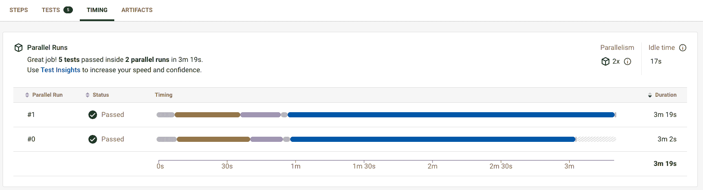

# 通过并行和测试分割加速 XCUITest 执行| CircleCI

> 原文：<https://circleci.com/blog/xcuitest-parallel-execution/>

> 本教程涵盖:
> 
> 1.  使用 XCUITest 和 fastlane 设置 iOS UI 测试
> 2.  使用 CircleCI 自动运行 XCUITest
> 3.  利用并行性和测试拆分加速 XCUITest 时间

在本文中，我将向您展示如何通过拆分和并行运行 XCUITest(iOS 模拟器上的 UI 测试)来减少它们的执行时间。

像 [CircleCI](https://circleci.com/) 这样的自动化测试和 CI/CD 平台是 iOS 应用开发所必需的。重要的是不仅要一次介绍它们，而且要不断改进它们。

当应用程序代码增长和自动化测试增加时，CI/CD 中构建和测试的执行时间会变长。构建和测试时间越长，开发速度越慢。

因为像 XCUITest (Xcode UITest)这样的 UI 测试需要在实际的 iOS 设备或者 iOS 模拟器上运行，所以执行时间往往会比较长。

CircleCI 有多种方法可以减少 iOS 应用程序开发中的执行时间:

在本文中，我将向您展示如何将 CircleCI 的测试拆分和并行性与 [fastlane](https://fastlane.tools/) 结合起来，以减少执行时间。

## 先决条件

对于本教程，您需要:

*   CircleCI 帐户，最好是用于最佳 macOS 虚拟机并发的[性能计划](https://circleci.com/pricing/)。
*   Xcode 已安装。本教程使用 Xcode 13.4.1。
*   [快车道](https://fastlane.tools/)已安装。
*   熟悉编写 XCUITest (Xcode UITest)。

## 如何使用 CircleCI 和 fastlane 将测试分割和并行性添加到 XCUITest 运行中(概述)

本教程中介绍的 iOS 应用程序的示例代码可以在 [GitHub](https://github.com/tadashi0713/circleci-demo-ios) 上获得。

这包括多个 UI 测试。通过插入`sleep()`改变执行时间，如下所示:

```
import XCTest

class CircleCIDemoUITests5: XCTestCase {
    func testTapButton5() throws {
        // UI tests must launch the application that they test.
        let app = XCUIApplication()
        app.launch()

        // Elements
        let text = app.staticTexts["text"]
        let button = app.buttons["button"]

        XCTAssertEqual(text.label, "Hello, world!")
        sleep(50)
        button.tap()
        XCTAssertEqual(text.label, "Button Tapped!")
    }
} 
```

要使用 fastlane 连续运行所有测试，使用 [run_tests](https://docs.fastlane.tools/actions/run_tests/) 动作并编写以下代码。

```
desc "Run all UITests"
lane :ui_test_all do
  run_tests(
    scheme: "CircleCIDemoUITests",
    devices: ["iPhone 13 (15.4)"]
  )
end 
```

要并行运行测试，请遵循以下步骤:

1.  运行 UI 测试的预构建(build_for_testing)
2.  启动多个 macOS 虚拟机/iOS 模拟器
3.  基于执行时间的分割测试
4.  并行运行分割测试
5.  上传测试结果，包括执行时间

## 预构建`build_for_testing`来运行 UI 测试

所有的 iOS 应用测试，包括 UI 测试，都必须在运行前构建。对于本教程，我提前完成了构建部分，因此您可以稍后在多个 macOS 虚拟机上并行运行测试。

从 Xcode8 开始，`build-for-testing`和`test-without-building`允许你分离构建和测试执行。

在快速通道中执行`build-for-testing`时，启用`run_tests`动作中的`build_for_testing`参数。

```
desc "Run all UITests"
lane :build_for_ui_test do
  run_tests(
    scheme: "CircleCIDemoUITests",
    devices: ["iPhone 13 (15.4)"],
    derived_data_path: "dist",
    build_for_testing: true
  )
end 
```

`derived_data_path`参数允许您指定工件的路径。

这是 CircleCI `build_for_ui_test`的工作:

```
build_for_ui_test:
  macos:
    xcode: 13.3.1
  resource_class: macos.x86.medium.gen2
  steps:
    - checkout
    - ruby/install-deps
    - run: bundle exec fastlane build_for_ui_test
    - persist_to_workspace:
        root: .
        paths:
          - dist 
```

这包括以下步骤:

*   使用[红宝石球](https://circleci.com/developer/orbs/orb/circleci/ruby)安装快速通道。
*   跑快车道(`build_for_testing`)。
*   使预构建工件可用于下一个作业， [persist_to_workspace](https://circleci.com/docs/workspaces/) 。

## UI 测试的测试拆分和并行性

在预构建`build_for_ui_test`任务完成后，运行`ui_test_parallel`任务来并行拆分和运行 UI 测试。

```
ui_test_parallel:
  parallelism: 2
  macos:
    xcode: 13.3.1
  resource_class: macos.x86.medium.gen2
  steps:
    - checkout
    - macos/preboot-simulator:
        device: iPhone 13
        version: "15.4"
    - attach_workspace:
        at: .
    - ruby/install-deps 
```

启动多个 macOS 虚拟机来并行运行测试。您可以通过设置`parallelism`键的值来增加或减少并行运行的 macOS 虚拟机的数量。

这项工作的步骤包括:

然后，拆分测试并并行运行它们。

这是一条快车道:

```
desc "Run specific UITests"
lane :ui_test_without_building do |options|
  run_tests(
    scheme: "CircleCIDemoUITests",
    devices: ["iPhone 13 (15.4)"],
    only_testing: options[:tests],
    derived_data_path: "dist",
    test_without_building: true
  )
end 
```

这段代码使用了`run_tests`动作，但是有两处不同。首先，它启用了`test_without_building`参数。这次我们已经预构建了应用程序`build-for-testing`，因此我们可以通过启用`test-without-building`参数来运行测试，而无需构建。

第二，启用`only_testing`参数。此参数只允许运行某些测试，而不是所有测试。`only_testing`(特定测试)的目标可以从外部通过。

下面是 CircleCI 配置文件的一部分，它拆分并并行运行测试:

```
- run:
    name: Split tests and run UITests
    command: |
      CLASSNAMES=$(circleci tests glob "CircleCIDemoUITests/*.swift" \
        | sed 's@/@.@g' \
        | sed 's/.swift//' \
        | circleci tests split --split-by=timings --timings-type=classname)
      FASTLANE_ARGS=$(echo $CLASSNAMES | sed -e 's/\./\//g' -e 's/ /,/g')
      bundle exec fastlane ui_test_without_building tests:$FASTLANE_ARGS
- store_test_results:
    path: fastlane/test_output/report.junit 
```

目标测试文件由`circleci tests glob`检索并由`circleci tests split`分割。

你可以看到`--split-by=timings`标志被加到了`circleci tests split`上。这将利用来自前一次测试运行的计时数据，在指定数量的并行运行的测试环境中尽可能均匀地分割测试套件。`--split-by=timings`标志给出了可用计算能力的最短测试时间。您可以在下面的视频中了解更多关于测试分割和并行性的信息。

[https://www.youtube.com/embed/zeukH6V_gEk](https://www.youtube.com/embed/zeukH6V_gEk)

视频

在这种情况下，具有不同执行时间的五个测试分两次并行运行。测试执行时间几乎没有变化。



## 结论

在本文中，我介绍了如何通过拆分和并行运行 XCUITest(iOS 模拟器上的 UI 测试)来减少它们的执行时间。

该解决方案的关键要点:

*   基于时间的测试分割为可用的计算能力提供了最短的测试时间。
*   通过设置 CircleCI 配置文件中的`parallelism`键的值，可以轻松调整并行度。
*   即使在并行运行多个 macOS 虚拟机时，如在这种情况下，性价比也很高。

**注:** *CircleCI 按每分钟 macOS VM 使用量(积分)收费，而不是按并行数收费。要了解更多信息，请查看我们的 [CircleCI 定价和计划信息](https://circleci.com/pricing)。*

如果你想提高 iOS 应用程序开发的性能，我希望你会发现这很有用。