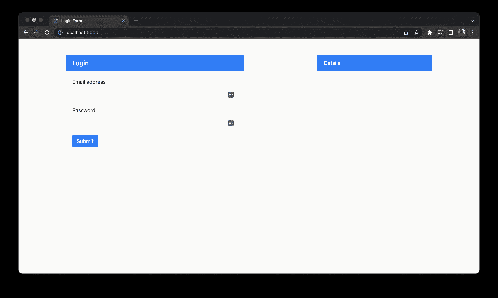
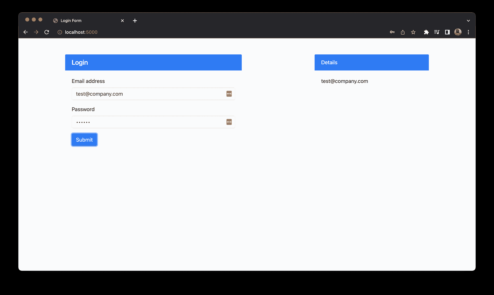
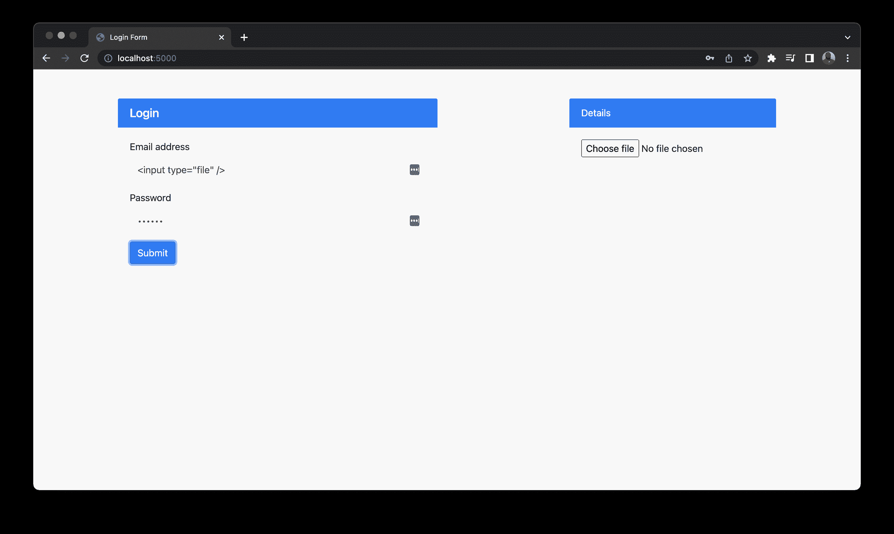
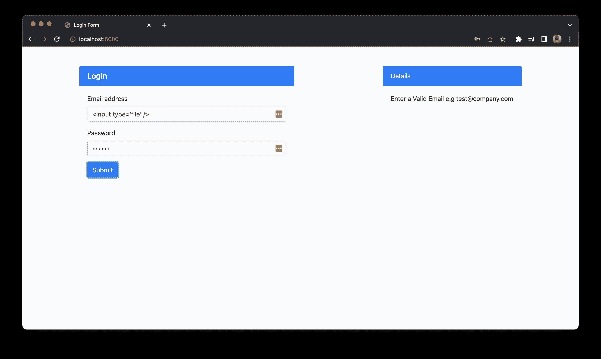
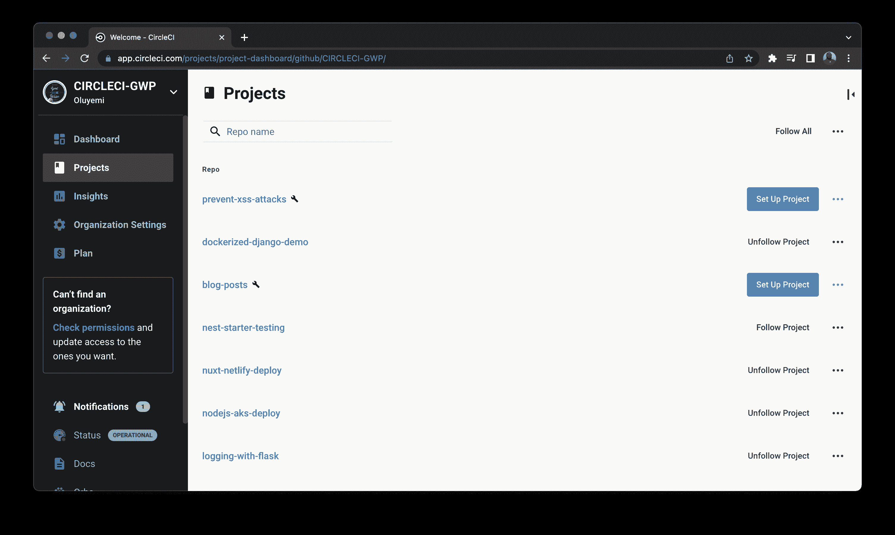
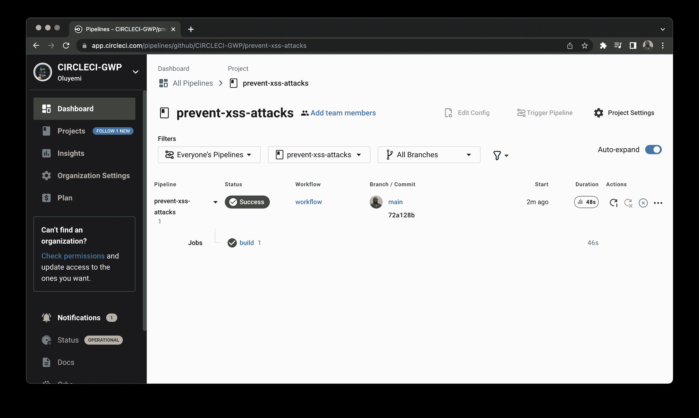
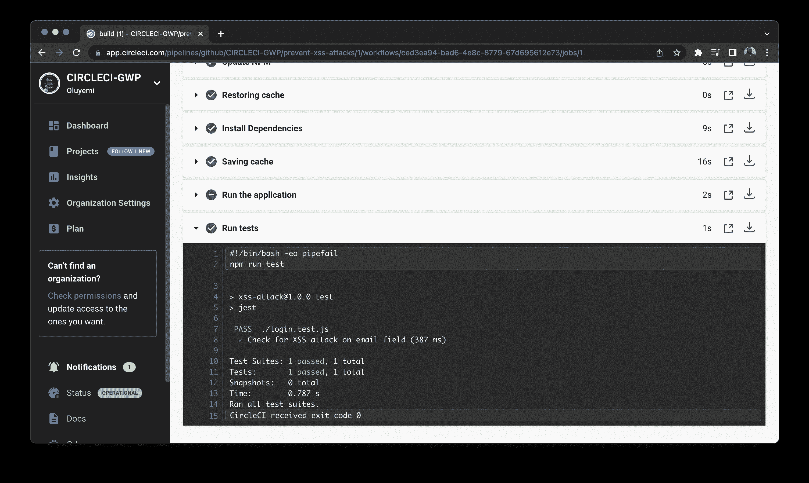

# 通过浏览器测试防止 XSS 攻击

> 原文：<https://circleci.com/blog/xss-attacks/>

> 本教程涵盖:
> 
> 1.  手动测试 XSS 攻击
> 2.  修复 XSS 漏洞
> 3.  自动化测试过程

网络安全是一场永无止境的战斗。您可以在短短几分钟内启动一台服务器，下一分钟，就有人已经在试图入侵它了。这些攻击可以使用恶意机器人自动进行，也可以手动发起。恶意用户可能会将网站作为攻击目标，试图破坏您的网站或数据。[跨站点脚本(XSS)](https://owasp.org/www-community/attacks/xss/) 这只是你的站点容易受到的一种攻击。

在 XSS 攻击中，用户利用应用程序中数据入口点的漏洞。攻击将脚本代码注入表单字段或地址栏，并强制其运行恶意脚本。这些攻击可能导致敏感的 cookie 信息泄露，或者它们可以在您的网页上运行脚本，将外来元素注入您的页面。

在本教程中，您将学习并演示如何使用浏览器安全测试来防止此类 XSS 攻击。

## 先决条件

要完成本教程，需要做几件事:

1.  JavaScript 的基础知识
2.  安装在您系统上的 [Node.js](https://nodejs.org) (版本> = 11)
3.  一个[圆](https://circleci.com/)的账户
4.  GitHub 的一个账户

> 我们的教程是平台无关的，但是使用 CircleCI 作为例子。如果你没有 CircleCI 账号，请在 注册一个免费的 [**。**](https://circleci.com/signup/)

## 克隆和运行示例应用程序

首先，您需要克隆将被测试 XSS 攻击的演示应用程序。运行以下命令在您的系统上获取代码:

```
git clone --single-branch --branch base-project https://github.com/coderonfleek/xss-attacks.git prevent-xss-attacks 
```

一旦应用程序被克隆，进入项目的根目录(`cd prevent-xss-attacks`)并通过运行以下命令安装依赖项:

```
npm install 
```

完全安装完依赖项后，运行应用程序:

```
node server 
```

这将在`http://localhost:5000`启动应用服务器。在浏览器上导航到此 URL。



该页面由一个表单和一个用于在右侧显示信息的栏组成。当您填写表格并按 Enter 键时，您的电子邮件会出现在`Details`框中。



## 手动测试 XSS 攻击

当提交表单时，信息被提交到后台服务器上的一个端点(`/sendinfo`)。这个端点在一个`json`响应主体中发回电子邮件，然后被页面获取并显示在细节部分。显示电子邮件表明，在表单中输入的数据到达了后端，并被返回到页面。恶意用户可以通过在电子邮件字段中输入损坏的数据来轻松利用这一过程。例如，在电子邮件字段中输入文件的 HTML 标记，而不是输入有效的电子邮件:

```
<input type="file" /> 
```

填写密码字段并点击`Submit`。细节部分看起来很不一样。



输入的数据导致页面上显示一个新的 HTML 元素，即文件输入字段。这肯定是不想要的，如果它被很好地定位，可能是危险的。攻击者可以使用这种策略在表单中嵌入恶意数据(或脚本)。在表单中放置一个隐藏的输入字段可能会导致表单向您的服务器提交泄露的数据及其有效负载。这可能会导致严重的损坏并危及数据完整性。您会希望在有人利用之前发现这样的漏洞。一种有效的方法是通过浏览器测试。

## 安装 Jest 和木偶师

浏览器测试允许您像普通用户一样，通过与网页交互来运行测试。这允许您测试不同的数据输入场景，以找到并修复黑客可能试图利用的任何漏洞。

要设置自动化浏览器测试，您需要两个包。

*   Jest 将被用作测试套件的测试运行程序。
*   [木偶师](https://pptr.dev/)将用于编写浏览器测试。

通过运行以下命令安装这些软件包:

```
npm install --save-dev jest puppeteer 
```

安装了这些包之后，您现在可以开始为您的浏览器编写测试了。

## 为浏览器添加 XSS 测试

在本节中，您将编写一个测试套件来测试您的浏览器，以检测电子邮件输入漏洞。如果发现漏洞，测试将失败。失败的 XXS 测试表明您的电子邮件字段中存在漏洞，需要解决以避免攻击。

您将要编写的测试将执行与您在上一节中手动执行的攻击相同的攻击。创建测试文件`login.test.js`并输入以下代码:

```
const puppeteer = require("puppeteer");

test("Check for XSS attack on email field", async () => {
  const browser = await puppeteer.launch();
  try {
    const page = await browser.newPage();

    await page.goto("http://localhost:5000");

    await page.type("#userEmail", '<input type="file" />');
    await page.type("#userPassword", "password");
    await page.click("#submitButton");

    let emailContainer = await page.$("#infoDisplay");
    let value = await emailContainer.evaluate((el) => el.textContent);

    expect(value.length).toBeGreaterThan(0);
  } finally {
    await browser.close();
  }
}, 120000); 
```

在上面的测试文件中，`Check for XSS attack on email field`测试用例使用 Puppeteer 启动一个浏览器实例，然后该实例在 URL `http://localhost:5000`加载应用程序。应用程序运行后，电子邮件字段将使用输入文件标记填充。密码字段也已填写。单击`Submit`按钮，一旦提交了表单，就会在显示部分检查长度大于零的字符串(非文本 HTML 元素将返回长度为零的字符串)。一旦测试运行完毕，关闭浏览器。

现在，您已经有了检查攻击的 XSS 测试。为了完成测试设置，向`package.json`文件添加一个`test`脚本:

```
...
"scripts" : {
    "test" : "jest"
} 
```

使用`node server.js`确保您的应用程序当前正在运行，并运行测试文件:

```
npm run test 
```

这个测试将会失败，因为我们已经知道，漏洞确实存在。以下是 CLI 输出显示的内容。

```
 FAIL  ./login.test.js (5.475 s)
  ✕ Check for XSS attack on email field (2096 ms)

  ● Check for XSS attack on email field

    expect(received).toBeGreaterThan(expected)

    Expected: > 0
    Received:   0

      23 |   let value = await emailContainer.evaluate(el => el.textContent);
      24 |
    > 25 |   expect(value.length).toBeGreaterThan(0);
         |                        ^
      26 |
      27 | }, 120000);
      28 |

      at Object.<anonymous> (login.test.js:25:24)

Test Suites: 1 failed, 1 total
Tests:       1 failed, 1 total
Snapshots:   0 total
Time:        14.582 s
Ran all test suites. 
```

## 修复 XSS 漏洞

解决 XSS 漏洞的一个有效方法是，确保在对数据进行任何形式的处理之前，对输入到应用程序中的数据进行验证。数据验证可以在应用程序的客户端和服务器端完成。对于这个应用程序，您将验证在服务器端收到的电子邮件，以确保只有安全的文本返回给客户端。

找到`server.js`。`/sendinfo`端点显示电子邮件未经验证就被返回给客户端:

```
app.post("/sendinfo", (req, res) => {
  const email = req.body.email;

  res.send({ email });
}); 
```

现在，用下面的代码替换这个端点:

```
app.post("/sendinfo", (req, res) => {
  let email = req.body.email;

  if (!validEmail(email)) {
    email = "Enter a Valid Email e.g test@company.com";
  }

  res.send({ email });
});

function validEmail(mail) {
  return /^[a-zA-Z0-9.!#$%&'*+/=?^_`{|}~-]+@[a-zA-Z0-9-]+(?:\.[a-zA-Z0-9-]+)*$/.test(
    mail
  );
} 
```

在新代码中，`validEmail`函数接收一个字符串，并根据该字符串是否是有效的电子邮件返回一个布尔值。然后在`/sendinfo`中使用这个函数来验证客户端发送的电子邮件。如果电子邮件有效，它将被返回给客户端。如果无效，则会发送一条消息，提示用户输入有效的电子邮件。

随着`server.js`代码的改变，通过杀死它(`Ctrl + C`)并使用`node server.js`重新启动来重新启动应用程序。您可以通过刷新浏览器并重试攻击来首先进行手动测试。这将显示一条验证消息，而不是输入字段。



现在用命令`npm run test`运行测试套件。测试将通过，如控制台输出所示。

```
 PASS  ./login.test.js (6.953 s)
  ✓ Check for XSS attack on email field (3887 ms)

Test Suites: 1 passed, 1 total
Tests:       1 passed, 1 total
Snapshots:   0 total
Time:        16.258 s
Ran all test suites. 
```

## 自动化安全测试过程

本练习的主要目的是自动化浏览器测试过程，以便可以在 XSS 漏洞进入您的生产代码之前发现它们。

要开始这个过程，导航到项目的根目录，创建一个名为`.circleci`的新文件夹。接下来，在其中创建一个新的`config.yml`文件。打开新创建的文件，并使用以下内容:

```
version: 2.1
orbs:
  node: circleci/node@5.0.2
jobs:
  build:
    working_directory: ~/repo
    docker:
      - image: cimg/node:18.2.0-browsers
    steps:
      - checkout
      - node/install-packages:
          cache-path: ~/project/node_modules
          override-ci-command: npm install
      - run:
          name: Run the application
          command: node server.js
          background: true
      - run:
          name: Run tests
          command: npm run test 
```

该脚本拉入 [Node.js Orb](https://circleci.com/developer/orbs/orb/circleci/node) 来安装 Node 及其包管理器。然后，它获取所需的映像，安装并缓存依赖项。为了确保浏览器测试运行，应用程序在后台进程中启动。一旦应用程序启动并运行，就会运行`test`脚本来测试它。

提交对项目的所有更改并[推送到您的远程 GitHub 存储库](https://circleci.com/blog/pushing-a-project-to-github/)。

接下来，转到 CircleCI 仪表板上的`Projects`页面添加项目。



点击**设置项目**开始设置项目。CircleCI 将检测项目中的配置文件。请随意检查并确保选择了配置文件所在的分支。

现在，点击**设置项目**继续。这将自动触发构建管道并成功构建。



点击 **build** 查看测试细节。



## 结论

将安全检查内置到您的构建过程中会为您的代码增加很多价值。代码能够工作并且没有错误是不够的；您还必须确保它不会受到损害。像这样的安全驱动的开发过程可以扩展到代码中涉及用户交互的其他部分，以防止恶意用户利用代码中的漏洞。鼓励您的团队成员在他们的代码中也使用这些步骤来防止 XSS 攻击。

编码快乐！

* * *

Fikayo Adepoju 是 LinkedIn Learning(Lynda.com)的作者、全栈开发人员、技术作者和技术内容创建者，精通 Web 和移动技术以及 DevOps，拥有 10 多年开发可扩展分布式应用程序的经验。他为 CircleCI、Twilio、Auth0 和 New Stack 博客撰写了 40 多篇文章，并且在他的个人媒体页面上，他喜欢与尽可能多的从中受益的开发人员分享他的知识。你也可以在 Udemy 上查看他的视频课程。

[阅读 Fikayo Adepoju 的更多帖子](/blog/author/fikayo-adepoju/)