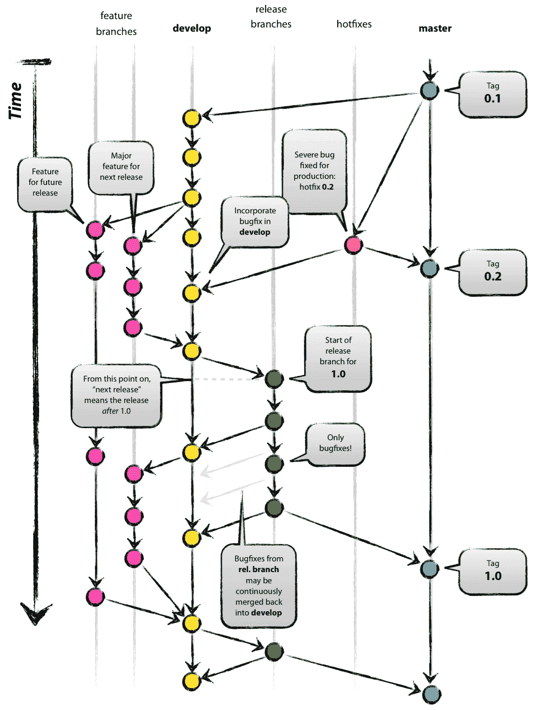
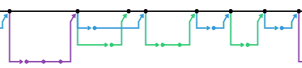

# 您的 VCS 分支模式如何影响您的交付节奏| CircleCI

> 原文：<https://circleci.com/blog/you-are-what-you-git-how-your-vcs-branching-model-affects-your-delivery-cadence/>

软件工程师的道路是不断学习的道路。我们学习从概念和过程到语言和工具的东西。一旦我们看到它们起作用，我们就把它们加入我们的武器库，成为我们的实践。

在加入 CircleCI 之前，我多年的经验让我相信，我是一名工程师，对工艺的技术方面以及被认为是良好的实践有着深刻的理解。CircleCI 告诉我，我还有很多东西要学。

在 CircleCI，我的团队使用一种短暂的分支模型进行软件开发。虽然这种策略与我曾经认为的开发软件的“正确”方式背道而驰，但在这篇文章中，我将描述在实践中看到它是如何教会我接受它的。

## 我们的模型

最流行的分支模型是 [GitFlow](https://nvie.com/posts/a-successful-git-branching-model/) 。出于本文的目的，我将其简化为:

*   使用一个分支进行开发工作。
*   使用一个或多个分支或标记来表示不同级别的生产就绪性、修补程序等。
*   *逐渐地*将代码从特性分支转移到开发，然后随着特性的测试和准备就绪，转移到生产。

作者:文森特·德里森

原始博客帖子

[here](https://nvie.com/posts/a-successful-git-branching-model/)

。

这是我熟悉的分支模型。这是我在每个项目、每个公司都经历过的，它对我很有帮助。或许有一些细微的变化，我认为每个人都是这样做的。

那么，当到达 CircleCI 时，发现没有登台环境，没有 hotfixes 分支，master 上的内容直接用于生产，这是多么令人惊讶啊。是的，在我们处理票据时，我们创建了一个分支。但这种分支往往持续不到一天。它可能只是部分地实现了一个特性(受特性标志的保护，或者只是用户不可访问)，被审查，并被合并。然后投入生产。还是那句话，没有暂存环境！没有 QA 团队来检查工作是否正常！没有与你的冲刺同步的发布窗口(因为，剧透，没有冲刺)！

CircleCI 的分支模式:一个主分支，许多非常短暂的“子功能”分支。

## 为什么是这种模式？

我们这样做的原因与 CircleCI 的使命有很大关系，即授权团队快速交付价值。您使用的 VCS 分支模型对您的交付节奏有很大的影响。我们的模型与 CI/CD 最佳实践配合得非常好。我们的流程的特征，比如短生命周期的分支，快速的部署周期，[已经被证明与高绩效团队](https://circleci.com/resources/data-driven-ci/)相关联。

## 你如何能做它

如果你像我一样习惯于更传统的流程，这可能听起来很可怕。我喜欢认为我写了好代码，但是软件有 bugs 那是不可避免的。CircleCI 是成千上万开发人员通往生产之路的关键部分。这意味着很大的责任。如果我将一个 bug 推向生产，却没有 QA 团队来抓它怎么办？如果我破坏了一个特征怎么办？如果我把整个事情搞糟了呢？

我担心我的同事似乎并不关心。他们是否比我更有经验，以至于相信他们的代码是完美的？他们只是天真吗？

CircleCI 有令人难以置信的天才。然而，对软件的信心并不是雇佣神话般的 10 倍工程师的结果。是每天工作的结果，让我们的[持续集成](https://circleci.com/continuous-integration/)管道更好更可靠。以下是我们实现这一目标的方法:

*   测试，[以其多种形式](https://circleci.com/blog/testing-methods-all-developers-should-know/)，从单元测试和安全测试扩展到负载和压力测试。
*   任何开发者都可以使用 canaries 进行部分部署。这包含了错误代码对很小一部分流量的爆炸半径。
*   我们实施平均恢复时间减少措施，包括监视器和有意义的警报、诊断工具以及快速回滚(或向前)的方法。
*   进行无过失事故事后分析是为了建立故障模式并最大限度地减少未来的再次发生，为该策略提供反馈。
*   我们时刻关注着平均故障时间和恢复时间之间、可靠性和敏捷性之间的平衡。

总有改进的空间，但是这个策略提供了难以置信的价值。如果使用像 GitFlow 这样的“更安全”的流程，或者如果我们有一个专门的 QA 团队，我们将无法快速交付价值。

## 结论

我加入 CircleCI 已经两年多了。虽然我承认没有适合所有团队的 VCS 分支模型，但我很高兴得知 CircleCI 选择的选项存在，并体验了它如何影响我们的交付节奏和我们围绕产品建立的工程文化。

当每个开发人员都对生产中的东西负责，并且把每一个提交都当作一个发布候选，这就培养了一种投资于可持续软件质量的文化，对他们自己和他们的队友都有好处。我们一起建造这个。