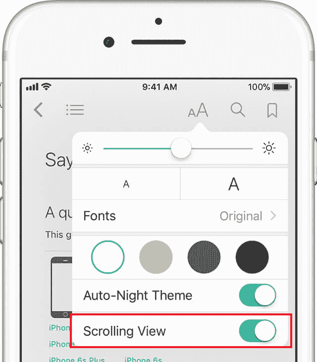

### 一则小建议

我建议在 iBooks 中阅读本书时开启滚动模式。  本书中有大量图片和长篇代码，  因此随机分页的显示效果并不是很好。

### 一则小建议

如果你的电子阅读器支持滚动模式，  我建议开启此功能。

本书中有大量图片和长篇代码，  因此随机分页的显示效果并不是太好。

# 如何阅读本书

本书对  “四人组  （Go­F）”  于 1994 年提出的 22 个经典设计模式进行了详细说明。

每章都会讨论一个特定的模式。  因此你可以按照顺序从头到尾进行阅读，  也可以挑选自己感兴趣的模式进行阅读。

许多模式之间存在着相互联系，  你可以使用大量的链接在主题间跳转。  每章末尾会列出与当前模式相关的其他模式的链接列表。  如果你看到了一个此前从未见过的模式名称的话，  只需接着往下读即可——其内容将会在后续章节中出现。

设计模式是通用的。  因此本书中的所有示例代码都以伪代码的形式呈现，  而不会出现特定编程语言的内容。

学习模式之前，  你可以复习面向对象程序设计的关键术语来回忆相关知识。  这一章还会介绍 UML 图的基础知识，  这些知识非常实用，  因为书中会有许多 UML 图。  当然，  如果你已经知晓了所有这些内容的话，  也可以直接开始学习设计模式。