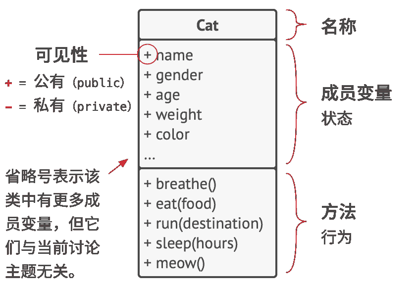

# 面向对象程序设计基础

**面向对象程序设计**  （Object-Ori­ent­ed Pro­gram­ming，  缩写为 OOP）  是一种范式，  其基本理念是将数据块及与数据相关的行为封装成为特殊的、  名为**对象**的实体，  同时对象实体的生成工作则是基于程序员给出的一系列  “蓝图”，  这些  “蓝图”  就是**类**。

### 对象和类

你喜欢猫吗？  希望你喜欢，  因为我将用和猫有关的各种示例来解释面向对象程序设计的概念。

这是一个 UML 类图。  你将在本书中看到许多类似的图示。

> 将图表中的类和成员名称保留为英文是一种标准做法，  这和在真实代码中一样。  但是，  注释和备注也可以用中文编写。
> 
> 在本书中，  我会用中文指代类名，  即使它们在图表或代码中以英文的形式出现  （就像我处理  `猫`类那样）。  我希望大家在读这本书时，  就像和我进行一场朋友间的谈话。  我不希望每次要引用某个类时都会让大家碰到生词。

假如你有一只名为卡卡的猫。  卡卡是一个对象，  也是  `猫`Cat 这个类的一个实例。  每只猫都有许多基本属性：  ​  `名字`name 、  ​  `性别`sex 、  ​  `年龄`age 、  ​  `体重`weight 、  ​  `毛色`color 和最爱的食物等。  这些都是该类的**成员变量**。

所有猫都有相似的行为：  ​  `它们会呼吸`breathe 、  ​  `进食`eat 、  ​  `奔跑`run 、  ​  `睡觉`sleep 和  `喵喵叫`meow 。  这些都是该类的**方法**。  成员变量和方法可以统称为类的*成员*。  存储在对象成员变量中的数据通常被称为*状态*，  对象中的所有方法则定义了其*行为*。

对象是类的实例。

你朋友的猫  “露露”  也是  `猫`这个类的一个实例。  它拥有与  “卡卡”  相同的一组属性。  不同之处在于这些属性的值：  她的性别是  “女孩”；  她的毛色不同；  体重较轻。  因此*类*就像是定义*对象*结构的蓝图，  而对象则是类的具体实例。

### 类层次结构

相信大家都已经了解单独的一个类的结构了，  但一个实际的程序显然会包含不止一个类。  一些类可能会组织起来形成**类层次结构**。  让我们了解一下这是什么意思。

假如你的邻居有一只名为  “福福”  的狗。  其实狗和猫有很多相同的地方：  它们都有名字、  性别、  年龄和毛色等属性。  狗和猫一样可以呼吸、  睡觉和奔跑。  因此似乎我们可定义一个  `动物`Ani­mal 基类来列出它们所共有的属性和行为。

类层次结构的 UML 图。  图中所有的类都是  `动物`类层次结构中的一部分。

我们刚刚定义的父类被称为**超类**。  继承它的类被称为**子类**。  子类会继承其父类的状态和行为，  其中只需定义不同于父类的属性或行为。  因此，  ​  `猫`类将包含  `meow`喵喵叫方法，  而  `狗`Dog 类则将包含  `bark`汪汪叫方法。

假如我们接到一个相关的业务需求，  那就可以继续为所有活的  `生物体`Organ­isms 抽取出一个更通用的类，  并将其作为  `动物`和  `植物`Plants 类的超类。  这种由各种类组成的金字塔就是**层次结构**。  在这个层次结构中，  ​  `猫`类将继承  `动物`和  `生物体`类的全部内容。

如果展示类之间的关系比展示其内容更重要的话，  那可对 UML 图中的类进行简化。

子类可以对从父类中继承而来的方法的行为进行重写。  子类可以完全替换默认行为，  也可以仅提供额外内容来对其进行加强。