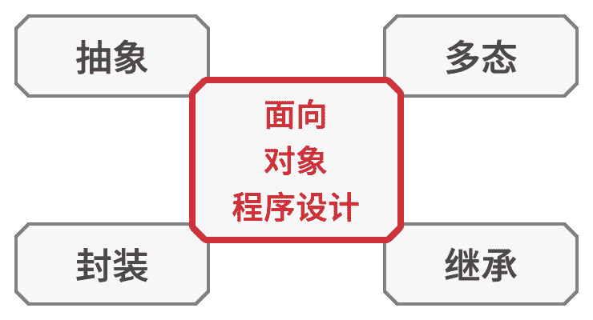
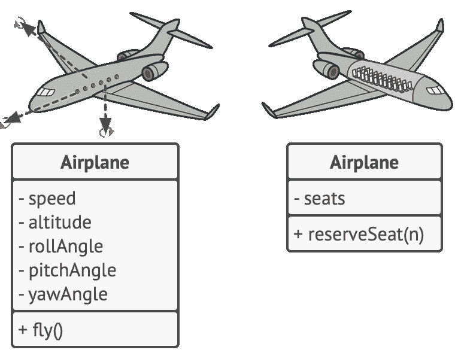
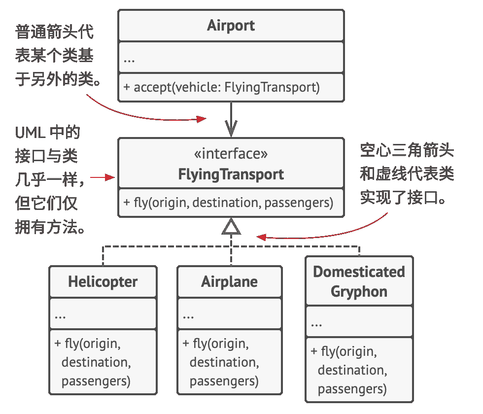
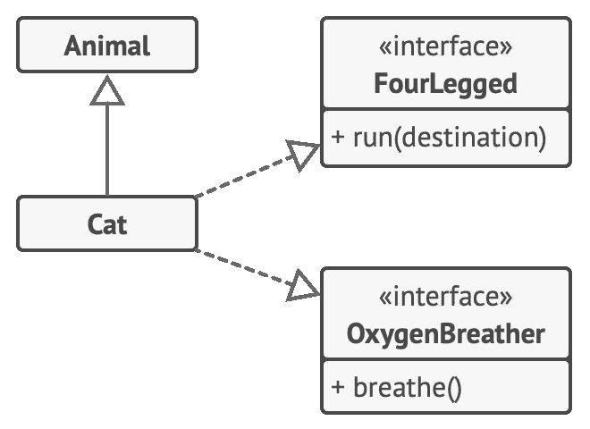
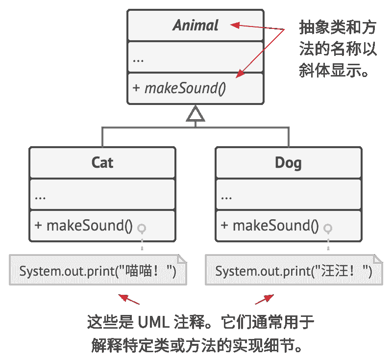

# 面向对象程序设计基础

面向对象程序设计的四个基本概念使其区别于其他程序设计范式。

### 抽象

当使用面向对象程序设计的理念开发一款程序时，  你会将大部分时间用于根据真实世界对象来设计程序中的对象。  但是，  程序中的对象并不需要能够百分之百准确地反映其原型  （极少情况下才需要做到这一点）。  实际上，  你的对象只需*模拟*真实对象的特定属性和行为即可，  其他内容可以忽略。

例如，  飞行模拟器和航班预订程序中都可能会包含一个  `飞机`Air­plane 类。  但是前者需包含与实际飞行相关的详细信息，  而后者则只关心座位图和哪些座位可供预订。

同一个真实世界对象的不同模型。

*抽象*是一种反映真实世界对象或现象中特定内容的模型，  它能高精度地反映所有与特定内容相关的详细信息，  同时忽略其他内容。

### 封装

如果想要启动一辆车的发动机，  你只需转动钥匙或按下按钮即可，  无需打开引擎盖手动接线、  转动曲轴和气缸并启动发动机的动力循环。  这些细节都隐藏在引擎盖下，  你只会看到一些简单的接口：  启动开关、  方向盘和一些踏板。  该示例讲述了什么是对象的**接口**——它是对象的公有部分，  能够同其他对象进行交互。

*封装*是指一个对象对其他对象隐藏其部分状态和行为，  而仅向程序其他部分暴露有限的接口的能力。

*封装*某个内容意味着使用关键字  `private`私有来对其进行修饰，  这样仅有其所在类中的方法才能访问这些内容。  还有一种限制程度较小的关键字  `protected`保护 ，  其所修饰的对象仅允许父类访问其类中的成员。

绝大部分编程语言的接口和抽象类  （或方法）  都基于抽象和封装的概念。  在现代面向对象的编程语言中，  接口机制  （通常使用  `interface`或  `protocol`关键字来声明）  允许你定义对象之间的交互协议。  这也是接口仅关心对象行为，  以及你不能在接口中声明成员变量的原因之一。

> 由于*接口*  （inter­face）  这个词代表对象的公有部分，  而在绝大部分编程语言中又有  `interface`类型，  因此很容易造成混淆。  在这里我将对此进行说明。

假如你的  `航空运输`Fly­ing­Trans­port 接口中有一个  `fly­(origin, destination, passengers)`方法  （即以起点、  终点以及乘客为参数的飞行方法）。  在设计航空运输模拟器时，  你可以对  `机场`Air­port 类做出限制，  使其仅与实现了  `航空运输`接口的对象进行交互。  此后，  你可以确保传递给机场对象的任何对象——无论是  `飞机` 、  ​  `直升机`Heli­copter 还是可怕的  `家养狮鹫`Domes­ti­cat­ed­Gryphon ——都能到达或离开这种类型的机场。

多个类实现一个接口的 UML 图。

你可以任何方式更改这些类中  `fly`方法的实现方式。  只要方法签名与接口中的声明保持一致，  那么所有  `机场`类的实例都能与飞行对象进行交互。

### 继承

*继承*是指在根据已有类创建新类的能力。  继承最主要的好处是代码复用。  如果你想要创建的类与已有的类差异不大，  那也没必要重复编写相同的代码。  你只需扩展已有的类并将额外功能放入生成的子类  （它会继承父类的成员变量和方法）  中即可。

使用继承后，  子类将拥有与其父类相同的接口。  如果父类中声明了某个方法，  那么你将无法在子类中隐藏该方法。  你还必须实现所有的抽象方法，  即使它们对于你的子类而言没有意义。

继承单个类和同时实现多个接口的 UML 图。

在绝大多数编程语言中，  子类仅能对一个父类进行扩展。  另一方面，  任何类都可以同时实现多个接口。  但是正如我之前提到的那样，  如果父类实现了某个接口，  那么其所有子类都必须实现该接口。

### 多态

让我们看一些动物的例子。  绝大部分  `动物`Ani­mals 可以发出声音。  我们需要所有子类都重写基类的  `make­Sound`发出声音方法，  让每个子类都发出正确的声音，  因此我们可以马上将其声明为*抽象*。  这让我们得以忽略父类中该方法的所有默认实现，  从而强制要求所有子类自行提供该方法的实现。

假如你将几只猫和狗放入一个大袋子中。  然后，  我们闭上眼睛，  将动物一个一个地从袋中取出。  我们并不知道自己取出的是何种动物。  但如果我们好好地摸摸它们的话，  它就会根据自己的具体类发出特殊的欢快叫声。

bag = [new Cat(), new Dog()];
foreach (Animal a : bag)
  a.makeSound()
// 喵喵！
// 汪汪！

程序并不知道  `a`变量中所包含的对象的具体类型，  但幸亏有被称为*多态*的特殊机制，  程序可以追踪对象的子类并调用其方法，  从而执行恰当的行为。

*多态*是指程序能够检测对象所属的实际类，  并在当前上下文不知道其真实类型的情况下调用其实现的能力。

你还可将多态看作是一个对象  “假扮”  为其他东西  （通常是其扩展的类或实现的接口）  的能力。  在我们的示例中，  袋中的狗和猫就相当于是假扮成了一般的动物。