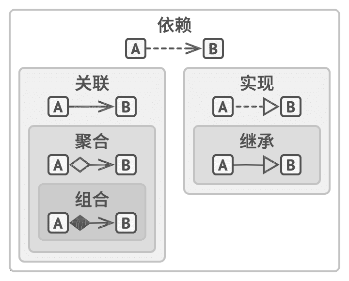

# 对象之间的关系

除了之前我们已见到的*继承*和*实现*之外，  对象之间还有其他我们尚未提及的关系。

### 依赖

UML 图中的依赖。  教授依赖于课程资料。

*依赖*是类之间最基础的、  也是最微弱的关系类型。  如果修改一个类的定义可能会造成另一个类的变化，  那么这两个类之间就存在依赖关系。  当你在代码中使用具体类的名称时，  通常意味着存在依赖关系。  例如在指定方法签名类型时，  或是通过调用构造函数对对象进行初始化时等。  通过让代码依赖接口或抽象类  （而不是具体类），  你可以降低其依赖程度。

通常情况下，  UML 图不会展示所有依赖——它们在真实代码中的数量太多了。  为了不让依赖关系破坏 UML 图，  你必须对其进行精心选择，  仅展示那些对于沟通你的想法来说重要的依赖关系。

### 关联

UML 图中的关联。  教授与学生进行交流。

*关联*是一个对象使用另一对象或与另一对象进行交互的关系。  在 UML 图中，  关联关系用起始于一个对象并指向其所使用的对象的简单箭头来表示。  顺带一提，  双向关联也是完全正常的，  这种情况就用双向箭头来表示。  关联可视为一种特殊类型的依赖，  即一个对象总是拥有访问与其交互的对象的权限，  而简单的依赖关系并不会在对象间建立永久性的联系。

一般来说，  你可以使用关联关系来表示类似于类成员变量的东西。  这个关系将一直存在，  因此你总能通过  “订单”  来获取其  “顾客”。  但是它并非一定是成员变量。  如果你根据接口来创建类，  它也可以表示为一个可返回  “订单”  的  “顾客”  的方法。

为了巩固你对关联和依赖之间区别的理解，  下面让我们来看一个两者结合的示例。  假设我们有一个名为  `教授`   （Pro­fes­sor）  的类：

class Professor is
  field Student student
  // ...
  method teach(Course c) is
    // ...
    this.student.remember(c.getKnowledge())

让我们来看看  `teach`   （教授知识）  方法，  它将接收一个来自  `课程`   （Course）  类的参数。  如果有人修改了  `课程`类的  `get­Knowledge`   （获取知识）  方法  （修改方法名或添加一些必须的参数等），  代码将会崩溃。  这就是依赖关系。

现在，  让我们来看看名为  `student`   （学生）  的成员变量，  以及如何在  `teach`方法中使用该变量。  我们可以肯定  `学生`   （Stu­dent）  类是  `教授`类的依赖：  如果  `remember`   （记住）  方法被修改，  ​  `教授`的代码也将崩溃。  但由于  `教授`的所有方法总能访问  `student`成员变量，  所以  `学生`类就不仅是依赖，  而也是关联了。

### 聚合

UML 图中的聚合。  院系包含教授。

*聚合*是一种特殊类型的关联，  用于表示多个对象之间的  “一对多”、  ​  “多对多”  或  “整体对部分”  的关系。  通常在聚合关系中，  一个对象  “拥有”  一组其他对象，  并扮演着容器或集合的角色。  组件可以独立于容器存在，  也可以同时连接多个容器。  在 UML 图中，  聚合关系使用一端是空心菱形，  另一端指向组件的箭头来表示。

尽管我们在此讨论的是对象之间的关系，  但请记住 UML 图表示的是*类*之间的关系。  这意味着大学对象可能是由多个院系构成的，  即便图中的每个实体只用一个  “方框”  来表示。  你可以使用 UML 符号在关系两端标明数量，  但如果可从上下文明确数量的话，  则可以省略此类标注。

### 组合

UML 图中的组合。  大学由院系构成。

*组合*是一种特殊类型的聚合，  其中一个对象由一个或多个其他对象实例构成。  组合与其他关系的区别在于组件仅能作为容器的一部分存在。  在 UML 图中，  组合与聚合关系的符号相同，  但箭头起始处的菱形是实心的。

注意，  许多人常常在实际想说聚合和组合时使用  “组合”  这个术语。  其中最恶名昭彰的例子是著名的  “组合优于继承”  原则。  这并不是因为人们不清楚它们之间的差别，  而是因为  “组合  （例如  ‘对象组合’）”  说起来更顺口。

### 总结

现在相信你已对对象间所有的关系类型有所了解了，  那么就让我们来看看它们之间的联系吧，  希望这能解答  “聚合与组合有何区别？”  或  “继承是不是一种依赖关系？”  等问题。

对象和类之间的关系：  从弱到强。

*   **依赖**：  对类 B 进行修改会影响到类 A 。
*   **关联**：  对象 A 知道对象 B。  类 A 依赖于类 B。
*   **聚合**：  对象 A 知道对象 B 且由 B 构成。  类 A 依赖于类 B。
*   **组合**：  对象 A 知道对象 B、  由 B 构成而且管理着 B 的生命周期。  类 A 依赖于类 B。
*   **实现**：  类 A 定义的方法由接口 B 声明。  对象 A 可被视为对象 B。  类 A 依赖于类 B。
*   **继承**：  类 A 继承类 B 的接口和实现，  但是可以对其进行扩展。  对象 A 可被视为对象 B。  类 A 依赖于类 B。