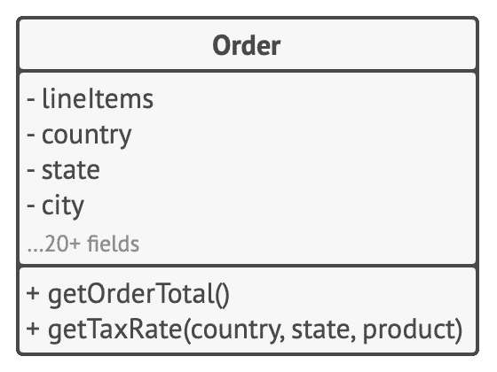
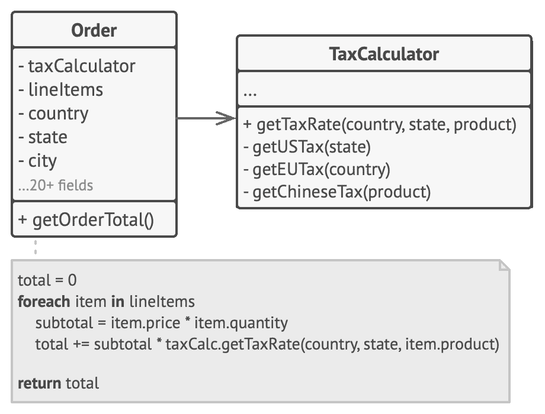

## 封装变化的内容

> 找到程序中的变化内容并将其与不变的内容区分开。

该原则的主要目的是将变更造成的影响最小化。

假设你的程序是一艘船，  变更就是徘徊在水下的可怕水雷。  如果船撞上水雷就会沉没。

了解到这些情况后，  你可将船体分隔为独立的隔间，  并对其进行安全的密封，  以使得任何损坏都会被限制在隔间范围内。  现在，  即使船撞上水雷也不会沉没了。

你可用同样的方式将程序的变化部分放入独立的模块中，  保护其他代码不受负面影响。  最终，  你只需花较少时间就能让程序恢复正常工作，  或是实现并测试修改的内容。  你在修改程序上所花的时间越少，  就会有更多时间来实现功能。

### 方法层面的封装

假如你正在开发一个电子商务网站。  代码中某处有一个  `get­Order­Total`获取订单总额方法，  用于计算订单的总价  （包括税金在内）。

我们预计在未来可能会修改与税金相关的代码。  税率会根据客户居住的国家/地区、  州/省甚至城市而有所不同；  而且一段时间后，  实际的计算公式可能会由于新的法律或规定而修改。  因此，  你将需要经常性地修改  `get­Order­Total`方法。  不过仔细看看方法名称，  连它都在暗示其不关心税金是*如何*计算出来的。

method getOrderTotal(order) is
  total = 0
  foreach item in order.lineItems
    total += item.price * item.quantity
  if (order.country == "US")
    total += total * 0.07 // 美国营业税
  else if (order.country == "EU"):
    total += total * 0.20 // 欧洲增值税
  return total

**修改前：** 税率计算代码和方法的其他代码混杂在一起。

你可以将计算税金的逻辑抽取到一个单独的方法中，  并对原始方法隐藏该逻辑。

method getOrderTotal(order) is
  total = 0
  foreach item in order.lineItems
    total += item.price * item.quantity
  total += total * getTaxRate(order.country)
  return total
method getTaxRate(country) is
  if (country == "US")
    return 0.07 // 美国营业税
  else if (country == "EU")
    return 0.20 // 欧洲增值税
  else
    return 0

**修改后：** 你可通过调用指定方法获取税率。

这样税率相关的修改就被隔离在单个方法内了。  此外，  如果税率计算逻辑变得过于复杂，  你也能更方便地将其移动到独立的类中。

### 类层面的封装

一段时间后，  你可能会在一个以前完成简单工作的方法中添加越来越多的职责。  新增行为通常还会带来助手成员变量和方法，  最终使得包含接纳它们的类的主要职责变得模糊。  将所有这些内容抽取到一个新类中会让程序更加清晰和简洁。

**修改前：** 在  `订单`Order 类中计算税金。

`订单`类的对象将所有与税金相关的工作委派给一个专门负责的特殊对象。

**修改后：** 对订单类隐藏税金计算。