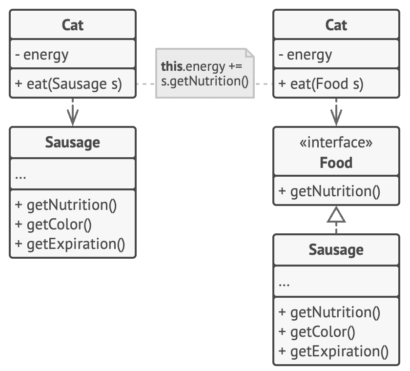
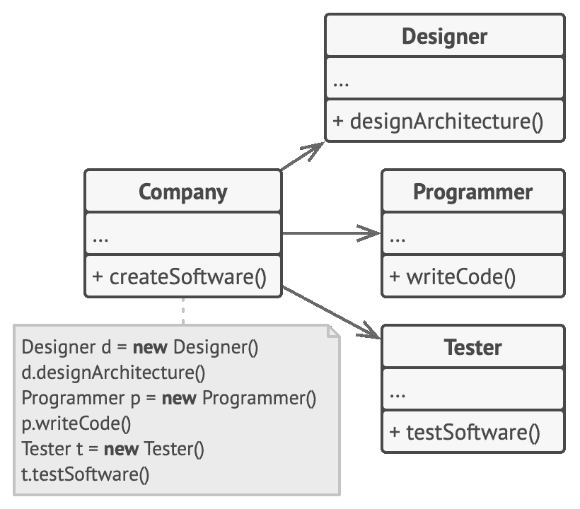
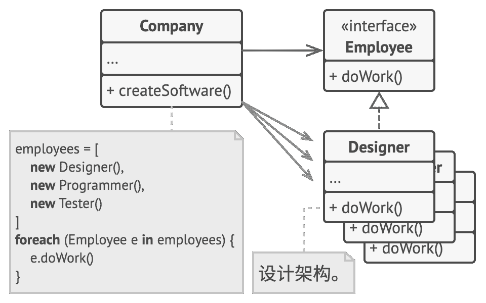
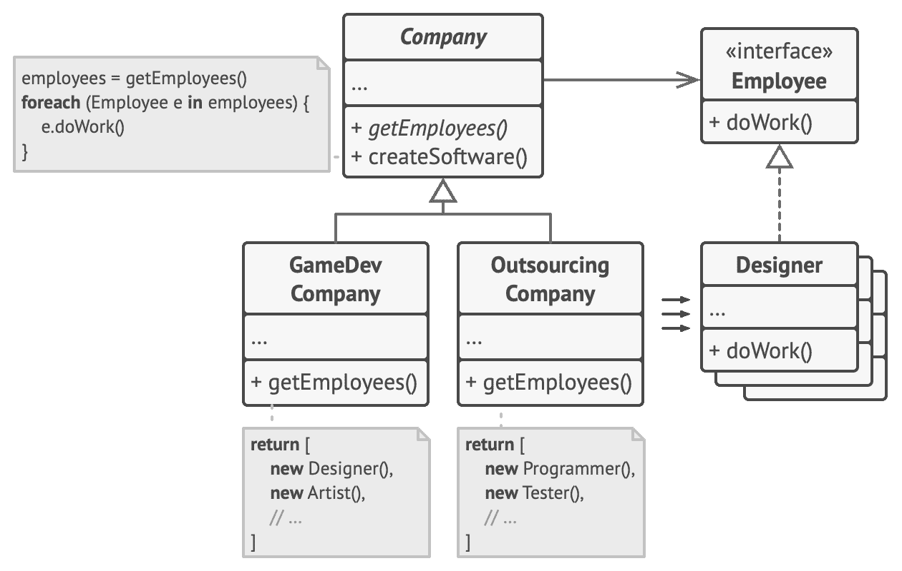

## 面向接口进行开发，
而不是面向实现

> 面向接口进行开发，  而不是面向实现；  依赖于抽象类型，  而不是具体类。

如果无需修改已有代码就能轻松对类进行扩展，  那就可以说这样的设计是灵活的。  让我们再来看一个关于猫的例子，  看看这个说法是否正确：  一只可以吃任何食物的  `猫`Cat 要比只吃香肠的猫更加灵活。  无论如何你都可给第一只猫喂香肠，  因为香肠是  “任何食物”  的一个子集；  当然，  你也可以喂这只猫任何食物。

当你需要两个类进行合作时，  可以让其中一个类依赖于另一个类。  实话实说，  刚入行时我自己也常常这么做。  但是，  你可用另外一种更灵活的方式来设置对象之间的合作关系。

1.  确定一个对象对另一对象的确切需求：  它需执行哪些方法？
2.  在一个新的接口或抽象类中描述这些方法。
3.  让被依赖的类实现该接口。
4.  现在让有需求的类依赖于这个接口，  而不依赖于具体的类。  你仍可与原始类中的对象进行互动，  但现在其连接将会灵活得多。

抽取接口前后的对比。  右侧的代码要比左侧更加灵活，  但也更加复杂。

完成修改后，  你很可能没法马上看到任何好处；  相反，  代码会变得比以前更加复杂。  但如果你觉得这里可以是个不错的额外功能扩展点，  或者其他使用这些代码的用户希望在此进行扩展的话，  那就马上动手去做吧。

### 示例

让我们来看另一个例子，  它说明了通过接口与对象交互要比依赖于其具体类的好处更多。  假设你正在开发一款软件开发公司模拟器，  而且使用了不同的类来代表各种类型的雇员。

**修改前：** 所有类都紧密耦合。

刚开始时，  ​  `公司`Com­pa­ny 类与具体雇员类紧密耦合。  尽管各个雇员的实现不尽相同，  但我们还是可以归纳出几个与工作相关的方法，  并且将其抽取为所有雇员的通用接口。

此后，  我们可在  `公司`类内应用多态机制，  通过  `雇员`Employ­ee 接口来处理各类雇员对象。

**优化：** 多态机制能帮助我们简化代码，  但  `公司`类的其他部分仍然依赖于具体的雇员类。

`公司`类仍与雇员类相耦合，  这很糟糕，  因为如果引入包含其他类型雇员的公司类型的话，  我们就需要重写绝大部分的  `公司`类了，  不能复用其代码。

为了解决这个问题，  我们可以声明一个*抽象*方法来获取雇员。  每个具体公司都将以不同方式实现该方法，  从而创建自己所需的雇员。

**修改后：** `公司`类的主要方法独立于具体的雇员类。  雇员对象将在具体公司子类中创建。

修改后的  `公司`类将独立于各种雇员类。  现在你可以对该类进行扩展，  并在复用部分公司基类的情况下引入新的公司和雇员类型。  对公司基类进行扩展时无需修改任何依赖于基类的已有代码。

顺便提一句，  你刚刚目睹的就是设计模式的应用！  这就是*工厂方法*模式的一个示例。  不要担心，  稍后我们会对其进行详细讨论。