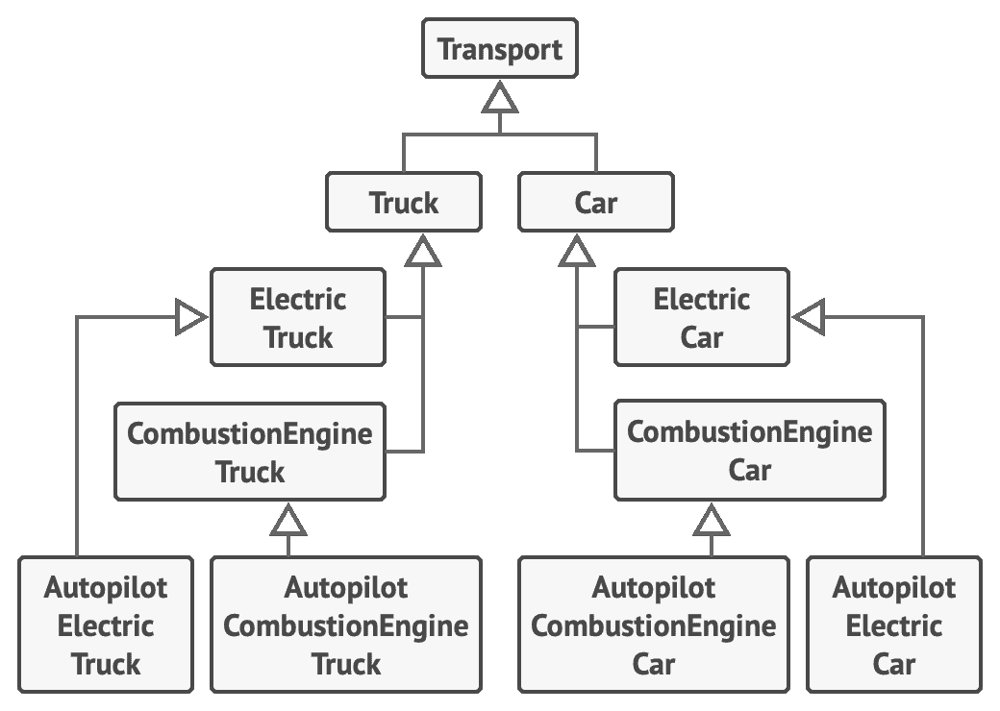
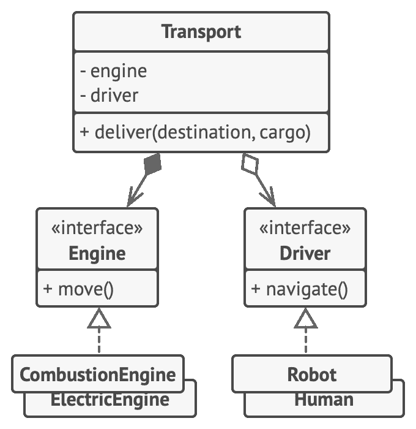

## 组合优于继承

继承可能是类之间最明显、  最简便的代码复用方式。  如果你有两个代码相同的类，  就可以为它们创建一个通用的基类，  然后将相似的代码移动到其中。  轻而易举！

不过，  继承这件事通常只有在程序中已包含大量类，  且修改任何东西都非常困难时才会引起关注。  下面就是此类问题的清单。

*   **子类不能减少超类的接口**。  你必须实现父类中所有的抽象方法，  即使它们没什么用。

*   **在重写方法时，  你需要确保新行为与其基类中的版本兼容**。  这一点很重要，  因为子类的所有对象都可能被传递给以超类对象为参数的任何代码，  相信你不会希望这些代码崩溃的。

*   **继承打破了超类的封装**，  因为子类拥有访问父类内部详细内容的权限。  此外还可能会有相反的情况出现，  那就是程序员为了进一步扩展的方便而让超类知晓子类的内部详细内容。

*   **子类与超类紧密耦合**。  超类中的任何修改都可能会破坏子类的功能。

*   **通过继承复用代码可能导致平行继承体系的产生**。  继承通常仅发生在一个维度中。  只要出现了两个以上的维度，  你就必须创建数量巨大的类组合，  从而使类层次结构膨胀到不可思议的程度。

*组合*是代替继承的一种方法。  继承代表类之间的  “是”  关系  （汽车**是**交通工具），  而组合则代表  “有”  关系  （汽车**有**一个引擎）。

必须一提的是，  这个原则也能应用于聚合  （一种更松弛的组合变体，  一个对象可引用另一个对象，  但并不管理其生命周期）。  例如：  一辆汽车上*有*司机，  但是司机也可能会使用另一辆汽车，  或者选择步行而*不使用汽车*。

### 示例

假如你需要为汽车制造商创建一个目录程序。  该公司同时生产  `汽车`Car 和  `卡车`Truck ，  车辆可能是  `电动车`Elec­tric 或  `汽油车`Com­bus­tion ；  所有车型都配备了  `手动控制`man­u­al con­trol 或  `自动驾驶`Autopi­lot 功能。

**继承：** 在多个维度上扩展一个类  （汽车类型 × 引擎类型 × 驾驶类型）  可能会导致子类组合的数量爆炸。

正如你所看到的，  每个额外参数都将使子类数量倍增。  子类中将有大量的重复代码，  因为子类不能同时继承两个类。

你可以使用组合来解决这个问题。  汽车对象可将行为委派给其他对象，  而不是自行实现。

还有一个好处是你可以在运行时对行为进行替换。  例如，  你可以通过重新为汽车对象分配一个不同的引擎对象来替换已连接至汽车的引擎。

**组合：** 将不同  “维度”  的功能抽取到各自的类层次结构中。

上述类的结构类似于我们稍后将在本书中讨论的*策略*模式。