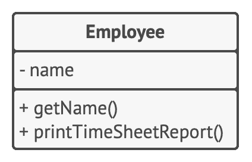
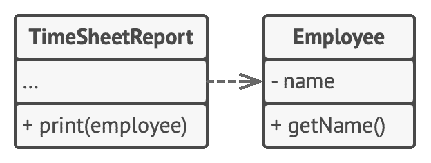

S 单一职责原则

## Single Respon­si­bil­i­ty Prin­ci­ple

> 修改一个类的原因只能有一个。

尽量让每个类只负责软件中的一个功能，  并将该功能完全封装  （你也可称之为*隐藏*）  在该类中。

这条原则的主要目的是减少复杂度。  你不需要费尽心机地去构思如何仅用 200 行代码来实现复杂设计，  实际上完全可以使用十几个清晰的方法。

当程序规模不断扩大、  变更不断增加后，  真实问题才会逐渐显现出来。  到了某个时候，  类会变得过于庞大，  以至于你无法记住其细节。  查找代码将变得非常缓慢，  你必须浏览整个类，  甚至整个程序才能找到需要的东西。  程序中实体的数量会让你的大脑堆栈过载，  你会感觉自己对代码失去了控制。

还有一点：  如果类负责的东西太多，  那么当其中任何一件事发生改变时，  你都必须对类进行修改。  而在进行修改时，  你就有可能改动类中自己并不希望改动的部分。

如果你开始感觉在同时关注程序特定方面的内容时有些困难的话，  请回忆单一职责原则并考虑现在是否应将某些类分割为几个部分。

### 示例

我们有几个理由来对  `雇员`Employ­ee 类进行修改。  第一个理由与该类的主要工作  （管理雇员数据）  有关。  但还有另一个理由：  时间表报告的格式可能会随着时间而改变，  从而使你需要对类中的代码进行修改。

**修改前：** 类中包含多个不同的行为。

解决该问题的方法是将与打印时间表报告相关的行为移动到一个单独的类中。  这个改变让你能将其他与报告相关的内容移动到一个新的类中。

**修改后：** 额外行为有了它们自己的类。