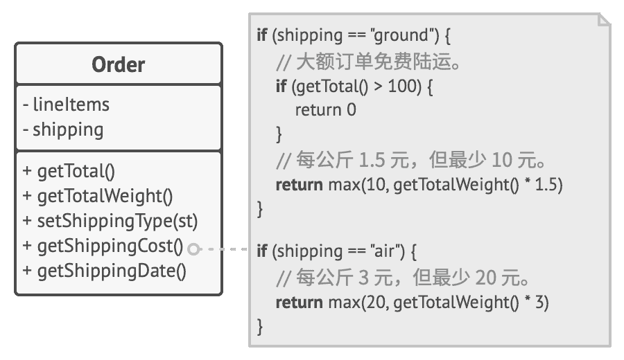
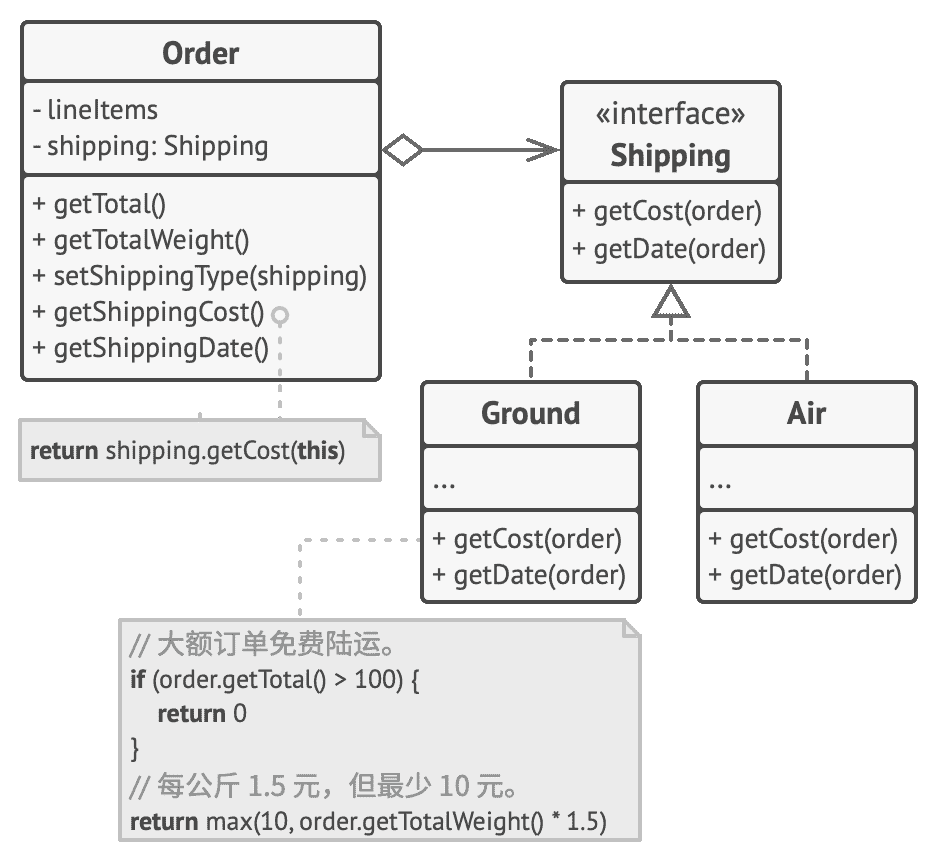

O 开闭原则

## Open/closed Prin­ci­ple

> 对于扩展，  类应该是  “开放”  的；  对于修改，  类则应是  “封闭”  的。

本原则的主要理念是在实现新功能时能保持已有代码不变。

如果你可以对一个类进行扩展，  可以创建它的子类并对其做任何事情  （如新增方法或成员变量、  重写基类行为等），  那么它就是*开放*的。  有些编程语言允许你通过特殊关键字  （例如  `final` ）  来限制对于类的进一步扩展，  这样类就不再是  “开放”  的了。  如果某个类已做好了充分的准备并可供其他类使用的话  （即其接口已明确定义且以后不会修改），  那么该类就是*封闭*  （你可以称之为*完整*）  的。

我第一次知道这条原则时曾感到困惑，  因为*开*和*闭*这两个字听上去是互斥的。  但根据这条原则，  一个类可以同时是  “开放  （对于扩展而言）”  和  “封闭  （对于修改而言）”  的。

如果一个类已经完成开发、  测试和审核工作，  而且属于某个框架或者可被其他类的代码直接使用的话，  对其代码进行修改就是有风险的。  你可以创建一个子类并重写原始类的部分内容以完成不同的行为，  而不是直接对原始类的代码进行修改。  这样你既可以达成自己的目标，  但同时又无需修改已有的原始类客户端。

这条原则并不能应用于所有对类进行的修改中。  如果你发现类中存在缺陷，  直接对其进行修复即可，  不要为它创建子类。  子类不应该对其父类的问题负责。

### 示例

你的电子商务程序中包含一个计算运输费用的  `订单`Order 类，  该类中所有运输方法都以硬编码的方式实现。  如果你需要添加一个新的运输方式，  那就必须承担对  `订单`类造成破坏的可能风险来对其进行修改。

**修改前：** 在程序中添加新的运输方式时，  你必须对  `订单`类进行修改。

你可以通过应用*策略*模式来解决这个问题。  首先将运输方法抽取到拥有同样接口的不同类中。

**修改后：** 添加新的运输方式不需要修改已有的类。

现在，  当需要实现一个新的运输方式时，  你可以通过扩展  `运输方式`Ship­ping 接口来新建一个类，  无需修改任何  `订单`类的代码。  当用户在 UI 中选择这种运输方式时，  ​  `订单`类客户端代码会将订单链接到新类的运输方式对象。

此外，  根据*单一职责原则*，  这个解决方案能够让你将运输时间的计算代码移动到与其相关度更高的类中。