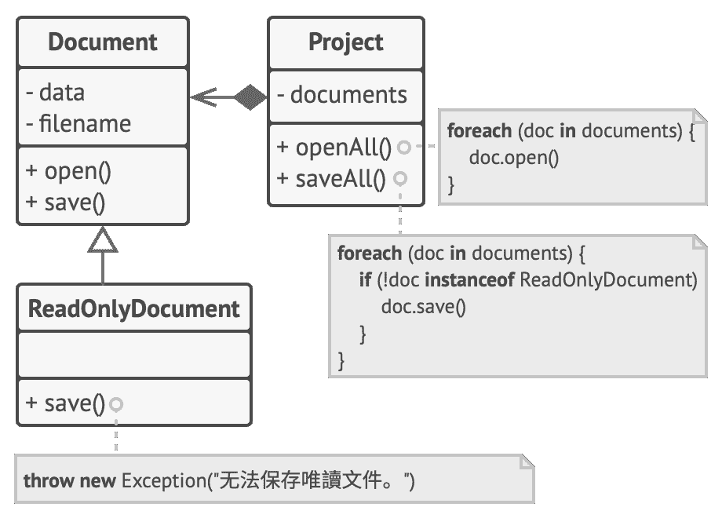
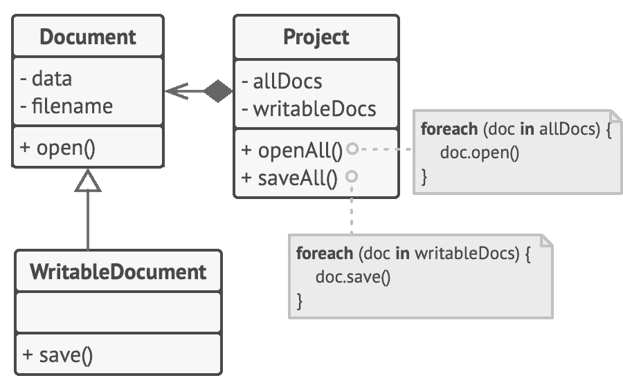

L 里氏替换原则

## Liskov Sub­sti­tu­tion Prin­ci­ple 5

> 当你扩展一个类时，  记住你应该要能在不修改客户端代码的情况下将子类的对象作为父类对象进行传递。

这意味着子类必须保持与父类行为的兼容。  在重写一个方法时，  你要对基类行为进行扩展，  而不是将其完全替换。

替换原则是用于预测子类是否与代码兼容，  以及是否能与其超类对象协作的一组检查。  这一概念在开发程序库和框架时非常重要，  因为其中的类将会在他人的代码中使用——你是无法直接访问和修改这些代码的。

与有着多种解释方式的其他设计模式不同，  替代原则包含一组对子类  （特别是其方法）  的形式要求。  让我们来仔细看看这些要求。

*   **子类方法的参数类型必须与其超类的参数类型相*匹配*或*更加抽象*。** 听上去让人迷惑？  让我们来看一个例子。

    *   假设某个类有个方法用于给猫咪喂食：  ​  `feed­(Cat c)` 。  客户端代码总是会将  “猫  （cat）”  对象传递给该方法。

    *   **好的方式：** 假如你创建了一个子类并重写了前面的方法，  使其能够给任何  “动物  （ani­mal，  即  ‘猫’  的超类）”  喂食：  ​  `feed­(Animal c)` 。  如果现在你将一个子类对象而非超类对象传递给客户端代码，  程序仍将正常工作。  该方法可用于给任何动物喂食，  因此它仍然可以用于给传递给客户端的任何  “猫”  喂食。

    *   **不好的方式：** 你创建了另一个子类且限制喂食方法仅接受  “孟加拉猫  （Ben­gal­Cat，  一个  ‘猫’  的子类）”：  ​  `feed­(Bengal­Cat c)` 。  如果你用它来替代链接在某个对象中的原始类，  客户端中会发生什么呢？  由于该方法只能对特殊种类的猫进行喂食，  因此无法为传递给客户端的普通猫提供服务，  从而将破坏所有相关的功能。

*   **子类方法的返回值类型必须与超类方法的返回值类型或是其*子类别*相*匹配*。** 正如你所看到的，  对于返回值类型的要求与对于参数类型的要求相反。

    *   假如你的一个类中有一个方法  `buyCat(): Cat` 。  客户端代码执行该方法后的预期返回结果是任意类型的  “猫”。

    *   **好的方式：** 子类将该方法重写为：  ​  `buyCat(): BengalCat` 。  客户端将获得一只  “孟加拉猫”，  自然它也是一只  “猫”，  因此一切正常。

    *   **不好的方式：** 子类将该方法重写为：  ​  `buyCat(): Animal` 。  现在客户端代码将会出错，  因为它获得的是自己未知的动物种类  （短吻鳄？  熊？），  不适用于为一只  “猫”  而设计的结构。

    编程语言世界中的另一个反例是动态类型：  基础方法返回一个字符串，  但重写后的方法则返回一个数字。

*   **子类中的方法不应抛出基础方法预期之外的异常类型。** 换句话说，  异常类型必须与基础方法能抛出的异常或是其*子类别*相*匹配*。  这条规则源于一个事实：  客户端代码的  `try-catch`代码块针对的是基础方法可能抛出的异常类型。  因此，  预期之外的异常可能会穿透客户端的防御代码，  从而使整个应用崩溃。

    > 对于绝大部分现代编程语言，  特别是静态类型的编程语言  （Java 和 C# 等等），  这些规则已内置于其中。  如果违反了这些规则，  你将无法对程序进行编译。

*   **子类不应该加强其前置条件。** 例如，  基类的方法有一个  `int`类型的参数。  如果子类重写该方法时，  要求传递给该方法的参数值必须为正数  （如果该值为负则抛出异常），  这就是加强了前置条件。  客户端代码之前将负数传递给该方法时程序能够正常运行，  但现在使用子类的对象时会使程序出错。

*   **子类不能削弱其后置条件。** 假如你的某个类中有个方法需要使用数据库，  该方法应该在接收到返回值后关闭所有活跃的数据库连接。

    你创建了一个子类并对其进行了修改，  使得数据库保持连接以便重用。  但客户端可能对你的意图一无所知。  由于它认为该方法会关闭所有的连接，  因此可能会在调用该方法后就马上关闭程序，  使得无用的数据库连接对系统造成  “污染”。

*   **超类的不变量必须保留。** 这很可能是所有规则中最不  “形式”  的一条。  *不变量*是让对象有意义的条件。  例如，  猫的不变量是有四条腿、  一条尾巴和能够喵喵叫等。  不变量让人疑惑的地方在于它们既可通过接口契约或方法内的一组断言来明确定义，  又可暗含在特定的单元测试和客户代码预期中。

    不变量的规则是最容易违反的，  因为你可能会误解或没有意识到一个复杂类中的所有不变量。  因此，  扩展一个类的最安全做法是引入新的成员变量和方法，  而不要去招惹超类中已有的成员。  当然在实际中，  这并非总是可行。

*   **子类不能修改超类中私有成员变量的值。** *什么？  这难道可能吗？* 原来有些编程语言允许通过反射机制来访问类的私有成员。  还有一些语言  （Python 和 JavaScript）  没有对私有成员进行任何保护。

### 示例

让我们来看看一个违反替换原则的文档类层次结构例子。

**修改前：** 只读文件中的保存行为没有任何意义，  因此子类试图在重写后的方法中重置基础行为来解决这个问题。

`只读文件`Read­Only­Doc­u­ments 子类中的  `save`保存方法会在被调用时抛出一个异常。  基础方法则没有这个限制。  这意味着如果我们没有在保存前检查文档类型，  客户端代码将会出错。

代码也将违反开闭原则，  因为客户端代码将依赖于具体的文档类。  如果你引入了新的文档子类，  则需要修改客户端代码才能对其进行支持。

**修改后：** 当把只读文档类作为层次结构中的基类后，  这个问题得到了解决。

你可以通过重新设计类层次结构来解决这个问题：  一个子类必须扩展其超类的行为，  因此只读文档变成了层次结构中的基类。  可写文件现在变成了子类，  对基类进行扩展并添加了保存行为。