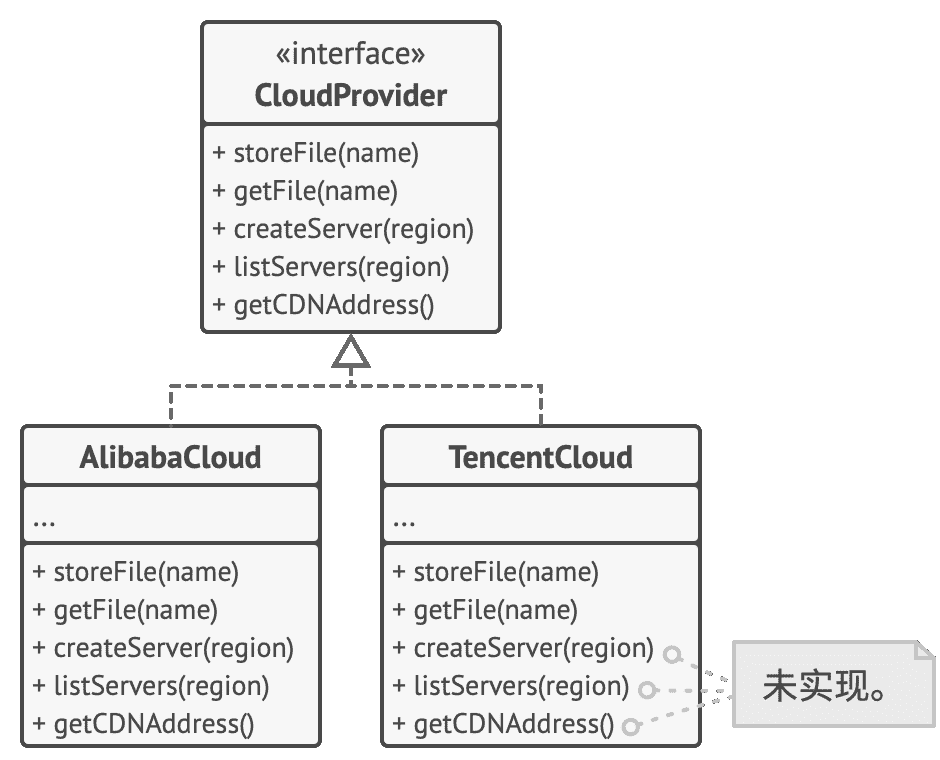

I 接口隔离原则

## Inter­face Seg­re­ga­tion Prin­ci­ple

> 客户端不应被强迫依赖于其不使用的方法。

尽量缩小接口的范围，  使得客户端的类不必实现其不需要的行为。

根据接口隔离原则，  你必须将  “臃肿”  的方法拆分为多个颗粒度更小的具体方法。  客户端必须仅实现其实际需要的方法。  否则，  对于  “臃肿”  接口的修改可能会导致程序出错，  即使客户端根本没有使用修改后的方法。

继承只允许类拥有一个超类，  但是它并不限制类可同时实现的接口的数量。  因此，  你不需要将大量无关的类塞进单个接口。  你可将其拆分为更精细的接口，  如有需要可在单个类中实现所有接口，  某些类也可只实现其中的一个接口。

### 示例

假如你创建了一个程序库，  它能让程序方便地与多种云计算供应商进行整合。  尽管最初版本仅支持阿里云服务，  但它也覆盖了一套完整的云服务和功能。

假设所有云服务供应商都与阿里云一样提供相同种类的功能。  但当你着手为其他供应商提供支持时，  程序库中绝大部分的接口会显得过于宽泛。  其他云服务供应商没有提供部分方法所描述的功能。

**修改前：** 不是所有客户端能满足复杂接口的要求。

尽管你仍然可以去实现这些方法并放入一些桩代码，  但这绝不是优良的解决方案。  更好的方法是将接口拆分为多个部分。  能够实现原始接口的类现在只需改为实现多个精细的接口即可。  其他类则可仅实现对自己有意义的接口。

**修改后：** 一个复杂的接口被拆分为一组颗粒度更小的接口。

与其他原则一样，  你可能会过度使用这条原则。  不要进一步划分已经非常具体的接口。  记住，  创建的接口越多，  代码就越复杂。  因此要保持平衡。