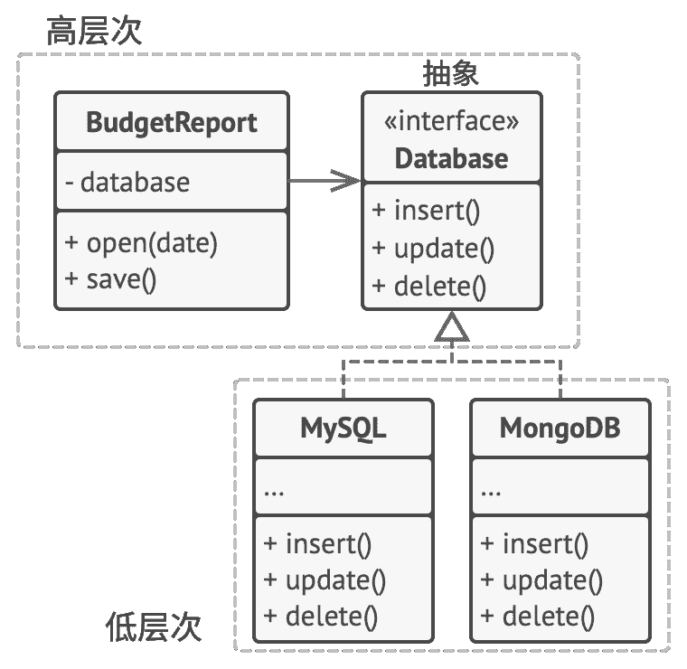

D 依赖倒置原则

## Depen­den­cy Inver­sion Prin­ci­ple

> 高层次的类不应该依赖于低层次的类。  两者都应该依赖于抽象接口。  抽象接口不应依赖于具体实现。  具体实现应该依赖于抽象接口。

通常在设计软件时，  你可以辨别出不同层次的类。

*   **低层次的类**实现基础操作  （例如磁盘操作、  传输网络数据和连接数据库等）。
*   **高层次类**包含复杂业务逻辑以指导低层次类执行特定操作。

有时人们会先设计低层次的类，  然后才会开发高层次的类。  当你在新系统上开发原型产品时，  这种情况很常见。  由于低层次的东西还没有实现或不确定，  你甚至无法确定高层次类能实现哪些功能。  如果采用这种方式，  业务逻辑类可能会更依赖于低层原语类。

依赖倒置原则建议改变这种依赖方式。

1.  作为初学者，  你最好使用业务术语来对高层次类依赖的低层次操作接口进行描述。  例如，  业务逻辑应该调用名为  `open­Report­(file)`的方法，  而不是  `open­File­(x)` 、  ​  `read­Bytes­(n)`和  `close­File­(x)`等一系列方法。  这些接口被视为是高层次的。
2.  现在你可基于这些接口创建高层次类，  而不是基于低层次的具体类。  这要比原始的依赖关系灵活很多。
3.  一旦低层次的类实现了这些接口，  它们将依赖于业务逻辑层，  从而倒置了原始的依赖关系。

依赖倒置原则通常和*开闭原则*共同发挥作用：  你无需修改已有类就能用不同的业务逻辑类扩展低层次的类。

### 示例

在本例中，  高层次的预算报告类  （Bud­get­Report）  使用低层次的数据库类  （My­SQL­Data­base）  来读取和保存其数据。  这意味着低层次类中的任何改变  （例如当数据库服务器发布新版本时）  都可能会影响到高层次的类，  但高层次的类不应关注数据存储的细节。

**修改前：** 高层次的类依赖于低层次的类。

要解决这个问题，  你可以创建一个描述读写操作的高层接口，  并让报告类使用该接口代替低层次的类。  然后你可以修改或扩展低层次的原始类来实现业务逻辑声明的读写接口。

**修改后：** 低层次的类依赖于高层次的抽象。

其结果是原始的依赖关系被倒置：  现在低层次的类依赖于高层次的抽象。