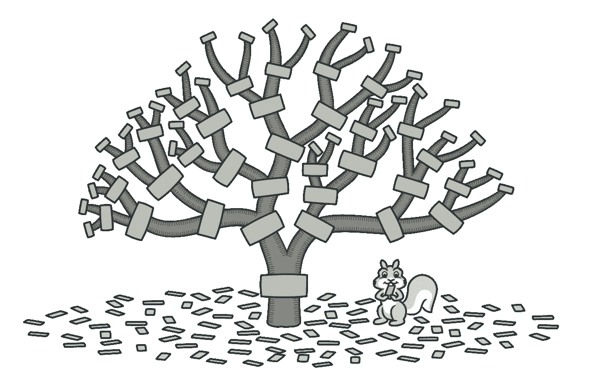
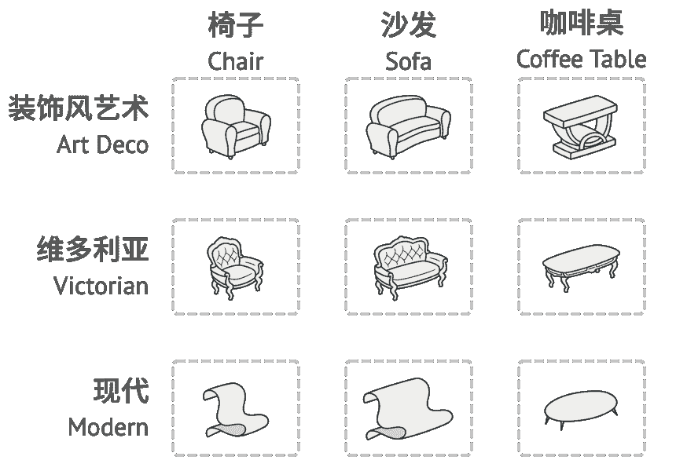
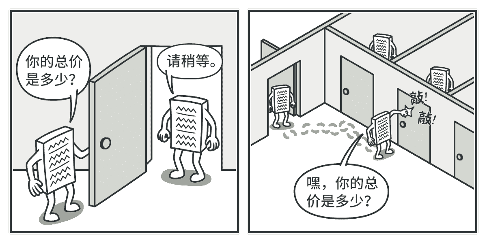

# 组合

亦称：对象树、Object Tree、Composite

　**组合**是一种结构型设计模式，
　你可以使用它将对象组合成　
　树状结构，并且能像使用独　
　立对象一样使用它们。

## *问题*

 *如果应用的核心模型能用树状结构表示，  在应用中使用组合模式才有价值。

例如，  你有两类对象：  ​  `产品`和  `盒子` 。  一个盒子中可以包含多个  `产品`或者几个较小的  `盒子` 。  这些小  `盒子`中同样可以包含一些  `产品`或更小的  `盒子` ，  以此类推。

假设你希望在这些类的基础上开发一个定购系统。  订单中可以包含无包装的简单产品，  也可以包含装满产品的盒子……以及其他盒子。  此时你会如何计算每张订单的总价格呢？

订单中可能包括各种产品，  这些产品放置在盒子中，  然后又被放入一层又一层更大的盒子中。  整个结构看上去像是一棵倒过来的树。

你可以尝试直接计算：  打开所有盒子，  找到每件产品，  然后计算总价。  这在真实世界中或许可行，  但在程序中，  你并不能简单地使用循环语句来完成该工作。  你必须事先知道所有  `产品`和  `盒子`的类别，  所有盒子的嵌套层数以及其他繁杂的细节信息。  因此，  直接计算极不方便，  甚至完全不可行。*  *## *解决方案*

 *组合模式建议使用一个通用接口来与  `产品`和  `盒子`进行交互，  并且在该接口中声明一个计算总价的方法。

那么方法该如何设计呢？  对于一个产品，  该方法直接返回其价格；  对于一个盒子，  该方法遍历盒子中的所有项目，  询问每个项目的价格，  然后返回该盒子的总价格。  如果其中某个项目是小一号的盒子，  那么当前盒子也会遍历其中的所有项目，  以此类推，  直到计算出所有内部组成部分的价格。  你甚至可以在盒子的最终价格中增加额外费用，  作为该盒子的包装费用。

组合模式以递归方式处理对象树中的所有项目

该方式的最大优点在于你无需了解构成树状结构的对象的具体类。  你也无需了解对象是简单的产品还是复杂的盒子。  你只需调用通用接口以相同的方式对其进行处理即可。  当你调用该方法后，  对象会将请求沿着树结构传递下去。*  *## *真实世界类比*

*

部队结构的例子。

大部分国家的军队都采用层次结构管理。  每支部队包括几个师，  师由旅构成，  旅由团构成，  团可以继续划分为排。  最后，  每个排由一小队实实在在的士兵组成。  军事命令由最高层下达，  通过每个层级传递，  直到每位士兵都知道自己应该服从的命令。*  *## *结构*

*

1.  **组件**  （Com­po­nent）  接口描述了树中简单项目和复杂项目所共有的操作。

2.  **叶节点**  （Leaf）  是树的基本结构，  它不包含子项目。

    一般情况下，  叶节点最终会完成大部分的实际工作，  因为它们无法将工作指派给其他部分。

3.  **容器**  （Con­tain­er）——又名  “组合  （Com­pos­ite）”——是包含叶节点或其他容器等子项目的单位。  容器不知道其子项目所属的具体类，  它只通过通用的组件接口与其子项目交互。

    容器接收到请求后会将工作分配给自己的子项目，  处理中间结果，  然后将最终结果返回给客户端。

4.  **客户端**  （Client）  通过组件接口与所有项目交互。  因此，  客户端能以相同方式与树状结构中的简单或复杂项目交互。*  *## *伪代码*

 *在本例中，  我们将借助**组合**模式帮助你在图形编辑器中实现一系列的几何图形。

几何形状编辑器示例。

`组合图形`Com­pound­Graph­ic 是一个容器，  它可以由多个包括容器在内的子图形构成。  组合图形与简单图形拥有相同的方法。  但是，  组合图形自身并不完成具体工作，  而是将请求递归地传递给自己的子项目，  然后  “汇总”  结果。

通过所有图形类所共有的接口，  客户端代码可以与所有图形互动。  因此，  客户端不知道与其交互的是简单图形还是组合图形。  客户端可以与非常复杂的对象结构进行交互，  而无需与组成该结构的实体类紧密耦合。

// 组件接口会声明组合中简单和复杂对象的通用操作。
interface Graphic is
  method move(x, y)
  method draw()
// 叶节点类代表组合的终端对象。叶节点对象中不能包含任何子对象。叶节点对象
// 通常会完成实际的工作，组合对象则仅会将工作委派给自己的子部件。
class Dot implements Graphic is
  field x, y
  constructor Dot(x, y) { ... }
  method move(x, y) is
    this.x += x, this.y += y
  method draw() is
    // 在坐标位置(X,Y)处绘制一个点。
// 所有组件类都可以扩展其他组件。
class Circle extends Dot is
  field radius
  constructor Circle(x, y, radius) { ... }
  method draw() is
    // 在坐标位置(X,Y)处绘制一个半径为 R 的圆。
// 组合类表示可能包含子项目的复杂组件。组合对象通常会将实际工作委派给子项
// 目，然后“汇总”结果。
class CompoundGraphic implements Graphic is
  field children: array of Graphic
  // 组合对象可在其项目列表中添加或移除其他组件（简单的或复杂的皆可）。
  method add(child: Graphic) is
    // 在子项目数组中添加一个子项目。
  method remove(child: Graphic) is
    // 从子项目数组中移除一个子项目。
  method move(x, y) is
    foreach (child in children) do
      child.move(x, y)
  // 组合会以特定的方式执行其主要逻辑。它会递归遍历所有子项目，并收集和
  // 汇总其结果。由于组合的子项目也会将调用传递给自己的子项目，以此类推，
  // 最后组合将会完成整个对象树的遍历工作。
  method draw() is
    // 1. 对于每个子部件：
    //     - 绘制该部件。
    //     - 更新边框坐标。
    // 2. 根据边框坐标绘制一个虚线长方形。
// 客户端代码会通过基础接口与所有组件进行交互。这样一来，客户端代码便可同
// 时支持简单叶节点组件和复杂组件。
class ImageEditor is
  field all: CompoundGraphic
  method load() is
    all = new CompoundGraphic()
    all.add(new Dot(1, 2))
    all.add(new Circle(5, 3, 10))
    // ...
  // 将所需组件组合为复杂的组合组件。
  method groupSelected(components: array of Graphic) is
    group = new CompoundGraphic()
    foreach (component in components) do
      group.add(component)
      all.remove(component)
    all.add(group)
    // 所有组件都将被绘制。
    all.draw()* *## *适合应用场景*

 **如果你需要实现树状对象结构，  可以使用组合模式。*

 **组合模式为你提供了两种共享公共接口的基本元素类型：  简单叶节点和复杂容器。  容器中可以包含叶节点和其他容器。  这使得你可以构建树状嵌套递归对象结构。**  ***如果你希望客户端代码以相同方式处理简单和复杂元素，  可以使用该模式。*

 **组合模式中定义的所有元素共用同一个接口。  在这一接口的帮助下，  客户端不必在意其所使用的对象的具体类。*****  *****## *实现方式*

 *1.  确保应用的核心模型能够以树状结构表示。  尝试将其分解为简单元素和容器。  记住，  容器必须能够同时包含简单元素和其他容器。

2.  声明组件接口及其一系列方法，  这些方法对简单和复杂元素都有意义。

3.  创建一个叶节点类表示简单元素。  程序中可以有多个不同的叶节点类。

4.  创建一个容器类表示复杂元素。  在该类中，  创建一个数组成员变量来存储对于其子元素的引用。  该数组必须能够同时保存叶节点和容器，  因此请确保将其声明为组合接口类型。

    实现组件接口方法时，  记住容器应该将大部分工作交给其子元素来完成。

5.  最后，  在容器中定义添加和删除子元素的方法。

    记住，  这些操作可在组件接口中声明。  这将会违反 _ 接口隔离原则 _，  因为叶节点类中的这些方法为空。  但是，  这可以让客户端无差别地访问所有元素，  即使是组成树状结构的元素。*  *## *优缺点*

 **   *你可以利用多态和递归机制更方便地使用复杂树结构。*
**   **开闭原则*。  无需更改现有代码，  你就可以在应用中添加新元素，  使其成为对象树的一部分。**

 ***   *对于功能差异较大的类，  提供公共接口或许会有困难。  在特定情况下，  你需要过度一般化组件接口，  使其变得令人难以理解。****  ****## *与其他模式的关系*

 **   桥接、  状态和策略  （在某种程度上包括适配器）  模式的接口非常相似。  实际上，  它们都基于组合模式——即将工作委派给其他对象，  不过也各自解决了不同的问题。  模式并不只是以特定方式组织代码的配方，  你还可以使用它们来和其他开发者讨论模式所解决的问题。

*   你可以在创建复杂组合树时使用生成器，  因为这可使其构造步骤以递归的方式运行。

*   责任链通常和组合模式结合使用。  在这种情况下，  叶组件接收到请求后，  可以将请求沿包含全体父组件的链一直传递至对象树的底部。

*   你可以使用迭代器来遍历组合树。

*   你可以使用访问者对整个组合树执行操作。

*   你可以使用享元实现组合树的共享叶节点以节省内存。

*   组合和装饰的结构图很相似，  因为两者都依赖递归组合来组织无限数量的对象。

    *装饰*类似于*组合*，  但其只有一个子组件。  此外还有一个明显不同：  *装饰*为被封装对象添加了额外的职责，  *组合*仅对其子节点的结果进行了  “求和”。

    但是，  模式也可以相互合作：  你可以使用*装饰*来扩展*组合*树中特定对象的行为。

*   大量使用组合和装饰的设计通常可从对于原型的使用中获益。  你可以通过该模式来复制复杂结构，  而非从零开始重新构造。****************