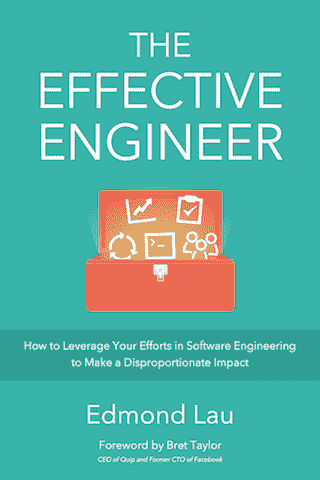
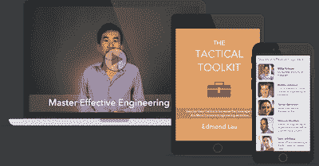

# 高效的工程师

> 原文：<http://www.effectiveengineer.com/blog/>

"一个全面的旅游，我们行业的集体智慧写得很清楚."

— Jack Heart，Asana 的工程经理

"埃德蒙成功地将他十年的工程经验提炼为清晰明了的最佳实践。"

——丹尼尔·彭，谷歌高级工程师

"一个全面的旅游，我们行业的集体智慧写得很清楚."

— Jack Heart，Asana 的工程经理

"埃德蒙成功地将他十年的工程经验提炼为清晰明了的最佳实践。"

——丹尼尔·彭，谷歌高级工程师

### 增长书本之外的技能

听顶级软件工程师的播客采访，观看大师级的视频，这些视频讲述的是以前只在研讨会上教授的技术。

