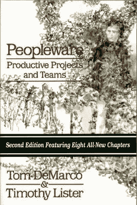
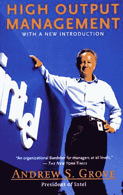
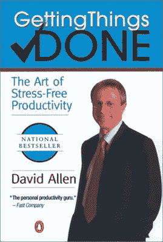
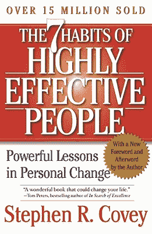

# 每一位卓有成效的工程师都应该阅读的五本书以及他们教授的课程

> 原文：<http://www.effectiveengineer.com/blog/five-books-every-effective-engineer-should-read>

我爱读书，每周大概看 1-2 本书。一些世界上最快的读者能够吸收书籍的数量远远不够——据说西奥多·罗斯福总统在白宫的两个任期内每天早餐前都会读一本书——但这是一个健康的速度，我一直在努力保持并希望随着时间的推移而增加。

不仅仅是娱乐，书中的故事有助于缩短你自己的学习曲线，让你可以更快地学习和成长。“从别人的错误中吸取教训，”埃莉诺·罗斯福曾经说过。“你不可能活得足够长，让它们都是你自己做的。”书籍，无论是小说还是非小说，都为读者提供了一种从他人的教训和错误中学习的方式，这样你就可以重新应用这些知识，而不必从头开始。

我读过许多关于编程和工程技术的经典文本，毫无疑问，它们为我每天在工程上使用的一套原则做出了贡献。但有几本书确实影响了我对如何成为一名更有效的工程师的思考，令人惊讶的是，其中大多数实际上都不是工程书籍。在本帖中，我与你分享这些书籍推荐以及我从中学到的东西。

这本书由两位软件顾问的研究支持，讨论了项目和团队中的许多动态，并让我走上了思考诸如如何建立有效的工程团队和[什么是良好的工程文化](/blog/what-makes-a-good-engineering-culture)等主题的道路。它涵盖的主题包括强制加班如何破坏团队的凝聚力，编程时听音乐如何干扰我们的思考能力，估计任务所需时间的行为如何实际上导致实际任务需要更长时间(尽管它可能有其他好处)，以及许多其他智慧。

首次出版于 1987 年，这本书的一些章节确实揭示了它们的年代——其中一章讨论了有家具的办公室，警察在工作场所实施装饰。但令我惊讶的是，我在谷歌、Ooyala 和 Quora 工作期间，看到了许多其他永恒的课程。最近由 Brian W. Fitzpatrick 和 Ben Collins-Sussman 撰写的《团队极客:软件开发人员与他人良好合作指南》 的风格类似，但更依赖于作者自己在谷歌和 Subversion 的工作经验，而不是实证研究。

 

当我寻求书籍来帮助我成长为一名工程领导者时，Quora 的联合创始人兼首席执行官 Adam D'Angelo 向我推荐了这本书。在*高产出管理*中，格罗夫提炼了他在运行和管理英特尔时使用的一些原则。如果你对管理不感兴趣，不要对标题中的“管理”一词感到厌烦。这条建议既适用于人事经理，也适用于那些他称之为“技术经理”的人——比如高级工程师，他们已经积累并分享了组织内的大部分知识。从这本书里，我学到了[我职业生涯中最有价值的一课](https://www.quora.com/Whats-the-single-most-valuable-lesson-youve-learned-in-your-professional-life/answer/Edmond-Lau?share=1)，那就是根据我的活动和任务的杠杆——单位时间内产出的数量或产生的影响——来确定它们的优先级。

 

这本书的价值在于，它彻底描述了如何管理待办事项和任务列表的具体实现。虽然我并不赞同艾伦描述的一切，但读到一种可能的做事方式还是令人大开眼界。如果你没有一个好的工作流程来安排事情的优先次序和完成事情，这本书提供了一个基线，你可以从它开始。

这本书的一个关键要点是，把你所有的待办事项写在一个单一的、容易获取的列表中，并从你的大脑中移除记忆任务的负担。这极大地帮助了我跟踪我需要完成的事情，并释放了我的精神能量来关注其他事情。随后阅读的书籍，如大卫·洛克的*、乔纳·莱勒的 [*我们如何决定*](http://www.amazon.com/gp/product/0547247990?ie=UTF8&camp=1789&creativeASIN=0547247990&linkCode=xm2&tag=theeffeengi-20) ^(以及约书亚·福尔的 [*与爱因斯坦一起漫步*](http://www.amazon.com/gp/product/0143120530?ie=UTF8&camp=1789&creativeASIN=0143120530&linkCode=xm2&tag=theeffeengi-20) 只是强化了我们的大脑没有被很好地设计来记住大量的事情，试图记住事情只会干扰我们的其他认知能力。)*

** 

*实际上，我并不喜欢柯维的写作风格——大部分都有点过于抽象和松散——但书中观点的持久影响弥补了这一点。从柯维的第三个习惯“把重要的事情放在第一位”中，我了解到人们往往会忽略重要但不紧急的活动，花很多时间处理邮件、电话等任务。这可能很紧急，但最终并不重要。这种对当务之急的关注抑制了我们在个人和职业上学习和成长的能力。从这个习惯中得到的一个关键是明确地安排时间投资自己，无论是通过学习新技能、维持关系、阅读等等。自从读了这本书，我养成了明确安排时间的习惯，把我认为重要的事情按优先顺序排列。*

**

*不管你是否真的选择订阅费里斯提倡的那种极端生活方式，这本书教会了我两件事。首先，它强调了如果你坚持不懈地对工作进行优先排序，会有什么样的可能性。帕累托原则，也称为 80-20 法则，关注的是 20%的努力可以产生 80%的胜利；Ferriss 专注于确定 10%的努力(每周 4 小时),这些努力能为你带来最大的成功。不管你工作了多长时间，根据影响对你的工作进行优先排序，减少非生产性的活动都是重要的经验。*

*第二，它让人们认识到创建低维护的可持续系统的重要性，因为这是一个人每周工作 4 小时就能可靠地创造财富的唯一途径。这是一个在工程中经常被忽视的教训，在工程中，我们用新的和性感的技术来构建新功能的设计选择不一定考虑未来维护的成本。*

* * *

*当然，关于有效性的书只是可以从中吸取教训和故事的一种类型的书。除了 [*Peopleware*](http://www.amazon.com/gp/product/0321934113?ie=UTF8&camp=1789&creativeASIN=0321934113&linkCode=xm2&tag=theeffeengi-20) 之外，这些书都是为普通读者写的，并不是专门针对工程师的。这就是为什么我很兴奋正在写我自己的书[，在这本书中，我将展示我们如何将这些经验直接应用到我们作为工程师遇到的情况中。](/book)*

*作为一名工程师，哪些书籍对你的思维影响最大？请在评论中分享你的想法。*