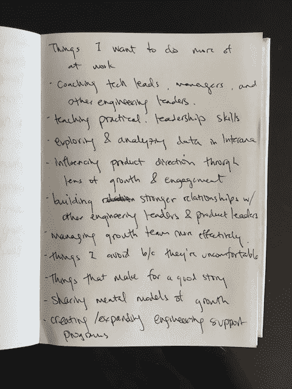

# 如何为自己想做的事创造时间和空间

> 原文：<http://www.effectiveengineer.com/blog/give-yourself-permission>

我躺在沙发上。我的身体在热浪和汗水中不舒服地交替着。我的下背部经常疼痛。我吞下了今天的第六片止痛药，希望我剧烈的头痛会停止。

我染上了一些正在传播的病菌。几乎没有精力做任何事情，我最终在一天之内看完了《西部世界》的整个赛季——整整 10 个小时。顺便说一下，我喜欢这部剧——它感觉像是一个混合了侏罗纪公园和人形机器人的角色扮演游戏，都注入了令人敬畏的故事情节，伟大的角色发展和不可预测的情节转折。

我通常不爱看电视节目。事后，我觉得有点内疚。

我生长在一个移民家庭，父母总是一周工作六天，努力工作一直是我身份的一部分。每当我浪费时间或效率低下时，我经常感到内疚。我会问自己，“这真的是对我所拥有的机会的最好利用吗？”

需要像生病这样的时刻——意识到我没有能力做更多的事情——允许自己去做那些让自己感到不负责任的事情。这让我想知道:我们有多少次发现自己如此专注于做我们觉得有责任做的事情，以至于没有时间做我们真正想做的事情？

## 平衡我们觉得应该负责的和我们想要的

我们许多人都感受到了责任的重量——无论是对我们的工作，对我们的家庭，还是对我们生活中的其他人。

责任有办法填满我们的时间表。常设会议、新的会议请求、电子邮件积压、任务列表、帮助解决问题的中断、消防、紧急客户需求——它们都可以很容易地填满我们的可用时间。

随着我们在角色中的成长，我们承担了更多的责任。随着时间的推移，我们成为“最适合这份工作的人”的领域越来越多。对所有到来的请求说不变得更加困难。我们有时会觉得花时间在我们*应该*做的事情上，在我们的时间表中留给我们*想要*做的事情的空间很少。

前几天，我和谷歌的一位高级工程经理进行了一次对话。她觉得她的日子充满了她不得不做的事情，而不是她想做的事情。

她不是一个人。我一直都在纠结这个问题。

我*应该*审查我团队的代码。我*希望*投入时间与其他工程领导建立更牢固的关系，为更广泛的工程师提供支持服务。

I *是否应该*专注于发展团队和执行产品。我想通过花时间准备并应邀在一千人面前演讲来拓展我的领导能力。

鉴于我们的团队很小，我*应该直接为我们的产品做出贡献。我*希望*花更多的时间来提高技术领导力的标准，并做所有必要的辅导、教学和指导来实现这一目标。*

你的奋斗会有所不同，但我们每个人都会有自己的清单，列出*应该做的*和*想要做的*——我们出于责任感而做的事情，以及因为它们让我们快乐和兴奋而做的事情。

这两者之间的关系非常紧张。

当我们同意做我们觉得有责任做的事情时，我们就含蓄地拒绝了其他我们想做的、让我们开心的或让我们更接近梦想的活动。我们不仅要默认说“是”，还要做出有意识的决定——允许自己在时间表中为自己想做的事情留出时间和空间。

## 为我们自己创造时间和空间

如果我们允许自己做自己真正想做的事情，我们的日子会是什么样子？我们肯定会给我们的工作带来新的活力和激情。结果会带来什么新的可能性？

为了打开这些新的可能性，我会做的一个练习是写下一个我想做更多或开始做的活动的列表。

我最近的清单之一。

为什么要列清单？实际上列举活动使你想做的所有事情在你的脑海中具体化。

以前你可能会因为你应该做的事情而拒绝一个机会，但你可能会记得这件事在你的清单上，然后实际去做。你甚至可以在我的日历上划出时间来专注于它。

有了你的*想要的*清单，当实现它们的机会出现时，你也会开始注意到更多。你将开始从新的角度处理问题。如何将你面临的问题重新定义为做你想做的事情的机会？

也许一个你并不期待的项目会成为一个拓展你领导力的机会——在这种情况下，你会如何领导和激励你的团队？

也许一个你不确定如何独自解决的问题会成为你和你一直想一起工作的人合作的机会。

也许你的压迫感会成为一个学习如何更有效地授权的机会。

这些清单也清楚地说明了为什么你应该对某些事情说不。你说不并不是不负责任——即使最初可能会有这种感觉——而是为所有你想说好的事情创造空间。

一位明智的经理曾经告诉我:我们将永远在做我们觉得有责任的事情和让我们快乐的事情之间保持平衡。在任何特定的方向上过度优化，我们最终会陷入困境。如果我们总是出于责任而专注于做事情，我们最终会感到筋疲力尽或怨恨，因为我们没有时间去做那些让我们快乐的事情。如果我们只考虑自己的幸福，我们会把那些依赖我们的人抛在身后。

确保为你想做的事情留出空间和时间——不仅仅是在你生病无法做其他事情的时候。