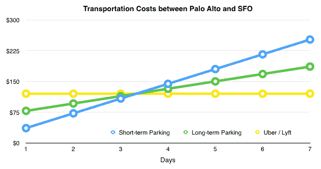

# 如何用一个数字来模拟你的时间价值可以简化决策

> 原文：<http://www.effectiveengineer.com/blog/how-much-is-your-time-worth>

我的朋友提着一箱她用过的罐子和瓶子进了保险箱，在顾客服务柜台等着。几分钟后，一名客户代表清点了 5 美分和 10 美分的容器，仔细检查了计算结果，并奖励了我的朋友 1 美元和零钱，作为她 10 分钟耐心的回报。我朋友的节俭和节俭——毫无疑问是从她的亚洲移民父母那里遗传下来的，他们辛辛苦苦攒钱进入美国中产阶级——让她很难简单地丢弃她 5 美分和 10 美分的集装箱存款，这些钱她认为是理所当然属于她的。所以她每隔几周就会尽职尽责地去一次。

没有意义的部分？我的朋友在谷歌做工程师，时薪超过 60 美元。但是每一次旅行都把她的时间看得比最低工资高不了多少。她花了一些时间说服自己，才同意改掉这个习惯。

虽然对许多工程师和年轻的专业人士来说，用易拉罐和瓶子换镍币和一角硬币不值得我们浪费时间，但我的朋友并不是唯一犯这种错误的人。许多聪明人低估了自己的时间，下意识地或无意地用自己的时间换取低工资。

对于一个年收入 8.5 万美元(美国软件工程师的工资中位数)的人来说，某些常见的行为在经济上是不合理的，假设我们没有从中获得任何非金融效用:

*   花 30 分钟在多个网站上比较购物，寻找尽可能低的价格，只为了在我们想要的相机存储卡上节省 5 美元。
*   剪下 10 分钟的实体或电子优惠券，在购物时节省 2 美元。
*   等待 30 分钟的公共汽车或班车到达，而不是支付 10 美元招呼优步，Lyft 或出租车到我们的目的地，只有 10 分钟的车程。
*   花 15 分钟在一个繁忙的地区寻找一个免费的或有咪表的停车位，而不是花 6 美元在一个停车场找一个有保证的停车位。
*   在“免费”的一天参观博物馆，此时所有展品都排到了最大容量，而不是在休息日花 20 美元去参观。
*   在塔可钟排队 20 分钟就为了一份免费的塔可钟，因为我们在广播广告上听说了它。
*   不买我们喜欢的衣服，因为另一家商店可能以更低的价格出售类似的东西，而不考虑每次试穿衣服需要 30 分钟的时间。

这些活动把我们的时间定价得太低了，假设它们不是我们真正喜欢做的活动。如果剪优惠券和排队是你的乐趣所在，那么无论如何不要让我这篇文章分散你的注意力。但是如果你想更有效地利用你的时间，如果这些活动占用了你与家人、朋友、爱好、志愿者工作或者其他你喜欢做的事情的时间，那么继续读下去。那么什么时候用我们的时间来换取金钱是有意义的呢？我们应该什么时候付钱来避免不愉快的、耗时的经历？一个关于如何珍惜时间的好框架可以帮助我们回答这些问题并做出更好的决定。令人惊讶的是，仅仅用一个数字来模拟我们的时间价值是非常有价值的。

## 为什么要用一个数字来模拟时间的价值

如果我们能计算出一个数字来代表我们时间的货币价值，它可以简化我们做出的许多决定。根据一位经济学家的说法，我们真正的效用函数可能更复杂，但对于某些日常决策来说，一个单一的数字可能是一个有用的近似值。简单地比较一下我们的时间价值和给定的活动每小时能为我们节省或赚取多少。如果我们能获得更多，那就去做；如果没有，就花钱保护我们的时间。

这并不是说我们应该总是把时间等同于金钱。给与家人和朋友共度的时光、我们的幸福、我们的健康或者我们生活中的许多经历和冒险贴上价格标签是很危险的。但是对于某一类决策——无聊的、我们对实际活动漠不关心的日常决策——拥有一个简单的框架来快速评估我们是否应该用时间换取金钱会非常有帮助。

例如，我们可以用它来减少优柔寡断，限制我们在两个选择之间痛苦挣扎的时间。如果一个决定最多能为我们节省 10 美元，并且我们认为我们的时间是每分钟 1 美元，那么我们做决定的时间不应该超过 10 分钟。在那之后，我们浪费的时间比节省的成本还多，还不如抛硬币决定。

我们也可以用我们的时间价值来回答更复杂的问题。我记得很多年前，我花 15 美元从旧金山国际机场(SFO)乘坐一辆超级面包车前往帕洛阿尔托。乘坐汽车通常需要 20 分钟，但因为面包车必须在我之前等待和放下其他 5 名乘客，整个磨难花费了 90 多分钟。那次经历之后，我发誓再也不乘坐超级飞船了。

但是我该怎么办呢？我应该支付优步还是 Lyft？我是否应该花时间(以及多长时间)去寻找一个同方向的陌生人，他可能想要合乘一辆出租车？我是否应该为附近的短期停车场每天支付 36 美元？或者每天为长期停车场支付 18 美元，但警告说可能需要 30 分钟才能等到载着人们往返于长期停车场的停车班车？公共交通有意义吗？当有两个人时，等式是如何变化的？

假设我们将此视为纯粹的财务决策，并且对特定的交通方式没有强烈的偏好，那么使用一个简单的数字来模拟我们的时间价值的好处在于，我们可以将每种交通方式的成本计算为人数和行程长度的函数。例如，为了简单起见，假设我们的时间价值为每分钟 1 美元，长期停车会增加 1 小时的往返穿梭时间，优步或 Lyft 的固定费率为 60 美元。然后，我们可以对各种运输方式的成本建模如下:

基于这些参数，最佳决策是对 3 天以内的行程使用短期停车，对 3 天以上的行程使用优步或 Lyft，并始终避免长期停车。您自己的决策规则将根据您的参数而变化。但是这个模型足够灵活，如果我们知道平均等待时间，我们可以包括其他交通选择；如果我们有更多的人，我们甚至可以增加等待时间的成本。我们不必为我们做出的每一个决定做这样复杂的分析(分析也需要时间)，但是这种分析说明了当我们有一个简单的时间价值模型时会发生什么。

同样，我们可以用我们的模型来回答这样的问题:为了避免在飞机上停留 2 小时，我们应该多付多少钱？我们应该付钱给会计师帮我们报税吗？我们应该外包任务还是自己做？我们应该为一本书、一门课程或一个帮助我们完成更多工作的工具付费吗？

一旦我们内化了这个模型，一个直接的推论是，我们在一个纯粹的财务决策上花费的时间应该与它能为我们节省或产生多少钱成比例。如果协商一份工作的薪水可以让我们多获得 3000 美元的税后收入，理论上我们应该愿意在这个决定上多花 1000 倍的时间，而不是一个可以节省 3 美元的小决定。我们大多数人不会这样做，如果我们把更多的时间放在更大的决定上，我们会过得更好。

## 如何计算你的时间价值

那么，我们如何得出时间价值的数字呢？一个候选者是我们的*税后小时收益率*，定义为我们的税后收入(工资和福利)除以工作小时数。这是一个可以理解的时间价值模型，我们可以很容易地计算出来。如果有人一年挣 10 万美元，有 15 天假期和 10 个假期，每周工作 40 小时，那就是 53 美元/小时，或者税后大约 32 美元/小时(假设税率为 40%)。如果他改为每周工作 60 小时，税后数字下降到税后 21 美元/小时。确定一项活动在财务上是否有利可图就变成了计算它是否比税后小时收益率节省或赚取更多的钱。然而，这个数字没有考虑一个人实际上有多少空闲时间。直觉上，每周工作 80 小时的初创公司或投资银行员工更珍惜时间，因为他们的空闲时间更少。

解决这一缺点的另一个模型是*盈亏平衡支出率*，定义为税后总收入除以空闲时间。另一种思考方式是，一个人在空闲时间每小时需要花多少钱才能最终零储蓄。假设我们每天睡 8 个小时，花 1 个小时满足基本需求，那么每周还有 105 个小时来分配工作和空闲时间。收入在 10 万美元以上、每周工作 40 小时(因此每周有 65 小时空闲时间)的个人的收支平衡支出率大约为每小时 20 美元。如果他每周工作 60 小时，工资将增加到 28.50 美元，如果他每周工作 80 小时，工资将增加到 51 美元。因此，对于空闲时间较少的人来说，收支平衡消费率更重视时间。

这两个模型都不是完美的，你可以根据你个人的具体情况上下调整最终的数字。你可能会心甘情愿地接受一份更有趣但薪水更低的工作，或者你可能会得到创业股权的部分补偿；因此，你可能会更加珍惜你的时间，因为你仍然可以选择更高的收入。储蓄目标(大多数人不想零储蓄)、购买目标(比如房子)、债务(包括学生贷款)或者你从一项活动中获得的非财务享受可能会导致你向下调整，并偏向于用你的时间来支付。相反，想要花更多的空闲时间与朋友和家人在一起，非常不喜欢某些类型的工作，或者已经有了大量的银行存款，这些都可能增加你的时间价值。

量化各种调整是一项艰苦的工作，但即使有一个模糊的近似值也比没有好。你甚至可以做一个四舍五入的调整，让心算变得更容易。最终，你可以考虑任何对你重要的输入。所有这些前期工作的产出是一个模拟你的时间价值的单一数字。该模型帮助你从经济学的角度理解什么时候做某事是理性的或者非理性的，并减少浪费的时间。

将你的决定简化为简单的数字比较并不总是有意义的。很多经历是不可估量的，难以量化的。但是也有越来越多的技术和服务让我们买回更多的时间。Odesk 允许我们将任务外包给远程工作人员。优步和 Lyft 让我们减少了等待交通工具的时间。亚马逊 Prime 和谷歌购物快递让我们在实体店排队的次数更少。Homejoy 让我们更容易雇人帮忙打扫房间。TaskRabbit 可以满足许多其他的需求。

了解我们的时间有多少价值可以让我们把更多的时间——我们最有限的资产——用在正确的地方。