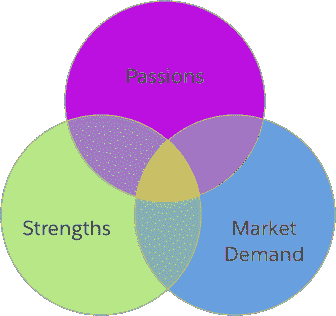
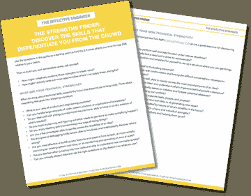

# 非凡职业生涯的三大关键

> 原文：<http://www.effectiveengineer.com/blog/remarkable-engineering-career>

在过去的几年里，我一直在指导谷歌的一位工程主管如何考虑发展她的职业生涯。她已经在公司工作了很多年，并准备扮演更重要的角色。

她不只是想成为另一个能够及时交付高质量代码的工程师。谷歌已经有很多这样的东西了。相反，她渴望做出自己明确无误的标记。

她是如何在公司的 2 万多名工程师中脱颖而出的？她如何对她的团队和她所从事的产品产生有意义的影响？

我们围绕她的职业发展的谈话通常围绕三个主题:

*   她应该在哪个团队工作。哪些团队是谷歌使命和公司优先事项的核心？她可以在哪里生产直接为公司带来有意义的商业价值的产品？
*   她如何对自己的工作更有活力和动力。她最喜欢做什么？什么项目会给她提供学习新事物的机会？
*   她认为自己与众不同的优势。尽管许多工程师倾向于埋头苦干，专注于编码，但她却拥有跨多个团队和系统管理复杂性的无畏能力。她可以有效地保持项目正常进行，并迅速找出出错的原因。

在明确了这些维度之后，她开始寻找与这些维度一致的机会，并逐渐成为公司的技术主管和经理。她赢得了同事的尊重，定期向组织中的高层领导提交关键计划，并开始在外部活动中代表公司。她为自己建立了非凡的事业。

通过研究类似的问题，你也可以找到做同样事情的方法。在这篇文章中，我分享了一个简单但强大的框架，你可以用它来区分自己，创造一个非凡的职业生涯。

当然，如何在你的工程生涯中脱颖而出不仅仅与谷歌员工相关。今天，世界上大约有 2000 万软件开发者。

这么大的就业市场，如何让自己与众不同？你如何确保 5 年或 10 年后，你不再是又一个做着和你现在一样事情的工程师，而是一个其他人了解和尊重的工程领导者，从事最让你兴奋的事情？你如何从一个努力争取每一个面试机会的人，变成一个顶级公司积极竞争招聘的人？

这些问题经常出现在我与工程师进行的领导力培训或职业发展谈话中。我想概述一个简单的结构，用于确定从一名优秀的工程师转变为一名伟大的工程师需要关注什么:

**找出你的激情、优势和市场需求的交叉点。**

这三个组成部分形成了一个维恩图——在它们的交叉点上，你找到了打造一份令人惊叹的职业的道路。如果你错过了任何一个元素，你最终将功亏一篑。

当你在一个领域有激情和技能，但是没有市场需求，你已经为自己创造了一个爱好——可能是有趣和值得的——但不是一个职业。

当你对一个高需求领域充满热情，但你缺乏技能，你将无法实现你想要创造的影响。最后，你会因缺乏进步和无法执行而沮丧——至少在你找到一个你确实有技能的相邻领域或角色之前。

当你在一个高需求领域表现出色，但对你正在做的事情缺乏激情时，你可能会赚很多钱。但迟早你会厌倦，失去动力。你会奇怪为什么你每周要花 40 个小时或更多的时间在没有成就感的工作上，这些工作没有给你的生活带来任何意义。

让我们更详细地了解每个元素。

## 激情、优势和市场需求

要找到你的激情，问问你自己:

*   什么活动让你最兴奋？
*   什么样的工作能让你进入心流状态——工作中你如此投入以至于你甚至没有注意到时间已经过去了多少？
*   什么样的工作让你充满活力，可能让你比刚开始时更兴奋、更有激情？

当思考你的激情时，想想它们的缺点也是有帮助的——你确实不喜欢做的活动。什么会过度消耗你的能量？会议？电子邮件？原型制作？设计？运营？

为了确定你的优势，问问你自己:

*   你真正擅长工程的哪些方面？
*   相对于你的同行或其他工程师，你的竞争优势是什么——尤其是在非技术技能方面？
*   有哪些与你目前的优势相关的[学科](/blog/master-adjacent-disciplines)你也可以学习和掌握？

当考虑你的优势时，变得真正擅长 2 或 3 件事是非常强大的。正如斯科特·亚当斯解释的那样，在一件特定的事情上成为最优秀的人要比在两项或更多的技能上成为前 25%的人更难，你需要将这两项或更多的技能结合起来才能做出非凡的事情。

例如，我是一个比许多人更强的工程师，但我不幻想我能达到杰夫·迪恩那样的工程水平。我并不比绝大多数全职作家更好，但我擅长提炼重要的东西，并把它传达给人们。这些技能共同创造了一个机会，让我可以就技术主题进行交流、教学和指导。

### 发现你与众不同的地方。

下载我的强项查找工具，它包含 30 多个有针对性的问题，可以帮助你找到自己的核心优势。

最后，为了确定市场需求，

*   市场上有哪些看起来需求量很大的热门趋势？例如，机器学习、数据科学和移动开发近年来都有很高的增长。
*   你公司的哪些团队和产品领域为你的企业创造了最大的价值？
*   你认为什么样的战略产品赌注或工程投资可以创造巨大的价值？

当考虑市场需求时，关键的洞察力是将您的工程工作与领域、公司、团队和计划结合起来，在这些领域、公司、团队和计划中，您的角色中的成功转化为商业价值。

## 寻找你自己的路

当你步入激情、优势和市场需求的交汇点时，你就为自己创造了一个可以持续有效地创造影响力的角色。

这就是为什么找到这三个领域的交叉点并在交叉点内寻找机会是如此重要。

然而，如果你的交叉点不明显，不要绝望。找到它的途径需要创造力，但是“工程师”这个职位最好的一个方面是你的角色可以非常灵活。作为一名工程师，你解决问题。你应该利用你所有的技能——技术的和非技术的——来做到这一点。

我花了几年时间才发现并在用户增长和参与这一重点领域迈出了自己的步伐。我刚开始职业生涯的时候甚至不知道这个领域的存在。这个领域结合了我在塑造用户行为方面的热情和我在产品领导、数据分析和写作方面的优势，是每个初创公司都需要成功的高需求领域。

我花了十年的时间才发现，工程师领导力培训是另一个让我充满活力的领域，它利用了我在倾听和发现人们的可能性方面的优势，并为我的同事增加了巨大的价值。

这里的长时间框架并不意味着你只是被动地等待，看看在你的职业生涯中会出现什么。相反，这是一个持续的学习过程——在任何时候，你都专注于最能代表你的交集的领域。随着时间的推移，你的兴趣会随着你的经历而变化。你的技能会提高。市场和社会的需求也会发生变化。随着每一次转变，新的可能性会出现在你面前。

你将如何利用它们？

### 从找出自己的核心优势开始。

下载我的强项查找工具，它包含 30 多个有针对性的问题，可以帮助你找到自己的核心优势。