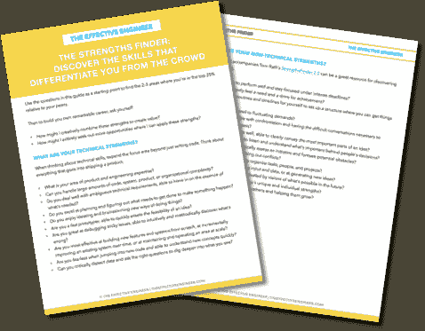

# 有效一对一的简单秘诀

> 原文：<http://www.effectiveengineer.com/blog/secret-to-effective-one-on-ones>

"你想从我们的合作中得到什么？"

每当我开始新的一对一工作关系时，无论是与团队中的新人、新学员、新经理、新项目合作伙伴还是新教练客户，我都会不可避免地以这个问题的某个版本开始对话。

新事物总是会出现。我可能有直觉和假设，知道什么对其他人来说是重要的，但它们从来都不完全准确。

有时他们甚至会偏离很远。我记得有一次，在我职业生涯的早期，我被指派给一个新的经理，突然有其他人开始主持会议，推动我之前一直在做的项目。当时，我感到被束缚住了，有点怨恨，也接受了这种新的世界方式。

我花了几个月的时间，终于在一对一的谈话中提出了我想要的东西——更多的引导空间。令我惊讶的是，一点反抗都没有。他之所以介入，是因为他认为自己需要填补一个空缺。我错误地认为他想施加更多的控制。

我们含蓄的假设导致了机会的错失。

这就是为什么在任何合作关系中最重要的事情是**明确设计关系**。在工作中，当涉及到你与你的经理和任何向你汇报的人的关系时，这一点尤其重要——这些关系往往是你拥有的最长久的关系。

## 注意你的默认模式

我经常会注意到工程师对他们的经理应该做什么和不应该做什么做出假设。他们会根据这些假设行事，而不是围绕他们想从这段关系中得到什么进行明确的对话。

然而，如果没有明确的设计，很容易陷入默认的次优模式。

也许你的默认做法是与你的经理进行一对一的谈话，并提供状态更新——这些更新本可以通过电子邮件、Quip、Asana 或其他项目管理工具轻松地异步交流。什么可能是更有用的对话？

也许你的默认做法是，把你那一周面临的任何技术问题都拿出来，向你的经理寻求建议。这些问题可能很重要，也可能只是满足你的短期需求——你想从长期关系中得到什么？

也许你的默认是要求更多地了解团队的其他成员和公司的情况。你的好奇心得到了满足，但是在公司的这段时间，你得到你想要的了吗？

这些模式没什么不好——只要它们是你和你的经理有意识地选择并愿意花时间去做的。

当我们没有要求我们真正想要的东西，当我们假设这种默认是对方想要的时，问题就来了。人类可能有同理心，但他们不会读心术。如果你不要求你想要的，人们不会知道。

如果我们从来没有就什么是重要的进行过明确的对话，我们在构建软件方面会取得多大的成功？如果我们不这样构建软件，为什么我们要用不同的方法来构建我们的关系呢？

这里常见的陷阱是相信处于更有权威地位的人有责任引导或指导你度过这一切。是的，当我们的经理和领导也是伟大的教练时，这是很棒的。

但你最终要为自己的成长负责。你要对你能影响的工作和生活领域负责。你有能力塑造你的对话和设计你的关系。

### 设计强大联盟的有力问题。

为自己准备一份问题清单，帮助你明确设计最重要的一对一工作关系。

## 设计您的联盟

因此，作为一名领导力教练，我学到的最有效的人际交往技巧之一就是**设计支持你人际关系的联盟**。在联盟中，两个或两个以上的独立方走到一起，以明确的条款达成互利的协议。

在教练的背景下，我会问和我一起工作的工程领导这样的问题:对我们每个人来说，成功的教练关系是什么样的？如果我把他们作为客户，我能从他们那里得到什么？他们对我有什么期望？

以同样的方式对待你的工作关系——与你的经理、你的下属或你的队友——如同联盟，这意味着什么？

这意味着在一开始就明确你想要什么，并要求对方明确他们想要什么。

这意味着与你的经理讨论:你最想从工作中得到什么，你的经理如何才能最好地支持你实现这一目标？你认为你的下一个发展水平或领域是什么？你希望你的经理如何给你反馈和挑战你？你的经理对你有什么期望？

这意味着与你的队友讨论:你对对方有什么期望？你们每个人都认为对团队来说什么是可能的？你希望如何一起工作和交流，重要的是什么？

现在，你可能会想，“我做同样的一对一已经很久了。现在改变它们已经太晚了。”或者你可能会问自己，“什么时候进行这次谈话比较合适？”

好消息是，设计你的人际关系永远不会太早或太晚。正确的时间是在你下次一对一的时候。事实上，你应该定期重新设计你的联盟。最牢固的关系是不断发展的，因为我们想要的和需要的以及我们的环境总是在变化。

这是对你的挑战。选择一种你还没有明确设计联盟的关系。在下一次一对一的谈话中，你只需要说，“我想就我们都想从这段关系中得到什么进行一次明确的谈话。”明确你的期望和你想要的，然后询问他们的期望和他们想要的。

请在评论中分享你从自己的经历中学到的东西，或者给我发个短信。我很想听听。

### 设计强大联盟的有力问题。

为自己准备一份问题清单，帮助你明确设计最重要的一对一工作关系。