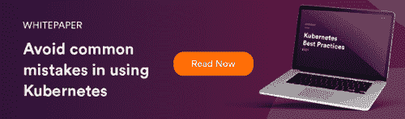

# Kubernetes 的 22 个基本概念

> 原文：<https://www.fairwinds.com/blog/22-essential-kubernetes-concepts>

 原生云代表了基础架构部署方式的一种范式转变。如果你是云原生和 Kubernetes 的新手，你需要掌握 22 个基本的 Kubernetes 概念。

## 工作量

1.  节点-节点可以是虚拟机或物理机，具体取决于群集。每个节点都包含运行 pod 所需的服务，由控制平面管理。
2.  集群——集群是基础。所有容器化的应用程序都运行在集群之上。
3.  Pod -工作的基本单位。Pods 是可以在 Kubernetes 中创建和管理的最小可部署计算单元。吊舱几乎从来不会自己被创造出来，相反，吊舱控制器做所有真正的工作。
4.  名称空间——Kubernetes 支持由同一个物理集群支持的多个虚拟集群。这些虚拟集群被称为名称空间。名称空间适用于许多用户分布在多个团队或项目中的环境。

## Pod 控制器

5.  部署-在 Kubernetes 上获取应用的最常见方式。为每个部署规范创建一个副本集。
6.  复制集-创建一个稳定的豆荚。你几乎不会直接创建它。
7.  daemon set-daemon set 确保所有(或一些)节点运行一个 Pod 的副本。随着节点添加到集群中，单元也会添加到其中。随着节点从集群中移除，这些 pod 将被垃圾收集。删除 DaemonSet 将清理它创建的 pod。常见于 CNI、监控代理、代理等系统进程。
8.  StatefulSet - StatefulSet 是用于管理具有持久存储的有状态应用程序的工作负载 API 对象。Pod 名称是永久性的，在重新计划时会保留(app-0、app-1)。与部署不同，pod 有 DNS 名称。与替换吊舱相关的存储停留。删除 pod 后，卷会持续存在。pod 是按顺序单独部署/更新的。
9.  horizontalpod auto scaler-Horizontal Pod auto scaler 根据 CPU 利用率等标准指标或请求延迟等自定义指标，自动扩展复制控制器、部署、副本集或有状态集中的 Pod 数量。
10.  pod disruption budget——限制升级和其他计划事件期间被中断的 pod 数量的能力，允许更高的可用性，同时允许集群管理员管理集群节点。
11.  作业-作业创建一个或多个 pod，并期望它们成功终止。
12.  按计划创建作业。

## 配置

13.  config maps——一个 API 对象，用于存储键值对中的非机密数据。
14.  secrets——允许您存储和管理敏感信息，如密码、OAuth 令牌和 ssh 密钥。

## 建立工作关系网

15.  ingress——一个 API 对象，管理对集群中服务的外部访问，通常是 HTTP。Ingress 可以提供负载平衡、SSL 终止和基于名称的虚拟主机。
16.  服务——将运行在一组 pod 上的应用程序公开为网络服务的抽象方式。
17.  网络策略——一种规范，说明允许多组 pod 如何相互通信以及如何与其他网络端点通信。

## 安全- RBAC

18.  ServiceAccount -为在 Pod 中运行的进程提供标识。
19.  角色-角色是特定名称空间内的一组权限；创建角色时，必须指定它所属的名称空间。
20.  ClusterRole - ClusterRole 与角色完全相同，只是它是一个没有命名空间的资源。资源具有不同的名称(Role 和 ClusterRole ),因为 Kubernetes 对象总是必须有命名空间或没有命名空间；不可能两者兼得。
21.  Role binding——将角色中定义的权限授予某组用户或服务帐户。它包含一个主题列表(用户、组或服务帐户)，以及对被授予的角色的引用。RoleBinding 授予特定命名空间内的权限。
22.  ClusterRoleBinding -授予集群范围的访问权限。

了解更多关于 [Kubernetes 架构基础知识](https://www.fairwinds.com/blog/getting-started-with-kubernetes-architecture-basics-definitions) 。

一些定义来源于 [kubernetes.io](https://kubernetes.io/docs/concepts/) 。