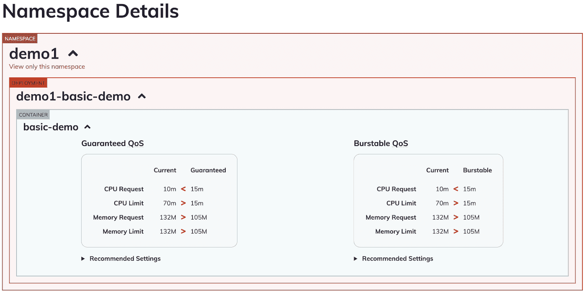

# 如何选择:使用 Goldilocks 与 Fairwinds Insights 的优势

> 原文：<https://www.fairwinds.com/blog/benefits-of-using-goldilocks-vs.-fairwinds-insights>

 在 [Fairwinds](https://fairwinds.com/) ，我们在过去几年中为几十个组织管理了数百个集群，这让我们对大多数组织在其 Kubernetes 环境中遇到的问题有了相当多的了解和见解。我们反复看到相同的问题，其中大部分与获得正确的资源请求和限制有关，所以我们创建了[金发女孩](https://www.fairwinds.com/blog/goldilocks-kubernetes-resource-requests)来帮助确定设置资源请求和限制的基线。我们在构建和使用 Goldilocks 中获得的经验使我们能够为 Fairwinds Insights 构建功能，从而提供更多的资源优化。

## 金发女孩和设置资源配置

您可以在 pod 中的每个容器上设置两种类型的资源配置:请求和限制。资源请求定义了容器需要的最小资源，而限制定义了容器可以使用的最大资源量。设置这些限制很重要，因为它们有助于防止您过度使用资源(同时也为其他部署节省资源)。请求会影响 Kubernetes 中 pods 的计划方式；基本上，调度程序读取 pod 中每个容器的请求，并找到适合该 pod 的最佳节点。Kubernetes 使用这些信息来优化您的资源利用。

设置正确的 Kubernetes 资源请求很重要，但是如果您不知道您的环境中发生了什么，这将是一个真正的挑战。我们的开源项目金凤花(Goldilocks)在推荐模式下使用[垂直 Pod 自动缩放器](https://github.com/kubernetes/autoscaler/tree/master/vertical-pod-autoscaler) (VPA)来查看每个应用上的资源请求建议。Goldilocks 为名称空间中的每个部署创建一个 VPA，然后向它们查询信息。Goldilocks 提供了一个很好的起点，可以很容易地查看所有建议，并决定如何设置您的资源请求和限制，以便根据您自己独特的用例更好地调整您的应用程序。

Goldilocks 仪表板资源建议示例

但是对于许多组织来说，金发女孩并不能满足他们所有的需求。为了更好地服务于我们的用户，我们为有以下需求的组织构建了 [Fairwinds Insights](https://www.fairwinds.com/insights) :

*   对资源请求和限制的多集群洞察
*   通过单一窗口查看其他最佳实践建议
*   访问其他资源指标

Fairwinds Insights 平台还可以轻松估算 Kubernetes 工作负载的支出和节省。

## 多集群洞察

[Fairwinds Insights](https://www.fairwinds.com/insights) 提供了提高 Kubernetes 计算资源效率的建议，并且提供了 Goldilocks 所不具备的多集群功能。对于运行多个集群的企业，Insights 提供了可见性，以确定您可以在哪些方面节省资金。如果需要，它还可以帮助您证明您的 Kubernetes 环境正在经济高效地运行。

> Fairwinds Insights 可供免费使用。你可以在这里报名。

Insights 使您更容易研究应用程序资源和历史使用情况，因此您可以调整设置，帮助您提高 Kubernetes 环境的效率。您还可以评估单个应用程序，以发现在不影响应用程序性能的情况下降低成本的机会。

虽然在 Goldilocks 中跟踪资源请求和限制对于单个集群来说很容易，但是随着您的组织发展到多个团队和多个集群，这将变得更具挑战性。Fairwinds Insights 使您能够更好地:

*   查看历史 CPU 和内存使用情况
*   获取关于跨集群的资源限制和请求的建议
*   提高工作负载的 CPU 和内存利用率
*   按名称空间或标签分配和分组成本估算

这种跨多个集群的可见性有助于您做出关于资源设置的正确决策，并创建和共享报告，展示您与业务目标的一致性。

## 一个工具(金发女孩)与多个工具(费尔温德见解)

Goldilocks 在为设置 Kubernetes 资源请求和限制提供基线方面做得很好。它可以方便地查看来自 VPA 的所有建议，并根据 pod 在一段时间内的历史使用情况做出决策。

Insights 提供了许多附加功能。例如，任何开源工具都可以链接到 Insights，使数据作为一个整体规范化变得简单，通过将来自多个来源的数据整合到一个视图中来提高对 Kubernetes 部署的可见性。它将所有来自其他工具的发现放在 Goldilocks 旁边，所以你可以更好地决定如何设置你的要求和限制。

Insights 是使用多种开源工具构建的，这些工具提供了 Goldilocks 无法单独提供的功能，包括:

Insights 还提供了我们从 [Prometheus](https://prometheus.io/docs/prometheus/latest/configuration/configuration/) 获取的额外资源指标。Fairwinds Insights 可以在多个集群和团队中应用 Goldilocks 和其他优秀工具的优势，在整个组织中保持一致。

## 不是哪个，是什么时候

金发女孩在这方面做得很好。它帮助您获得设置 Kubernetes 资源请求和限制的基线，并获得关于您可以做出更改的地方的建议。我们继续对 Goldilocks 进行更新，我们鼓励加入我们的开源用户组，帮助我们确定项目的方向。

Fairwinds Insights 是一个跨多个集群提供可见性的平台，因为它合并了多个开源项目，所以它为您的 Kubernetes 环境的整体效率和可靠性提供了更多有用和可操作的信息。我们在 Insights 平台中的集成使您可以轻松查看您的金发女孩结果以及其他审计工具和资源指标。

Goldilocks 和 Insights 都可以帮助您评估您的资源请求和限制，而 Insights 还可以帮助您识别和修复 Kubernetes 中的安全性、效率和可靠性问题。处于 Kubernetes 之旅早期的组织可能希望从 Goldilocks 开始，但是一旦您在多个团队中运行多个集群，Fairwinds Insights 可以帮助提供一致性和治理，以最大限度地降低风险，并保持集群高效、可靠和经济高效地运行。

