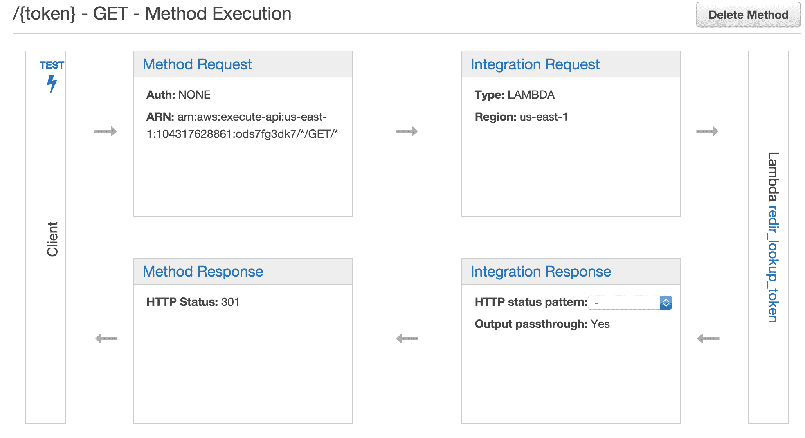

# 用 AWS Lambda 和 API 网关服务构建一个无服务器的 URL 缩短器

> 原文：<https://www.fairwinds.com/blog/build-a-serverless-url-shortener-with-aws-lambda-and-api-gateway-services>

几个月来，我一直在关注亚马逊的和  [API 网关](https://aws.amazon.com/api-gateway/) 服务。运行 web 应用程序而没有维护服务器的成本或麻烦是有吸引力的。当然，没有一个平台是没有权衡的。因此，为了让自己熟悉无服务器应用程序的优点，我决定启动一个简单的项目:弄清楚如何建立一个网址缩短器

通过几个小时的工作和每月几美元的花费，我得到了一个不错的原型，能够每月处理数百万个请求。这篇文章介绍了我遇到的一些问题。还有一个  [附带的代码回购](https://github.com/davekonopka/serverless-url-shortener) ，你可以用它来自己尝试一下，并学习如何构建一个 url 缩短器。

## 项目概述

以下是该项目的基本要求:

*   一个 HTTP 端点接受一个 JSON `POST` 包含一个短令牌和目的地 URL。这些值需要存储在某个地方。
*   第二个 HTTP 端点通过  `GET`获取一个短令牌，查找相应的目的 URL，并返回 301 重定向。
*   重定向端点应该无需认证即可访问，而  `POST` 应该需要认证。
*   尽可能通过代码来定义一切，以使其可重复。
*   将服务放在自定义域中。

为此，我需要一些组件:

*   接受 HTTP 请求的前端。
*   后端处理请求并生成响应。
*   保存所有相关短令牌和目标 URL 的数据存储。

## 前端:亚马逊 API 网关

一开始，我不确定 Amazon API Gateway 会处理前端所需的一切。它需要支持  `application/json` 和  `text/html` 内容以及设置自定义响应代码和标题。支持不同的内容类型。并且在 2015 年底增加了对 Lambda 函数结果映射到响应头的支持。API Gateway 看起来符合要求。

### 创建 API

API 网关服务由资源和方法组成。资源本质上是 URL 端点。方法对应的 HTTP 方法有  `GET`、  `POST`、  `PUT`等。

URL 缩写程序的端点受到限制。有一个  `GET` 将提供的短 URL 转换成重定向。和一个  `POST` 来接受短令牌和目的地 URL 关联进行存储。

### 方法组件

每个 API 网关方法都有四个组件。这是接受令牌并返回重定向的  `/{token}` 端点  `GET` 方法的示例:



*   **方法请求-** 定义传入的请求，包括从请求路径、查询字符串和头中提取的任何参数。它还支持为特定方法启用授权。
*   **集成请求-** 将请求映射到后端。在这种情况下，我使用 Lambda 函数，但它也支持代理到另一个 HTTP 服务或出于开发目的模拟响应。在这里，您可以选择哪个 Lambda 函数来处理单个请求，并将请求参数映射到后端数据负载。
*   **方法响应-** 定义您的服务支持的响应状态代码和头的集合。
*   **集成响应-** 将 Lambda 函数执行的返回数据映射到适当的响应代码。这可以使用正则表达式匹配器来完成。更多细节请关注。它还允许您设置自定义响应头和设置模板来转换 Lambda 结果。

URL shortener 的神奇之处在于将 Lambda 函数的结果映射到一个响应头。我需要将  `Location` 头设置为 Lambda 函数基于短令牌查找提供的目的地 URL。

下面是集成响应设置为  `/{token}` 端点  `GET` 的方法。注意  `Location` 头映射到 Lambda 函数的 return JSON 中的一个值。

### 需要认证

网址缩写者的  `POST` 方法需要认证来控制谁可以张贴条目。API Gateway 提供的身份验证选项之一是 API 密钥。可以生成 API 密钥并将其与应用程序相关联。在方法上启用时，对该方法的所有请求都必须包含有效的 API 键头才能执行:

`x-api-key: bkayZOMvuy8aZOhIgxq94K9Oe7Y70Hw55`

这种方法允许我在 URL `POST` 上要求认证，并将  `GET`端点向世界开放。

### 将 API 作为代码管理

我的目标之一是用代码管理这个项目，而不是通过亚马逊控制面板点击。API Gateway 提供了以 Swagger 格式导出和导入应用程序配置的能力。

Swagger 是一个旨在以 JSON 或 YAML 格式描述和记录 RESTful API 的规范。各种服务可以使用 Swagger 文件来可视化、测试或实现 API 服务。

我不得不承认，使用基于网络的控制面板，开始使用亚马逊的 API 网关服务要容易得多。我最终能够将服务定义导出到一个  [YAML 文件](https://github.com/davekonopka/serverless-url-shortener/blob/master/redir-v1-swagger.yml)中。我还能够使用亚马逊提供的[AWS-API gateway-importer](https://github.com/awslabs/aws-apigateway-importer)工具应用更改并克隆 API。

综上所述，我首先通过点击 web 面板来创建服务。它极大地帮助了我理解 API 网关应用程序是如何构造的。我建议使用 web 面板作为起点。

## 后端:亚马逊 Lambda

Lambda 支持  [Java](https://www.oracle.com/java/index.html) 、  [JavaScript](https://www.javascript.com/) 、[Python](https://www.python.org/)等语言。Lambda 还支持上传和执行二进制文件，因此其他语言也是可能的。我最熟悉 JavaScript，所以我从那里开始。

### 功能输入和输出

Lambda 函数按需执行。与  [EC2](https://aws.amazon.com/ec2/) 不同，无论何时执行函数，AWS 都会确保计算环境。无需维护服务器，容量可按需扩展。

每个函数都可以以参数的形式获取数据，执行函数并返回数据。函数可以导入外部库，比如连接到其他 AWS 服务。

Lambda 处理函数在调用时接收两个参数:  `event` 和  `context`。当由 API 网关  `event` 执行时，包括从传入请求翻译的参数。在令牌查找的情况下，来自 URL 的令牌值被映射到一个名为  `token`的 JSON 属性。  `context` 参数提供关于函数执行环境的运行时信息。

### URL 缩写函数

`redir_lookup_token` 接受一个令牌值并返回一个相应的目的 URL。

`redir_post_token` 取一个短 URL 和目的 URL 的关联并存储。

### 使用 API 网关处理错误

Lambda 函数的  `context` 参数还包括生成响应的方法。它提供了  `succeed`、  `fail`和  `done` 方法。最后一个方法是前两个方法的辅助包装器。它有两个参数，如果第一个参数不是  `null` ，它就会触发一个  `fail`。

API Gateway 提供正则表达式模式匹配，用于将失败错误消息映射到适当的响应状态代码。这允许将后端故障转换成有意义的客户端响应。可以定义各种响应状态代码，并将其与正则表达式模式相关联。如果 Lambda 函数返回与其中一个模式匹配的错误消息，客户端响应将返回匹配的状态代码。

每个响应代码都有自己的模板映射。这允许响应内容根据每个响应条件单独定制。对于短 URL 查找，301 是成功请求的默认响应代码。如果有人试图查找一个不存在的令牌，那么应该返回 404。

下面显示了令牌查找 Lambda 函数中的错误情况(第 7 行)以及来自 API 网关的相应 404 消息响应。

#### API 网关响应状态


#### Lambda 函数错误结果处理

### 使用 Apex 管理 Lambda 函数

Lambda 函数可以直接在 AWS web 面板中创建，也可以通过 zip 文件包上传。有一些框架可以从本地开发环境中帮助管理 Lambda 应用程序的编码和部署。

我考虑过  [无服务器](https://github.com/serverless/serverless)，一个用 Lambda 和 API Gateway 构建应用程序的扩展框架。我还看了一下  [Apex](https://github.com/apex/apex) ，一个最小的 Lambda 函数管理器。

Apex 为组织功能代码和元数据提供了一个轻量级结构。它提供了一个 CLI 命令来部署和执行 Lambda 函数。对于这个项目，我决定采用更简单的 Apex 方法。对于 Apex，每个函数都由一个目录表示，该目录包含一个 JSON 元数据文件和一个包含函数代码的 JavaScript 文件。

在编写代码时，您可以使用  `apex deploy` 命令来部署变更。

```
> apex deploy
   • deploying                 function=post_token
   • deploying                 function=lookup_token
   • created build (1.1 kB)    function=lookup_token
   • created build (1.2 kB)    function=post_token
   • config unchanged          function=post_token
   • code unchanged            function=post_token
   • config unchanged          function=lookup_token
   • code unchanged            function=lookup_token 
```

上传后，您可以使用  `apex invoke` 命令从您的笔记本电脑执行样本输入功能。

对于小项目，Apex 的结构很容易快速工作，而且不会碍事。该项目提到了在未来包含 API 网关管理的计划。

## 数据存储:DynamoDB

为了与无服务器主题保持一致，  [DynamoDB](https://aws.amazon.com/dynamodb/) 非常适合存储短 URL 和目的地 URL。使用 DynamoDB，您可以指定  [的读写容量](http://docs.aws.amazon.com/amazondynamodb/latest/developerguide/ProvisionedThroughputIntro.html)，而不是建立一个服务器。Amazon 确保分配的读写能力可用。您可以根据需要增加或减少容量单位。

DynamoDB 表是无模式的。主索引可以是单个值，也可以是两个字段的组合。组合键的一个重要限制是它们是分层的。这意味着第二个字段在主字段的上下文中是可选的。单独选择它会导致昂贵的表扫描。由于 URL shortener 主索引是一个单一的短令牌字符串，这不是一个问题。

## 这要花多少钱？

那么这一切要花多少钱？以下示例假设一个月内大约有 100 万次点击的工作示例。价格不包括数据传输费用，该费用会有所不同。

## 桌子

| 服务 | 说明 | 费用 |
| --- | --- | --- |
| [API 网关](https://www.reactiveops.com/blog/build-a-serverless-url-shortener/#api-gateway) | 每月每 100 万次请求 | $3.50 |
| [Lamba](https://www.reactiveops.com/blog/build-a-serverless-url-shortener/#lambda) | (命中*典型执行秒)*(内存/1024) * $.00001667 | $1.04 |
| [DynamoDB](https://www.reactiveops.com/blog/build-a-serverless-url-shortener/#dynamodb) | 每秒 1 次读取，1 次写入 | $0.58 |
|   | **总计** | 每月 5.12 美元 |

## 有哪些陷阱？

*   API 网关响应时间可能会有很大差异。支持响应缓存，这极大地改善了延迟。
*   从 Swagger 导入 API 网关不会创建所需的 Lambda 权限。我必须通过 web 面板手动重新选择每个 Lambda 函数，以便为从 Swagger 新克隆的服务应用适当的权限。
*   API Gateway Swagger 导出似乎不包含您创建的任何模型模式。如果您没有模型，web 面板似乎会显示一条错误消息。
*   API 网关自定义域需要 SSL。此时与 Route 53 的 AWS 证书管理器没有连接。证书必须手动过账。
*   自定义域使用 CNAME 记录指向 API 网关。这意味着使用一个不适合短 URL 的子域。