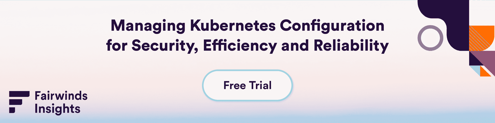

# 我可以安全地使用 Kubernetes 吗？

> 原文：<https://www.fairwinds.com/blog/can-i-use-kubernetes-securely>

 ## 你担心你缺乏安全使用 Kubernetes 的能力

当你有了一个新的范例，你必须学习一种新的思考安全的方式。没有理由重新发明轮子，有很好的工具可以帮助您轻松实现安全的基础架构。你不会因为在健身房使用储物柜而感到恐慌，也不会去健身房，你会买一个工具——一把锁——然后用它，这样你就不用担心了。

如果您不确定从哪里开始使用 Kubernetes security，请查看以下 OSS 工具:

想要一种简单的方法，通过单个代理部署所有这些工具，并帮助对每个报告中的发现进行优先排序？查看 [Fairwinds Insights](https://www.fairwinds.com/insights) ，我们汇总安全调查结果，揭示错误配置，并提供解决问题的建议。

> 使用 Fairwinds Insights，在一个平台中免费获得 Kubernetes 安全性、成本分配和规避、合规性和护栏。

验证你所建立的是正确的，你可以在晚上睡个好觉。新的范例就是这样，它们本质上并不可怕。如果您在刚接触 Kubernetes 时缺乏保护它的专业知识和经验，有一个很好的工具可以帮助您快速理解。

一把大锁对心灵的平静有奇效。

