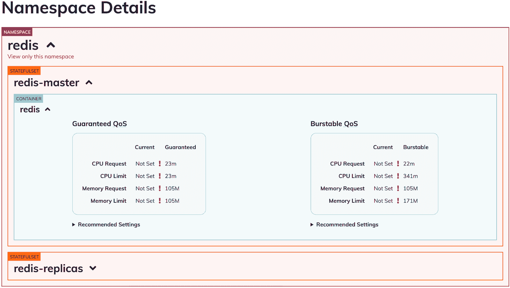

# 查看我们新的金发女孩升级的细节

> 原文：<https://www.fairwinds.com/blog/check-out-the-specifics-of-our-new-goldilocks-upgrade>

 我们开源项目 Goldilocks 的最初目标是提供一个仪表板工具，用于识别 Kubernetes 资源请求和限制的基线。为了提供建议，我们使用[垂直 Pod 自动缩放器](https://github.com/kubernetes/autoscaler/tree/master/vertical-pod-autoscaler) (VPA)，这是一个控制器堆栈，包含一个评估您的 Pod 当前资源使用情况的建议引擎，以便提供指导。

Goldilocks dashboard 提供了 VPA 建议的可视化，因此您可以访问集群中的服务并查看两种类型的建议，具体取决于您部署所需的服务质量等级。QoS 类别是 Kubernetes 的一个概念，它决定了 pods 被调度和驱逐的顺序，Kubernetes 本身将 QoS 类别分配给 pods。

因为对大多数组织来说，获得正确的资源请求和限制是一个持续的挑战，所以我们继续定期改进 Goldilocks，提供我们的变化的定期更新。我们最近对 Goldilocks 进行了一些重大升级，并很高兴与我们的开源社区分享这些改进。

了解更多关于 Fairwinds 的开源项目[这里](https://www.fairwinds.com/open-source-software)。

## 金发姑娘有什么新鲜事？

拉请求 [#373](https://github.com/FairwindsOps/goldilocks/pull/373) 和 [#376](https://github.com/FairwindsOps/goldilocks/pull/376) 为金发女孩带来了多控制器支持。在此更新之前，Goldilocks 只能为部署创建 VPA 对象。但是，有了这些新的“拉”请求，Goldilocks 现在可以支持为使用标准 pod 模板规范(spec.template.spec.containers)的任何更高级别的工作负载控制器创建 VPA 对象。这一变化大大扩展了 Goldilocks 可以报告的工作负载数量，从而为您的集群中的工作负载资源提供了更多建议。

Kubernetes 集群很少会只有通过部署创建的 pod。DaemonSets(以及在较小程度上的 StatefulSets)构成了工作负载的重要组成部分。直到现在，金凤花都不会对这些类型的工作负载创建的容器提出建议。

## 拉取请求的细节是什么？

第一个拉请求(#373)是后端更改，它更新控制器以监视 pod 创建，并确定该 pod 的父工作负载。然后，如果该父对象具有适当的注释(或者在 goldilocks 寻找的具有适当标签的名称空间中)，将创建 VPA。

这个功能彻底颠覆了以前的方法，因为以前我们只关注已创建的部署。通过观察 pod，然后推断父控制器，我们可以涵盖更多的控制器类型，包括那些还没有人想到的控制器。也就是说，假设它们遵循上面提到的 pod 模板规范。

提到的两个 PR 中的第二个(#376)确保 Goldilocks 的仪表板部分实际显示建议，因为一些代码只查找部署。

## 你如何为金发女孩做贡献？

[Goldilocks 是开源的，可以在 GitHub 上获得](https://github.com/FairwindsOps/goldilocks)。我们致力于提高其处理具有数百个名称空间和 VPA 对象的大型集群的能力。在 2021 年夏天，我们还改变了 Goldilocks 的部署方式，增加了一个 [VPA 子图](https://github.com/FairwindsOps/charts/tree/master/stable/vpa)，你可以用它来安装 VPA 控制器和资源。在这方面，我们计划继续改进我们所有的开源项目，并欢迎您的贡献！

Goldilocks 也是我们的 [Fairwinds Insights 平台](https://www.fairwinds.com/insights)的一部分，该平台提供对您的 Kubernetes 集群的多集群可见性，因此您可以针对规模、可靠性、资源效率和[容器安全性](https://www.fairwinds.com/kubernetes-security)配置您的应用。对使用 Fairwinds Insights 感兴趣吗？免费提供！[在此了解更多信息。](/coming-soon)

[加入我们的开源社区](https://www.fairwinds.com/open-source-software-user-group)并在 2021 年 12 月 14 日参加下一次聚会。加入我们，赢取费尔温德的奖励！

