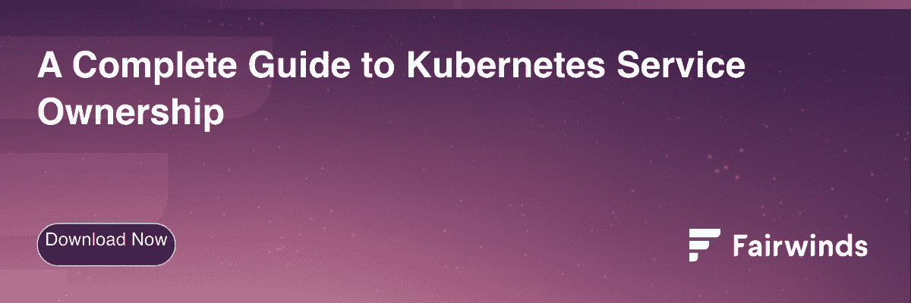

# 为什么 DevSecOps 只是 Kubernetes 服务所有权的一个花哨的缩写

> 原文：<https://www.fairwinds.com/blog/devsecops-fancy-acronym-kubernetes-service-ownership>

 是的，软件开发正在成为世界上最突出和最关键的行业之一，但它仍处于自身发展的阵痛中——特别是当它涉及到开发、安全以及对更好的 Kubernetes 服务所有权的需求。DevSecOps 已经成为解决 DevOps 实践中安全性需求的一种方法，但这并不是想象这种文化和实践转变的唯一方法。

如果 DevOps 能够 [简化 Kubernetes](/)的混乱局面，一个类似的成功秘诀就会出现。DevSecOps 和 Kubernetes 服务所有权都在为同一个最终目标而努力——为 DevOps 团队提供更多的自主权、速度和责任。但仍有大量工作要做。如果我们希望快速安全地交付代码，同时降低风险，DevSecOps 需要成为 Kubernetes 和微服务的安全管理的同义词。

## **发展警察的崛起**

从历史上看，软件开发由几个团队组成，所有团队都朝着一个单一的目标努力——生产优秀的产品。尽管有这种共同的努力，开发过程本身通常采用孤立的方法，其中一个开发团队编写代码，一个质量保证团队测试代码，另一个运营团队将其部署到生产中。如今，安全团队也必须参与进来，以确保软件的质量和安全性符合所有现代标准和治理要求。

然而，这些孤立的小组导致了团队之间的摩擦、文化差异以及对更协作、更有效的工作流的需求。DevOps 曾经作为一种开发方法出现，以提高开发和运营之间的协调水平，DevSecOps 迅速跟进，以确保安全性集成到软件开发生命周期(SDLC)的所有阶段。对 DevSecOps 的这种演进已经在团队之间创建了更紧密的集成，并使从业者能够提高他们的速度，同时也将安全性融入到更大的过程中，而不是作为事后的想法栓上它。

## **服务所有权的现实**

DevSecOps 并不是描述这种新兴问责模式的唯一方式。作为 DevOps“编码、发布、拥有”的理念，Kubernetes 服务所有权要求工程师对他们持有的代码和服务负责，从代码提交到生产再到部署。工程师们不再将代码交给运营部门或依赖可靠性工程(SRE)团队，而是从头到尾对他们创建的代码的安全性和可靠性负责。

随着团队的重组，以促进更快的移动和与客户更密切的关系，他们被期望建立对他们所支持的服务的完全所有权。在这种运营模式中，服务所有权涵盖从软件设计和开发到生产环境中的部署，再到最终管理软件的过时。这个 Kubernetes 所有权模型是高度可伸缩的，因为它允许团队快速交付和响应客户问题。然后，运营团队可以构建一个允许组织扩展的基础。

随着 DevSecOps 价值的增加，在整个开发过程中对安全性的需求也在增加。 [使用最佳实践](https://www.fairwinds.com/kubernetes-best-practices-comprehensive-white-paper) ，Kubernetes 服务所有权使这种“左移”成为可能，并实现了 DevSecOps 信徒所支持的变革类型——提高可靠性、成本效益和更好的应用安全性。

## **更好的前进方式**

要了解更多有关 Kubernetes 服务所有权的基本要素以及 Fairwinds Insights 如何为您的组织带来更易于管理的体验，请阅读我们的[Kubernetes 服务所有权完整指南。](https://www.fairwinds.com/kubernetes-service-ownership-whitepaper)

寻找一个完整的 Kubernetes 治理平台？Fairwinds Insights 是免费的。今天就开始吧。

