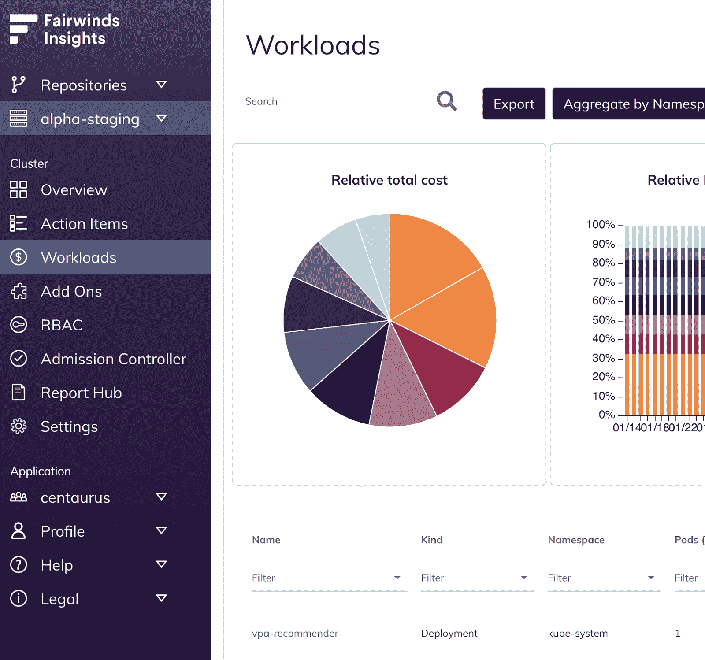
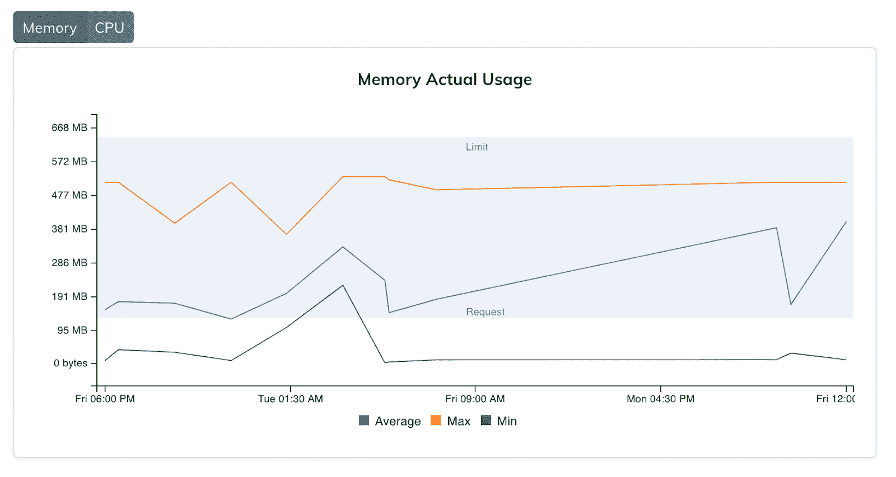
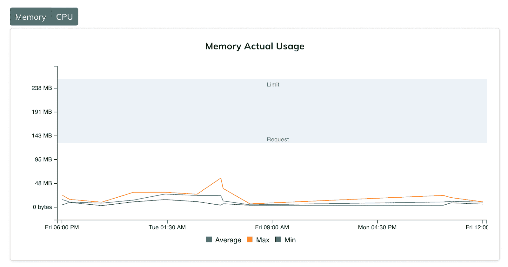
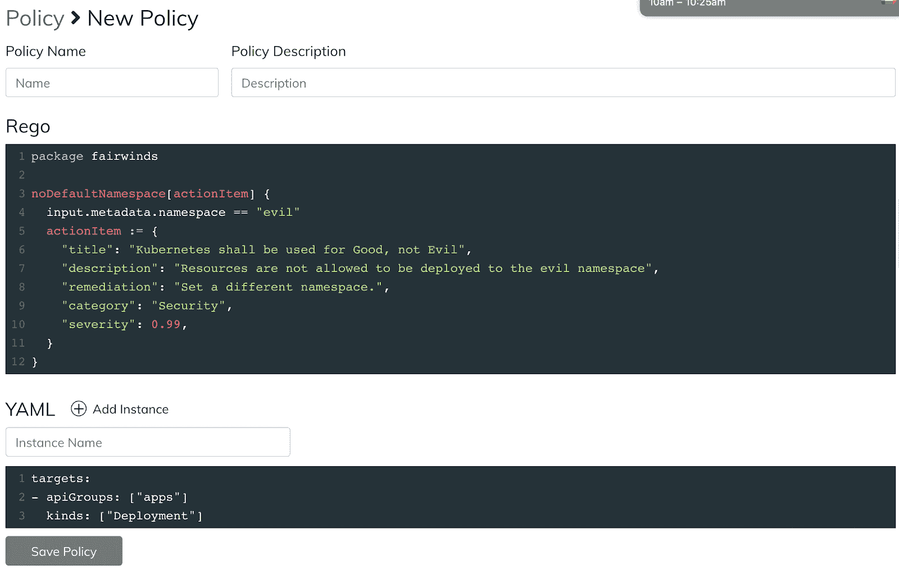
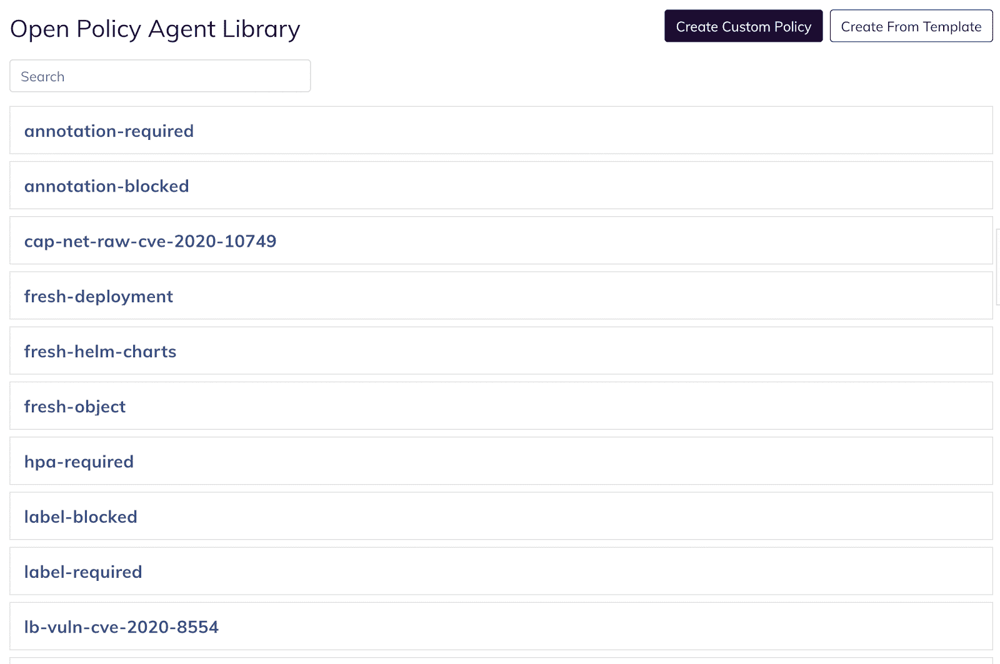

# Fairwinds Insights 达到 3.0

> 原文：<https://www.fairwinds.com/blog/fairwinds-insights-3.0>

 我很高兴地宣布 Fairwinds Insights 的下一个主要版本！

[Fairwinds Insights](/insights) 是 Kubernetes 中的一个政策执行和审计平台。它附带了十几个与开源工具的集成，如 [【北极星】](https://github.com/FairwindsOps/polaris) 、 [Trivy](https://github.com/aquasecurity/trivy) 和 [OPA](https://www.openpolicyagent.org/) ，并且可以在 CI 中检查您的基础架构代码，通过准入控制保护您的集群，或者作为集群内代理运行，为您提供对安全性、效率和可靠性问题的持续监控。

Insights 已经抛出了许多关键数据，因此在这个版本中，我们专注于帮助您可视化、导航和分类这些数据的方法。以下是 3.0 中的几个主要特性。

## **New Navbar**

****

当 Insights 最初构思的时候，我是唯一一个从事这项工作的人。我很快拼凑了一个带有水平导航的 UI，这对于两三个可用的特性来说已经足够了。

两年后，特性集已经发展到我们空间不足的地步！值得庆幸的是，我们现在有一位出色的 UI/UX 设计师与我们合作，他能够从头开始重新想象我们应用程序的信息层次:

*   顶部允许您切换上下文，在不同的 Kubernetes 集群和基础设施即代码存储库之间移动

*   中间部分允许您在给定的上下文中导航

*   在底部，您可以注销、查看不同的组织或找到文档的有用链接

新的导航更接近其他云原生 SaaS 产品，如 Datadog 或谷歌云控制台，所以用户应该感觉更熟悉。如果这些产品是任何指标，新的垂直导航将允许我们在未来几年增长应用程序。

## **资源监控**

Fairwinds Insights 已经有了与成本和资源使用相关的功能，但数据相当粗糙:我们利用[](https://github.com/fairwindsops/goldilocks)来维护每个工作负载的 CPU 和内存使用的运行平均值、最小值和最大值。对于稳定的工作负载，这允许我们提供合理的建议，说明应该在哪里设置限制和请求；但是对于使用高峰的工作负载，我们需要更多的信息。

为了解决这个问题，我们引入了 [普罗米修斯收集器报告](https://insights.docs.fairwinds.com/reports/resource-metrics/) ，它每 30 秒捕获一次 CPU 和内存使用情况的信息。我们保留了两周的数据，因此您可以看到您的使用量在一天或一周内的变化。



通过在您当前的请求和限制旁边显示这些信息，您可以很容易地看到它们设置得有多好。例如，在上面的图表中，因为线条大部分在蓝色阴影区域内，我们可以得出结论，我们已经为内存请求和限制选择了好的值；工作负载最多使用大约 75%的内存限制，平均来说至少使用我们所要求的内存。

相比之下，在下图中，线条远低于蓝框，这表明该工作负载已被过度调配，并且我们的成本可能超过了需要:



有了所有这些额外的数据，加上一些聪明的可视化，我们的用户能够更好地调整他们的工作负载，这使他们既能节省资金，又能维护一个更稳定的环境。

如果您想尝试一下，请登录您的 Insights 帐户，并通过报告中心将 Prometheus Collector 报告添加到您的集群。

## **自动化规则**

我们得到的关于洞察力的最常见的反馈之一是，庞大的数据量可能会让人不知所措。此外，Fairwinds Insights 生成的许多行动项目不是立即可操作的——它们由第三方或核心 Kubernetes 基础架构控制。

为了帮助解决这个问题，我们引入了自动化规则，它允许您基于某些规则自动地对行动项目进行分类。例如，您可能希望忽略在 kube-system 名称空间中出现的任何问题，因为这是由 Kubernetes 本身控制的。为此，您可以编写一些 JavaScript 代码:

```
if (ActionItem.ResourceNamespace === 'kube-system') {

  ActionItem.Resolution = WILL_NOT_FIX_RESOLUTION;

}
```

这是开始减少生成的数据量的有效方法，这样您就可以专注于对您的组织最重要的问题。

您还可以使用自动化规则向 Slack 发送通知，如果(例如)您的生产集群中出现了严重的漏洞。我们计划继续扩展这个功能，包括创建 GitHub 和吉拉票，或者发送任意的 HTTP 请求。

要开始使用自动化规则， [查看文档](https://insights.docs.fairwinds.com/features/rules/) 。

## **OPA 政策 UI**

虽然我们在 2.0 中增加了对 OPA 策略的支持，但策略管理完全是通过 CLI 控制的。虽然我们仍然认为这应该是主要流程(因为它允许您将策略存储在基础设施即代码存储库中)，但我们已经构建了一个用户界面来帮助您查看和管理策略。



这将帮助用户更快地实现 OPA 策略的价值，并帮助他们实时查看、编辑和启用/禁用他们的策略。

我们还提供了一个不断扩大的策略库，供您克隆和修改:



[阅读文档](https://insights.docs.fairwinds.com/features/policy/) 了解更多。

## **向前移动**

我对我们在 Fairwinds Insights 上取得的进展感到非常兴奋。在创建了一个强大的 MVP，能够解决任何人的 Kubernetes 集群的安全性、效率和可靠性问题之后，我们做了大量工作，使这些发现更具可操作性和可理解性。

> 对使用 Fairwinds Insights 感兴趣吗？免费提供！点击此处了解更多信息。

在接下来的一个季度，我们将继续完善我们的用户界面，提供更多可视化效果和定制结果的方式，并将继续关注我们可以连接到报告中心的新的有趣的开源工具。敬请期待！

[](https://cta-redirect.hubspot.com/cta/redirect/2184645/d329e036-9905-4715-85b8-31a98b50623c)