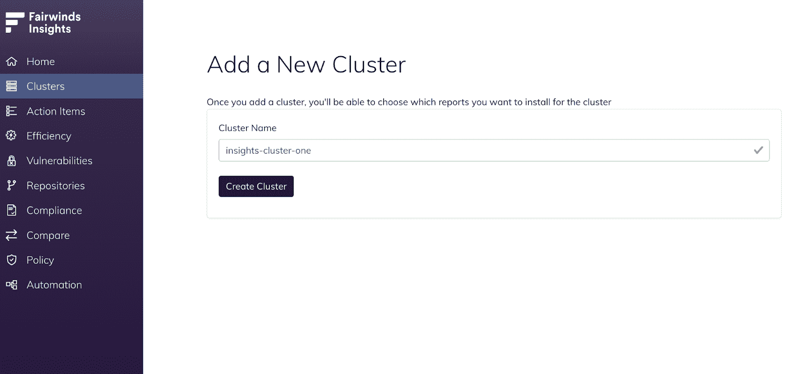
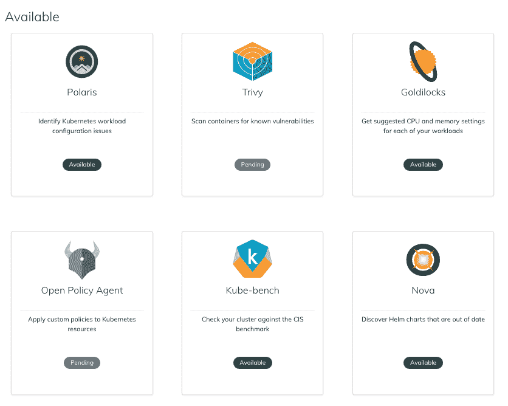
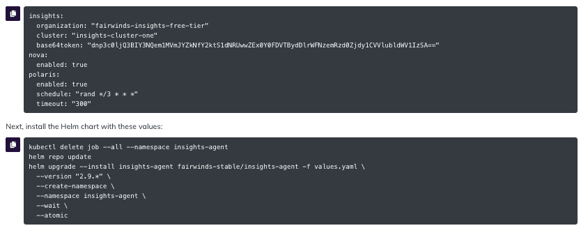
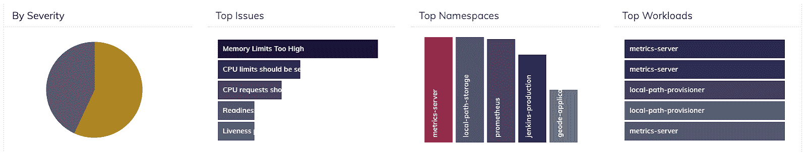

# Fairwinds Insights 基础教程:如何安装集群内代理

> 原文：<https://www.fairwinds.com/blog/fairwinds-insights-basics-tutorial-how-to-install-the-in-cluster-agent>

 首先，让我们讨论一下[fair winds Insights](https://www.fairwinds.com/insights)集群内代理，它到底是什么？在 Fairwinds，我们将用于部署它的舵图称为 Fairwinds Insights 代理。该代理使得使用单个 Helm 安装来部署多个开源工具变得容易；我们将与软件集成的工具称为报告。如果您想要添加或删除报告，这个简单的安装过程可以轻松地重新部署 Fairwinds Insights，这有助于工程师避免进行安装和配置每个工具的定制工作。

集群内代理在您的 Kubernetes 集群内运行，并将收集到的数据发送回 Fairwinds Insights，在 fair winds Insights 中，来自每个报告的调查结果被汇总并发布在仪表板视图中，以便于使用、确定优先级和跟踪问题。这为在 Kubernetes 上部署的组织遇到最多配置问题的三个领域提供了一个统一的多集群视图:安全性、成本效率和可靠性。

## 如何安装集群内代理？

如果您是 Fairwinds Insights 的新手，请查看关于 [如何开始](https://www.fairwinds.com/blog/get-started-with-fairwinds-insights-free-tier) 的这篇文章(尝试我们的免费层，用于多达 20 个节点、两个集群和一个回购的环境)。如果您已经在 Fairwinds Insights 中创建了一个组织，请登录用户界面(UI)。然后，点击左栏中的集群，然后找到右上角的按钮**添加集群**。输入新的集群名称，然后点击**创建集群**。这创建了一个端点，允许代理将数据发送回 Insights 平台。

在 Insights 平台中创建集群后，您有很多选项可以选择如何配置它。Insights 允许许多不同的报告与其共享数据，以帮助您更好地了解您的 Kubernetes 集群是如何运行的。这些报告涵盖了 Kubernetes 的许多重要方面，包括:

根据您目前最关注的领域，您可能希望选择一两个这样的报告(或者更多，由您决定)并安装它们。安装后，报告可以开始扫描您的集群并将数据上传到平台。从那里，您还可以创建 [【吉拉】](https://www.fairwinds.com/blog/kubernetes-basics-tutorial-how-to-integrate-jira-and-fairwinds-insights)[松弛](https://insights.docs.fairwinds.com/installation/integrations/slack/) 警报，为 [治理](https://www.fairwinds.com/blog/kubernetes-governance-what-is-opa) 设置策略，以及其他操作和集成。

现在你已经在 Fairwinds Insights 中创建了集群，让我们看看如何添加 [【北极星】](https://www.fairwinds.com/polaris) 和 [新星](https://nova.docs.fairwinds.com/) 。Polaris 是一个开源策略引擎，可以验证和修复 Kubernetes 资源，而 Nova 可以帮助您找到集群中运行的过时或不推荐使用的舵图。转到顶部导航栏中的 Install Hub，单击 Polaris 下显示 **Available** 的按钮，如果您想要定制您的报告节奏和时间表，请做出选择并单击 **Update Config Options** 。或者，如果您想稍后进行更新，只需点击**快速添加**。

重要的是要明白，完成这一步实际上并不安装北极星或任何其他报告。它为你生成一个舵图，添加北极星和你选择的配置设置。如果你点击 UI 右上角的按钮**准备安装**，你可以看到舵图的新值自动生成。

您可以选择灰色文本，或者单击灰色框左侧的小复制/粘贴图标。

这是 values.yaml 文件的内容，其中还包括允许您向平台进行身份验证的令牌。您可以在代码中看到，Polaris 和 Nova 是您将要启用的两个报告。 现在需要创建 values.yaml 文件，粘贴舵图，然后保存。接下来打开你的命令行，运行提供的 helm install 命令。 然后你可以复制命令来安装带有那些新值的 Insights。

## 配置您的集群内代理

可能需要配置的东西很多。有些配置很简单，就像北极星和新星一样。您可以在 Install Hub 中进行更改并重新构建 values.yaml 文件，也可以在命令行中对该文件进行更新。其他报告需要多一点努力才能正确安装。

[Trivy](https://www.aquasec.com/products/trivy/) 扫描容器中的漏洞，这是一个需要更多配置的报告的好例子。如果您有驻留在私有回购中的容器，比如 AWS 或 GCP 回购，Trivy 将需要访问这些回购的权限。所以您需要在 values.yaml 文件中给它必要的权限。您可以设置许多不同的标志和设置，所以请花一点时间来处理这些报告，使它们适合您的特定需求。

一旦你按照你想要的方式设置了你的配置，是时候通过重新运行提供的舵升级命令来更新舵图设置了。为了检查 pod 的状态，可以在“insights-agent”名称空间中运行“get pods”命令。

仍然查看命令行，您可以看到一切都是按照您计划的方式安装的。如果仔细观察，您会发现代理为 Nova 和 Polaris 设置了许多 cron 作业。根据本例中的设置，它将每三小时运行一次群集扫描。然后，它将这些信息发送回 [Insights](https://www.fairwinds.com/insights) 平台，您可以在 Insights 仪表盘中看到这些数据变成了行动项目。

现在您已经安装了集群内代理，您将看到您的 Insights 仪表板定期更新。您可以回来更改安装了哪些报告以及如何配置它们，这样您就可以专注于使您的 Kubernetes 集群尽可能地安全、经济和可靠。如果遇到困难或有问题，请联系我们。并加入 [Fairwinds 社区 Slack 群](https://fairwindscommunity.slack.com/) 向 Fairwinds 团队和社区成员提问并获得答案。

观看安装视频: [如何安装 Fairwinds Insights 集群内代理](https://training.fairwinds.com/how-to-install-the-fairwinds-insights-in-cluster-agent)

