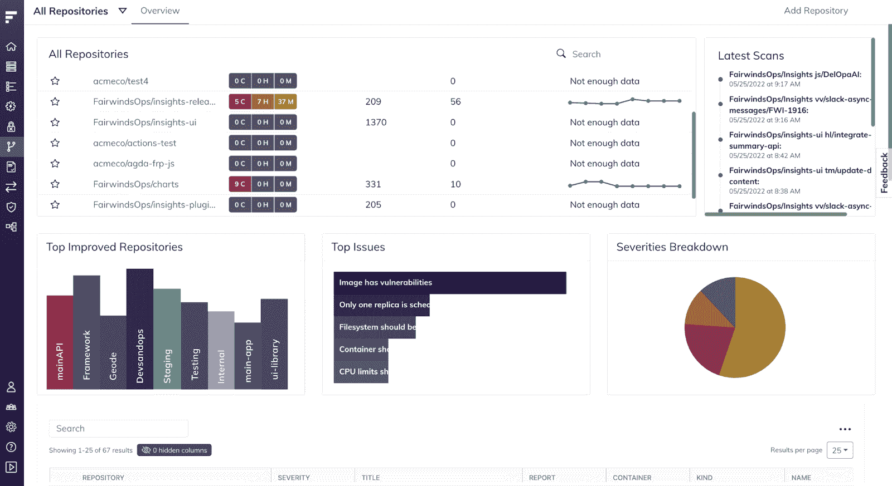
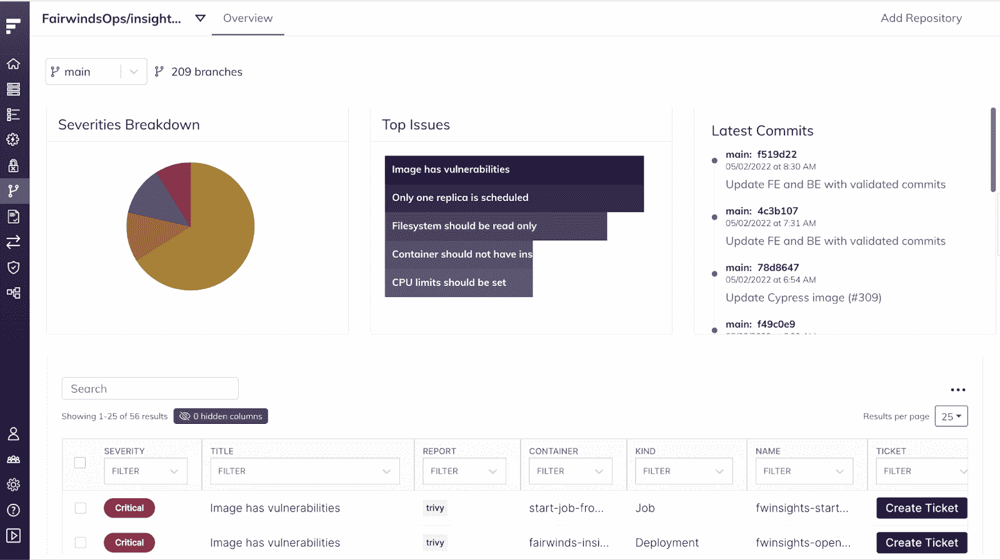

# Fairwinds Insights 最新发行说明:8.5.0

> 原文：<https://www.fairwinds.com/blog/fairwinds-insights-latest-release-notes-8.5.0>

 Fairwinds 最近强调了我们对 Insights 的一些 [增强，有助于进一步统一 DevSecOps 与额外的左移安全功能。我们还深入挖掘了为什么您需要保持](https://www.fairwinds.com/news/fairwinds-insights-latest-release-unifies-devsecops-with-additional-shift-left-security-enhancements) [第三方图像最新](https://www.fairwinds.com/blog/kubernetes-vulnerability-management-third-party-images-up-to-date) 来帮助管理潜在的 Kubernetes 漏洞。除此之外，我们还继续改进我们的 Kubernetes 治理平台，以确保用户能够围绕安全性、可靠性和成本提供保护。

我们最新的发行说明强调了进一步的增强。你可以在 [Fairwinds Insights 文档](https://insights.docs.fairwinds.com/release-notes/#_8-6-0) 阅读所有发布说明。

## **8.5.0**

### **自动扫描基础设施代码**

Fairwinds 正在升级 GitHub 集成，并向所有客户提供新的基础设施代码扫描功能。自动扫描使使用 GitHub 的组织能够跨多个存储库进行基础设施代码扫描，而不必配置单独的 CI 管道。可以对任何 GitHub repo 上的每个 pull 请求启动扫描，并将使用 Fairwinds Insights SaaS 基础架构来运行检查。

*   这消除了配置单个 CI 管道的需要，允许组织节省计算资源，并在几分钟内启动“左移”基础架构代码测试。
*   当然，任何已配置的现有 CI 管道将继续正常运行。如果您认为自动扫描不适合您，没问题—当提示您添加新存储库时，只需选择“手动连接”。这将提供在您自己的基础设施上的 CI 管道中运行扫描的选项，并且不需要 GitHub 权限。

### **基础设施代码文件的自动发现**

现在，使用新的权限，Fairwinds 将自动定位到 GitHub 存储库中可供扫描的 Helm 和 YAML 文件。这避免了在存储库根目录下的 fairwinds-insights.yaml 文件中指定赫尔姆和 YAML 清单的确切位置的需要。

### **扫描结果发布 GitHub 评论**

使用新的权限，Insights 还可以将扫描结果作为 GitHub 评论发布，使开发人员能够专注于他们的工作流程。

### **增强的存储库用户界面**

存储库 UI 已得到增强，支持自动扫描和我们最新的 UX 标准。

所有客户都可以使用这些新功能，并且接受权限是可选的。如果您选择不接受权限，自动扫描将不可用，但用户仍然可以通过将洞察力集成到他们现有的 CI/CD 系统中来采用基础架构代码扫描。

## **8.2.0**

我们的 Insights 代理的 2.0 版本带来了一些小的突破性变化，以提高舵图的可用性。虽然现有的 1.x 安装将按预期继续工作，但在升级到代理 2.0 时，您可能需要更改 values.yaml。当更新到新版本时，准入控制器和 CI 行为也会发生一些微小的变化。 [这里是一个破坏和行为改变的列表。](https://github.com/FairwindsOps/charts/tree/master/stable/insights-agent#version-20)

### **错误修复和改进**

我们也继续通过修复错误来改进平台。以下是其中一些改进的简要概述:

*   一些工作负载指标显示不适用

*   更快地加载集群概览页面

*   效率页面的用户界面改进

*   修复了节点容量图表中有时会出现节点重复的问题

*   节点容量图表中的固定节点名称

*   修复了内存差异，如果差异过大，则显示 0(不适用)

*   到行动项目表的链接现在可以工作了

*   单击下拉列表中的所有集群选项将转到正确的页面

*   修复了取消分配和取消休眠的动作项目

*   在行动项目表上选择多个过滤器现在会显示正确的结果

*   可以创建与以前删除的集群同名的新集群(在 8.1.0 版之前删除的集群)

