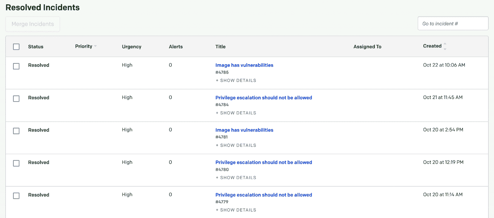

# Fairwinds Insights 现在集成了 PagerDuty

> 原文：<https://www.fairwinds.com/blog/fairwinds-insights-now-integrates-with-pagerduty>

 在 Fairwinds，我们依靠 PagerDuty 来管理我们的随叫随到和支持我们的客户——我们是他们产品的忠实粉丝，无法想象没有它的生活。相反，PagerDuty 使用我们的 SaaS 产品 Fairwinds Insights 来帮助管理和监控他们的 Kubernetes 集群。

作为 Kubernetes 治理和安全软件， [Fairwinds Insights](/insights) 持续扫描集群，以确保应用程序在规模、可靠性、资源效率和安全性方面得到配置。作为彼此技术的客户，PagerDuty 和 Insights 之间的整合是显而易见的。

> 对使用 Fairwinds Insights 感兴趣吗？免费提供！点击此处了解更多信息。

page duty 和 Fairwinds Insights 的客户现在可以针对其 Kubernetes 集群中的关键问题生成和定制 page duty 事件。该功能包括内置于 Fairwinds Insights 的 100 多项检查，包括容器漏洞、不安全的工作负载配置和资源使用情况，以及针对合规性和内部要求的自定义用户定义策略。

## 为什么 Fairwinds & PagerDuty 整合如此重要？

作为一个组织，PagerDuty 是 [全服务所有权](https://ownership.pagerduty.com/introduction/) 的巨大倡导者，引用他的话说:

“全面服务所有权意味着在软件/服务生命周期的每个阶段，人们都有责任支持他们交付的软件。这种级别的所有权使开发团队更加接近他们的客户、业务和交付的价值。反过来，这将释放出关键的竞争优势，使当今的数字世界变得与众不同。”

Fairwinds Insights 在 Kubernetes 中启用了这种服务所有权方法，使*编码、运输、拥有*成为可能。Fairwinds Insights 为 DevOps 团队提供了整个 Kube 环境的可见性，提供了集群的仪表板视图，有助于他们更好地识别与严重的安全性和合规性风险相关的错误配置。我们的平台对这些风险进行优先级排序，最高优先级的项目现在可以被推送到 PagerDuty 中，以确保团队始终掌握 Kubernetes 的错误配置和漏洞。

## 它是如何工作的

page duty 集成允许您为 Fairwinds Insights 中的任何操作项创建 page duty 事件，包括 CI/CD、准入控制和集群内。

寻呼机工作事件通过 [Fairwinds Insights 的自动化规则](https://insights.docs.fairwinds.com/configure/policy/rules/#writing-rules) 创建。可以定制您的自动化规则，仅在特定事件时触发，以及具有不同紧急级别的 PagerDuty 事件。您还可以将资源元数据和补救详细信息添加到事件正文中，等等。

用户使用 Fairwinds Insights 的自动化规则创建新的 PagerDuty 事件，当满足特定场景时，该规则会自动触发。例如，一个常见的用户场景是在 Kubernetes 集群中发现新的高严重性安全错误配置时创建一个 PagerDuty 事件。

创建 PagerDuty 事件后，它将出现在 PagerDuty 控制台中指定的特定服务 ID 下。

阅读 [Insights 文档](https://insights.docs.fairwinds.com/configure/integrations/pagerduty/) 可以得到一个集成演练。

了解更多关于 Fairwinds 的见解和整合、 [联系](https://www.fairwinds.com/fairwinds-insights-demo) 。

