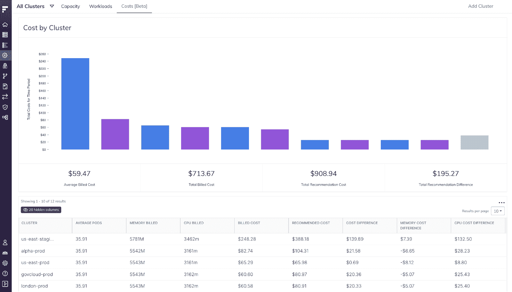
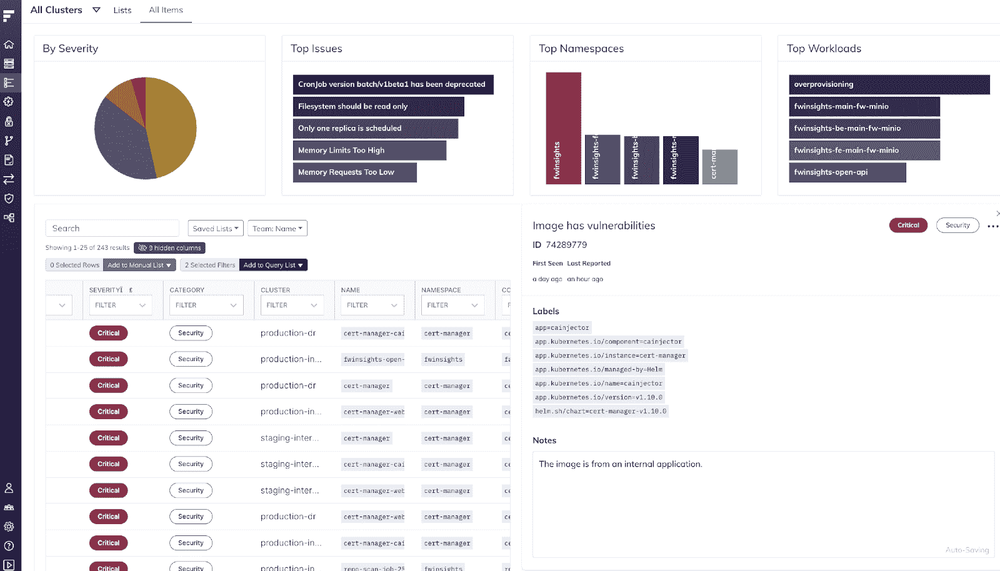

# Fairwinds Insights 发行说明 10.2-10.6:聚焦工作负载成本分配

> 原文：<https://www.fairwinds.com/blog/fairwinds-insights-release-notes-10.2-10.6-spotlight-on-workload-cost-allocation>

 本月的[fair winds Insights](https://www.fairwinds.com/insights)发行说明提供了许多错误修复，以及我们对成本分配功能的最新增强的详细信息。工作负载成本分配允许平台工程经理查看一组工作负载的历史成本，并将支出分配给特定团队，以便公司可以向利益相关方显示成本，并确定可以节省的领域。

借助新的工作负载成本分配功能，平台工程经理可以使用实际的云支出和工作负载使用情况来了解跨多个集群、聚合和自定义时间段发生的历史成本。

[了解更多关于 Kubernetes 治理平台全部特性的](https://www.fairwinds.com/insights-features) 。

## 新费用页面- Beta

Fairwinds 发布了新费用页面的测试版。组织可以使用该页面更好地了解他们的 Kubernetes 集群成本明细。要查看这一新页面，请访问 Insights 中的效率>成本。

## 错误修复和改进

*   现在，安装中心推荐使用 Insights Agent 2.8

*   行动项目表格中的新 ID 栏

*   UI 指示何时删除危险区域中的集群

*   更改了漏洞中修复版本列的过滤器

