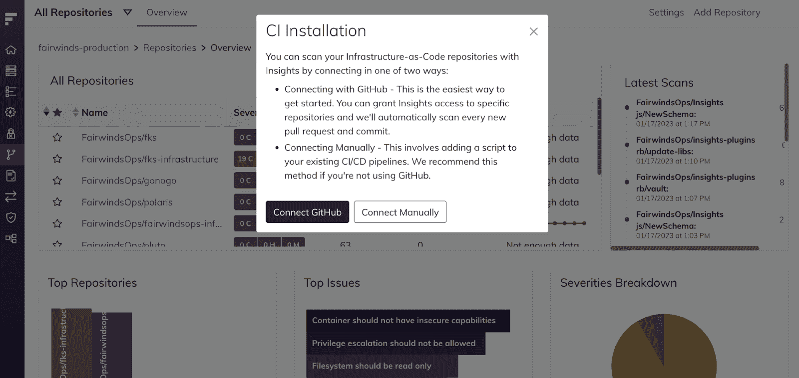

# Fairwinds Insights 发行说明 10.7-11.1:新见解持续集成(CI)脚本

> 原文：<https://www.fairwinds.com/blog/fairwinds-insights-release-notes-10.7-11.1-new-continuous-integration-script>

 本月的[fair winds Insights](https://www.fairwinds.com/insights)发行说明包括几个错误修复和改进，以及一个新的 Insights 持续集成(CI)脚本，以提高持续集成/持续交付(CI/CD)扫描的可靠性。新的 Insights CI script 2.2.0 现在可以更好地处理不同的 Git 签出状态。

借助更新的 Insights CI/CD 脚本，Fairwinds Insights 能够更好地处理各种 Git 检验状态，从而提高 CI/CD 扫描的可靠性。升级到最新版本的 Insights CI/CD 脚本的 Insights 用户将看到更少的错误，如“无法获得合并基础”

使用 Insights 持续集成(CI)脚本的客户现在也可以扫描 Terraform 文件以发现安全缺陷。这使组织能够实现更大的基础设施即代码扫描覆盖率。

请注意，此功能尚不可作为自动扫描的一部分。要获取脚本，请导航至“存储库”>“添加存储库”>“手动连接”。

## 错误修复和改进

我们在过去几周进行了大量修复，以确保 Insights 尽可能直观和全面，以便您可以专注于快速发布云原生应用。

*   自动扫描存储库的状态指示器引导用户扫描日志

*   固定 簇中健康评分卡中行动项目的顺序

*   添加文件名到 仓库中的行动项卡片

*   增加了更多州对 合规 报告的检查

*   通过质控 id 过滤合规报告检查的能力

*   修正了费用测试页中的高级过滤

有兴趣尝试 Fairwinds 的见解吗？它可免费用于多达 20 个节点、两个群集和一个存储库的环境！ [点击](https://www.fairwinds.com/coming-soon) 了解更多见解自由层。要了解如何使用最新的功能并了解最新的[fair winds Insights，请在此处查看发行说明](https://insights.docs.fairwinds.com/release-notes/?utm_campaign=Fairwinds%20Insights%3A%20Release%20notes&utm_source=hs_email&utm_medium=email&_hsenc=p2ANqtz-8kxXaoeWDuI2rFl0smhfCIWuBTr1uJ4zHBWT9dQ_yroNz7qTppogIYlKu75JGBavIEA0PM) 。

