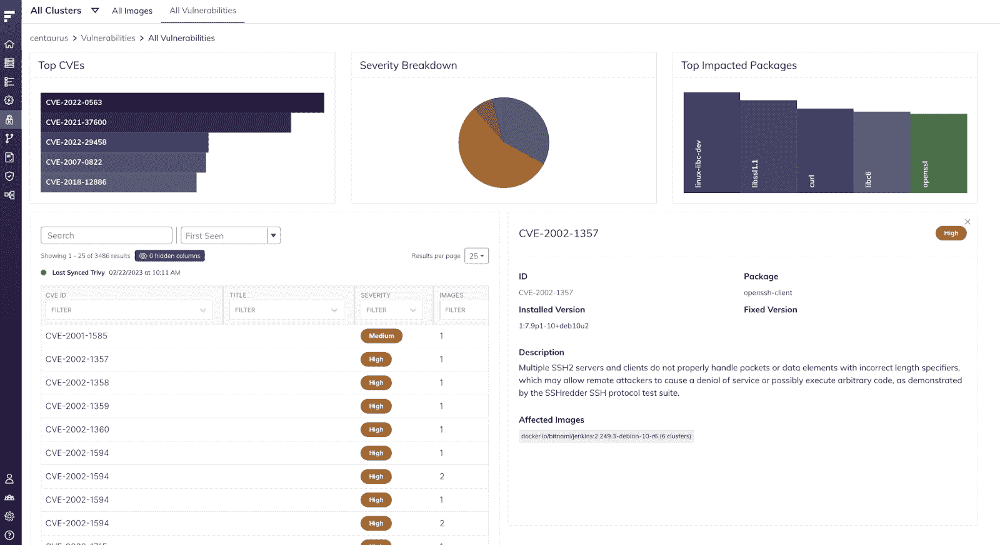
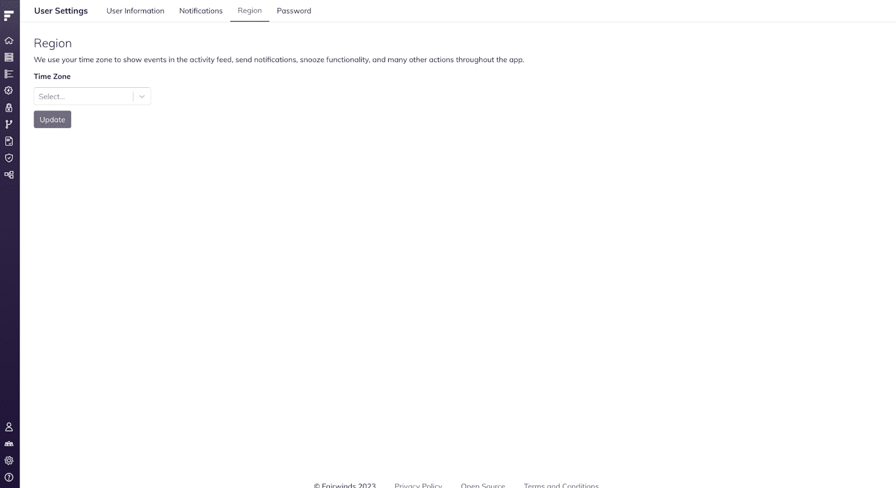

# Fairwinds Insights 发行说明 11.2-11.6:改进的集群概述

> 原文：<https://www.fairwinds.com/blog/fairwinds-insights-release-notes-11.2-11.6-improved-cluster-overview>

 这个月，[fair winds Insights](https://www.fairwinds.com/insights)的发行说明包括几个错误修复和改进。我们已经更新了“集群概述”页面，以改变行动项目图表的工作方式。还提供了新的集群数据，因此您可以通过访问此页面快速了解集群的整体状态。

通常，在 Kubernetes 网络内部运行的工作负载容器使用基于 HTTP 的入口控制器向外界公开；为了确保安全，您需要向 Kubernetes 集群添加一个基于 SSL/TLS 加密的配置。为了验证您是否已为集群配置了 TLS，Insights 现在还包括针对入口的自动化合规性 TLS。您可以使用 Fairwinds Insights 自动运行该合规性测试。集成到 Insights 中的 [Polaris](https://www.fairwinds.com/polaris) 检查 Kubernetes 集群中的所有入口是否都配置了 TLS。

Fairwinds Insights 现在还使您能够在部署过程的早期发现安全问题。最新的更新包括一个新的 Insights CI 脚本，使您能够 [扫描 Terraform 文件](https://www.fairwinds.com/blog/new-fairwinds-insights-release-terraform-scanning) ，自动扫描功能允许您扫描私人图像。有关其工作原理的更多信息，请访问 Insights 文档中的 [自动扫描](https://insights.docs.fairwinds.com/configure/ci/autoscan) 页面。

## 错误修复和改进

我们将继续修复和解决缺陷，以确保您的洞察力经验能够让您更轻松地快速识别和解决可靠性、安全性和成本效益方面的问题。

*   用户现在可以通过访问用户设置>地区页面来选择他们的时区

*   用户现在可以导航到漏洞页面中受影响的图像

*   修复了效率页面中未显示的节点容量图表

*   修正了行动项目列表的表格视图功能的问题

*   对集群概览页面的小改进

*   修复创建第三方票流

*   修复漏洞-某些组织的所有图片页面无法加载

*   费用页面的改进

*   修复了自由层升级按钮的重定向

*   修正了合规报告的编辑

*   删除了集群概览页面中的设置细节

如果您还没有使用 Fairwinds Insights，请尝试新的层！它可免费用于多达 20 个节点、两个群集和一个存储库的环境。 [点击](/blog/get-started-with-fairwinds-insights-free-tier) 了解更多关于洞察自由层的信息。要了解更多有关如何使用最新功能并与 [Fairwinds Insights 更新保持同步的详细信息，请查看此处](https://insights.docs.fairwinds.com/release-notes/?utm_campaign=Fairwinds%20Insights%3A%20Release%20notes&utm_source=hs_email&utm_medium=email&_hsenc=p2ANqtz-8kxXaoeWDuI2rFl0smhfCIWuBTr1uJ4zHBWT9dQ_yroNz7qTppogIYlKu75JGBavIEA0PM) 的发行说明。

