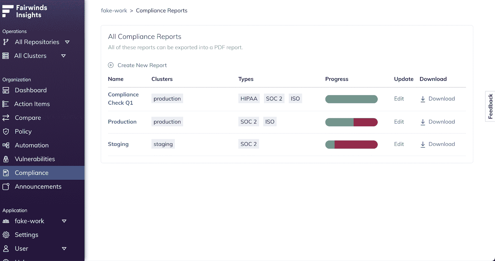
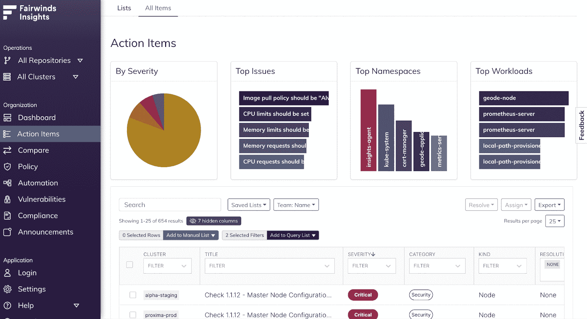

# Fairwinds Insights 发行说明 6.7.0-7.1.0:关注减少 Kubernetes 警报疲劳

> 原文：<https://www.fairwinds.com/blog/fairwinds-insights-release-notes-6.7.0-7.1.0-spotlight-on-reducing-kubernetes-alert-fatigue>

 我们一直在根据客户反馈为 Fairwinds Insights 开发新功能。我们最近对软件做了几处改动。从错误修复到合规性功能到配置设置，这些发行说明涵盖了我们最近对 Fairwinds Insights 的所有升级，以帮助用户改善他们的 Kubernetes 安全性和治理。

## 特色聚焦:减少噪音和警报疲劳

使用配置验证解决方案时，有时会出现警报噪音。当用户跨多个集群响应多个配置问题时，“警报疲劳”可能会令人痛苦。Fairwinds Insights 帮助汇总来自各种工具的调查结果，现在包括高级过滤，因此用户可以减少噪音和痛苦的警报疲劳。我们在行动项目中添加了图表，以便团队可以根据严重性、主要问题、命名空间或工作负载轻松查看警报。

## Fairwinds Insights 发行说明

**6.7.0 许可控制器 Kubernetes 1.22 支持**

准入控制器已更新，以支持 Kubernetes 1.22。这意味着在集群上运行 1.22 的用户现在可以在自己的工作负载中使用准入控制器特性。

**6.9.0 新的合规特性**

此功能允许组织为其 Kubernetes 集群创建合规性报告。客户现在可以通过创建报告和对每次检查进行自我评估来跟踪他们的 SOC 2、 [、HIPAA](https://www.fairwinds.com/blog/how-kubernetes-is-changing-the-face-of-medical-technology) 和 ISO 合规性。在自我评估期间，客户可以提供证据证明他们是如何遵守每项检查的。也可以随时下载 PDF 格式的完整报告。

**配置准入控制器**

用户现在能够通过 Insights 配置准入控制器的设置。准入控制器可以被设置为被动模式，该模式将执行通常的检查，但不会阻止任何准入请求。此外，用户可以选择哪些报告应该阻止准入请求。当组织的所有者访问**准入控制器**上的**安装中心**时，他们可以访问这些设置。

**6.11.0 行动项目图表**

Insights 中的措施项页面现在有图表，这些图表按照严重性、主要问题、主要名称空间和主要工作负载对措施项进行可视化分类。用户还可以通过单击图表中的项目来过滤行动项目表。

****

**错误修复和改进**

有关我们最近对 Fairwinds Insights 的错误修复和改进的具体信息，请随时 [访问我们的发行说明](https://insights.docs.fairwinds.com/release-notes/) 。对于那些已经在使用我们开源项目的人，我们最近启动了一个用户组。加入我们吧！您可以在这里注册 Fairwinds 开源用户组，并考虑参加我们于 2022 年 3 月 23 日举行的下一次会议。

**使用 Fairwinds Insights**

使用我们的 Kubernetes 安全和治理软件了解更多信息！Fairwinds Insights 是免费的。你可以在这里报名。

