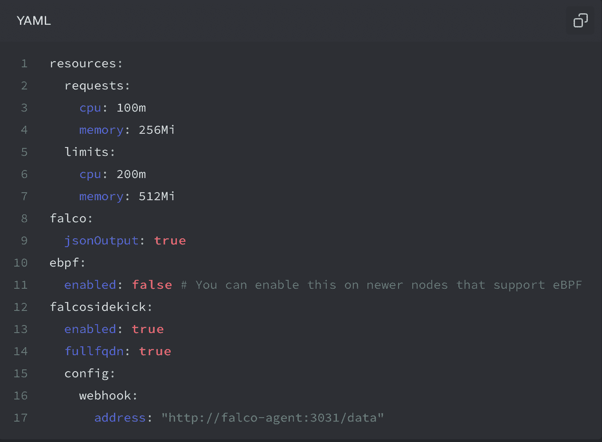
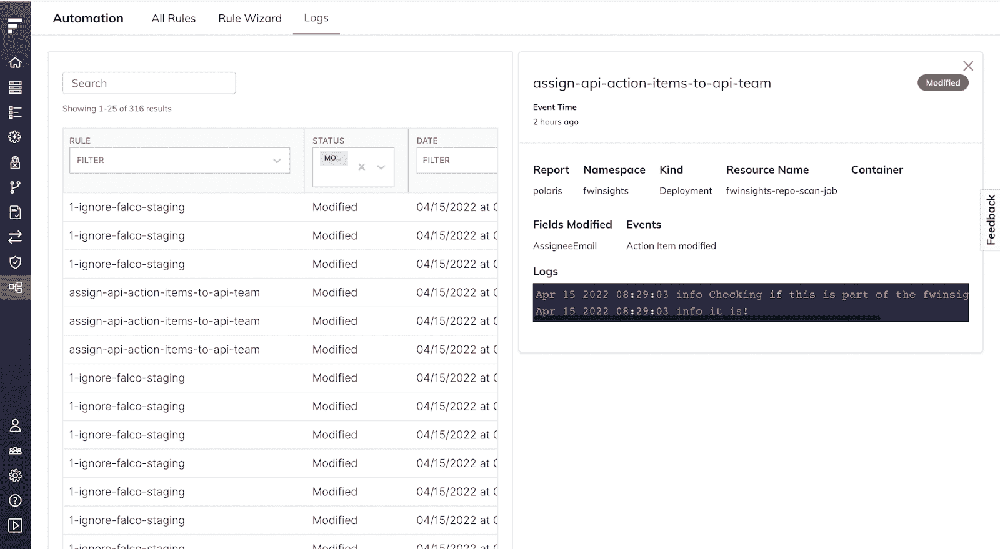
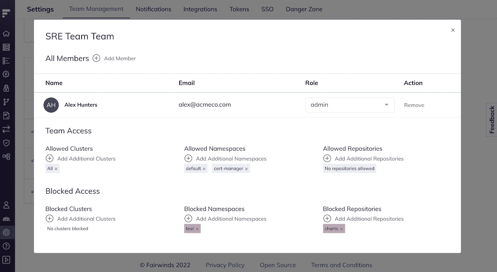
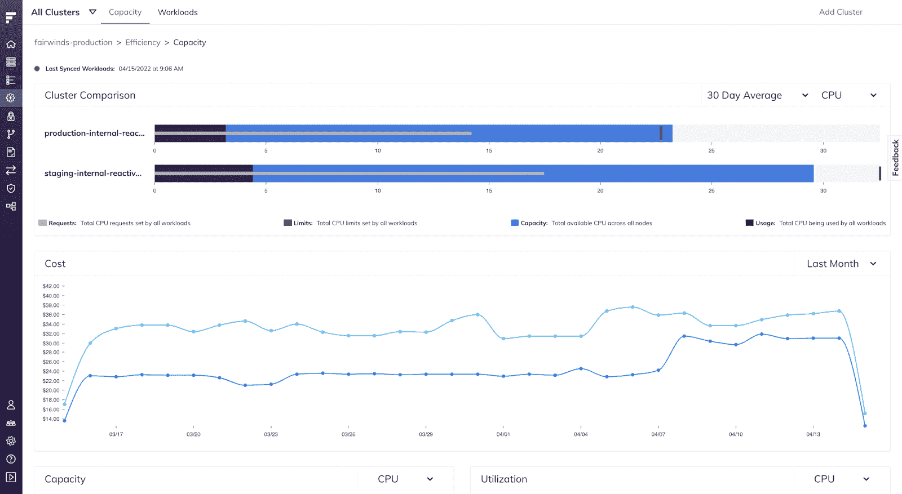

# Fairwinds Insights 代理 2.0 |发行说明:7.12.0 - 8.1.0

> 原文：<https://www.fairwinds.com/blog/fairwinds-insights-release-notes-7.12.0-8.1.0-insights-agent-2.0>

 费尔温斯的春天快乐！四月份，我们对 Kubernetes、 [Fairwinds Insights、](https://www.fairwinds.com/insights) 的 SaaS 治理平台的特性和功能进行了大量新的改进。除了常见的错误修复，本月的发行说明将涵盖几项关键升级，包括关注自动化规则日志和围绕 Insights Agent 2.0 新版本的公告。请继续阅读，了解有关 Insights 最新增强功能的更多信息，以及如何充分利用其不断改进的功能。

## 洞察代理 2.0

我们很高兴地宣布我们的 Insights 代理的 2.0 版本！这个新版本带来了一些小的突破性的变化，以提高舵图的可用性。虽然您现有的 1.x 安装将按预期继续工作，但在升级到这个新版本时，您可能需要更改您的**值。在更新到代理 2.0 时，您还可以预期准入控制器和 CI 行为会有一些微小的变化。**

要了解更多关于用户应该如何处理这些配置更改和**值. yaml** 更新、 [的信息，请随时访问代理 2.0 发行说明](https://insights.docs.fairwinds.com) 。

## **功能亮点:7.13.0 自动化规则日志**

除了一些错误修复之外，升级 7.13.0 还包括自动化规则页面的新选项卡，用户可以在其中找到自动化规则的日志。这种改进通过添加像 **console.log** 语句这样的元素——或者查看任何运行时错误，使得调试自动化规则变得更加容易。

作为建议的映像升级的结果，Trivy 现在将在源 repo 中搜索可用的更新，这将解决当前安装的映像中存在的 CVE。用户将在**补救**文本中找到这些建议，并附有琐碎的行动项目。

注意:您需要更新到最新版本的 Insights Agent (1.17.28)才能利用此功能。

## 7.12.0 阻止团队访问的能力

本月的另一个重要功能升级包括阻止团队访问 Fairwinds Insights 中的特定名称空间和存储库。具有特定访问权限的团队成员将不再能够看到阻止列表中的集群、名称空间和存储库。现在可以使用 Esc 键盘按钮关闭操作项，从而在工作负载页面上进行搜索时提供更好的性能。

## 8.1.0 新集群和节点成本

这个新页面允许用户快速查看他们正在使用的资源量与可用资源量的对比。这一升级提供了一个很好的工具，可以帮助客户识别利用率不足或过高的集群。组织中的用户可以比较所有集群之间的资源利用率，并查看与每个集群相关的成本。此外，他们可以了解 Kubernetes 集群中每个节点的资源利用率。关于集群和节点成本的新页面可以在**效率>容量**下找到。此外，用户现在还可以创建一个与以前删除的集群同名的集群。

## 错误修复和其他改进

7.14.0-8.00 版本主要包括错误调整和修复。有关这些增强功能的更多具体信息，请随时访问我们的发布说明 。

