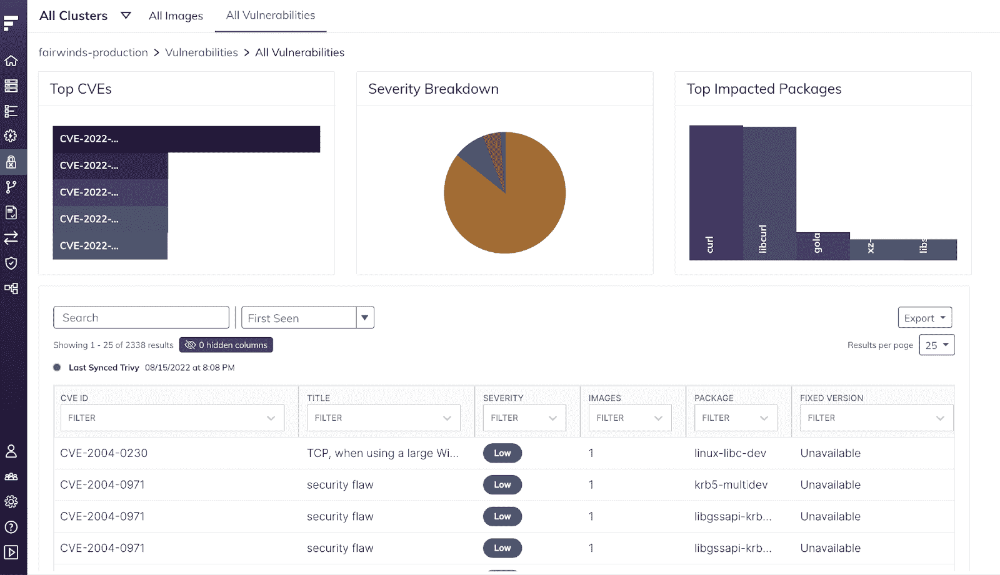
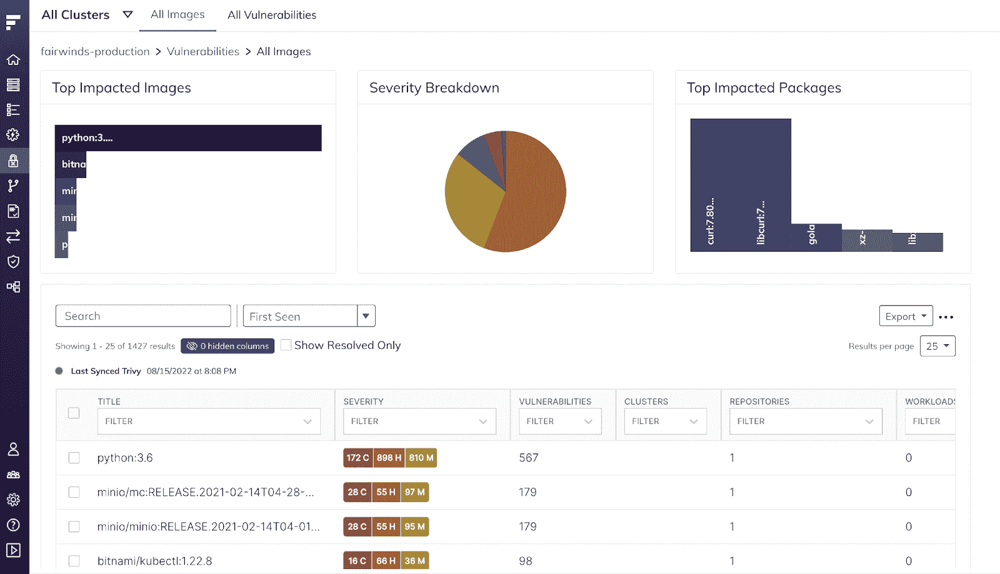

# Fairwinds Insights 发行说明:8.10-9.6

> 原文：<https://www.fairwinds.com/blog/fairwinds-insights-release-notes-8.10-9.6>

 在过去的一个月里，Fairwinds 开发团队发布了许多 Insights 的更新，包括我们新设计的帮助团队降低风险的[漏洞浏览器](https://www.fairwinds.com/blog/mitigate-kubernetes-risk-with-vulnerabilities-explorer)。

## 聚焦漏洞浏览器

漏洞资源管理器的更新使团队能够轻松了解高层次的风险，并解决影响最大的问题。([看视频游](https://youtu.be/8e9PzPQEJhM))。Fairwinds Insights 可识别顶级 CVE、风险最高的工作负载和最易受攻击的容器包。团队还可以选择按图像或漏洞查看数据，从而灵活地关注最相关的上下文。漏洞浏览器通过提供带有预计漏洞减少计数的自动升级建议，进一步支持节省时间。

## Insights 发行说明

### 9.6.0

*   公共存储库中的 Fairwinds Insights 详细信息链接重定向到新的存储库页面
*   在添加存储库的手动连接流程中，推荐新的 Insights CI 脚本版本 2.1.0
*   为注册和支持页面添加了验证码
*   现在，行动项目表格中的栏可以完全展开
*   修复了访问用户设置页面时左侧导航中的组织下拉菜单
*   修正了合规报告中的 ISO 27001 下拉列表
*   现在建议在安装中心安装 Insights Agent 2.6

### 9.5.0

重新设计的漏洞页面，使团队能够从高层次理解风险，并解决影响最大的问题。“所有映像”选项卡允许组织查看哪些映像风险较高，而“所有漏洞”选项卡则帮助用户确定他们是否受到了某些漏洞的影响。

### 准入控制器中的冥王星

[冥王星](https://pluto.docs.fairwinds.com/)已在准入控制器中启用。如果使用不赞成使用或已删除的 Kubernetes 资源，则准入请求将创建低和中严重性操作项。要了解如何在准入控制器中配置报告，请访问安装中心和策略文档。

## 错误修复和改进 8.10-9.6

*   存储库中的设置按钮允许更容易地访问启用/禁用自动扫描
*   存储库中的“操作项目”表格现在有一个“文件名”列
*   左上方的集群下拉列表在几个页面上被修复
*   新用户的密码需要数字、字母和符号
*   在存储库中选择手动连接时，代码复制现在可以正常工作
*   修复了图表为空时效率>工作负载页面中的错误
*   修复了存储库中的自动扫描切换
*   行动项目表中的事件 ID 现在是事件类型
*   在“集群概述”页面中，Insights 版本已更改为代理版本
*   将建议的 Insights 代理版本更新至 2.4
*   查看者现在可以在自动化中查看日志
*   修正了吉拉门票的漏洞链接
*   添加了仅针对一个复制副本的描述和补救是计划操作项
*   OPA 策略现在有了正确的事件类型
*   通过洞察提高可访问性
*   为存储库操作项添加了导出选项
*   文档的固定链接
*   集群页面加载改进

点击此处阅读[完整发行说明。](https://insights.docs.fairwinds.com/release-notes/#_9-6-0)

