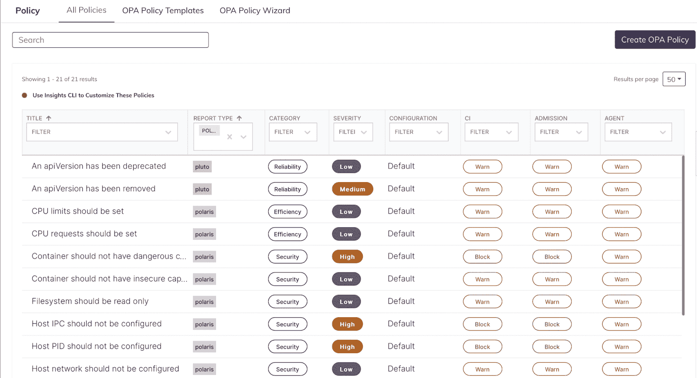

# Fairwinds Insights 发行说明 8.6-10:聚焦政策和 NSA 强化指南

> 原文：<https://www.fairwinds.com/blog/fairwinds-insights-release-notes-8.6-10>

 Fairwinds Insights 在过去的一个月中得到了增强，增加了许多新功能和错误修复。Kubernetes 治理平台确保用户可以配置设置，以确保安全风险最小化和成本优化，同时为开发人员提供护栏，以更快地交付应用程序。

## 聚焦:NSA Kubernetes 强化指南

作为我们的 NSA Kubernetes 强化指南的一部分，我们提供了有关如何使用 Insights 帮助改善 [pod 安全性](https://www.fairwinds.com/blog/three-ways-fairwinds-insights-can-root-out-poor-pod-security)、[网络访问](https://www.fairwinds.com/blog/nsa-hardening-guide-locking-down-network-access-with-fairwinds-insights)、[认证和授权](https://www.fairwinds.com/blog/nsa-hardening-guide-how-can-fairwinds-insights-strengthen-your-authentication-authorization-practices)、[审计日志记录和威胁检测](https://www.fairwinds.com/blog/nsa-kubernetes-hardening-guide-audit-logging-and-threat-detection-overview)和[升级和应用安全实践的信息。](https://www.fairwinds.com/blog/nsa-kubernetes-hardening-guide-upgrade-and-application-security)现在，Fairwinds Insights 提供了为用户导出报告的功能，以指导集群实现 NSA 强化。该报告将显示 NSA 政策、相关洞察检查以及需要解决的行动项目数量。

## 聚焦:增强的策略配置

我们重新设计了策略页面，现在显示 Insights 内置的所有策略以及用户添加的任何 OPA 策略的列表。用户现在能够看到每个策略的严重性，以及他们当前是否会阻止准入请求或 CI/CD 管道。在使用 Insights UI 创建新策略时，我们也开始使用 OPA v2。

## Insights 发行说明

## 8.10.0

### 策略配置器

我们重新设计了 Insights 中的政策页面。策略页面现在将显示作为 Insights 一部分的所有策略以及用户添加的任何 OPA 策略的列表。用户现在能够看到每个策略的严重性，以及他们当前是否会阻止准入请求或 CI/CD 管道。此外，用户现在能够使用 Insights CLI 设置这些值[，以根据他们的需求定制策略](https://insights.docs.fairwinds.com/configure/cli/settings)。

### 洞察 CI 脚本 2.0

我们的用户可以在 CI/CD 渠道中使用新的 Insights CI 脚本。新的 2.0 Insights CI 脚本现在将根据准入和 CI 策略中设置的值阻止准入请求和 CI/CD 管道。使用自动扫描功能的用户[将自动使用这个新的脚本版本。2.0 脚本还默认只阻止严重性为高或严重的操作项目。](https://insights.docs.fairwinds.com/installation/ci/autoscan/)

## 8.9.0

### 使用 OPA v2 在 Insights 中创建新策略

使用 Insights UI 创建新策略时，我们将使用 OPA v2。这里最大的变化是不再需要 YAML 实例。所有 v1 策略将继续工作，并且仍然能够在 Insights web UI 中进行编辑。OPA v2 仅适用于 [Insights Agent 2.x](https://github.com/FairwindsOps/charts/tree/master/stable/insights-agent#version-20) 。要了解更多关于 OPA v1 和 v2 之间的差异，请查看 [V1 和 V2 洞察 OPA 政策。](https://insights.docs.fairwinds.com/configure/policy/policy/#v1-and-v2-insights-opa-policies)

## 8.7.0

### NSA 强化指南的 CSV 导出

用户现在可以导出一份报告，指导他们的集群进行 NSA 加固。该报告将显示 NSA 政策、相关洞察检查以及需要解决的行动项目数量。要获取报告，请转到 Action Items 页面，从左上角的下拉列表中选择一个集群，然后单击 Export > Export NSA Report 按钮。

## 8.6.0-8.10.0

### 错误修复和改进综述

*   工作负载现在即使经过过滤也可以导出
*   修正了显示百分比时准入控制器图表的显示
*   现在，删除集群需要在确认之前键入集群名称
*   修复了导出行动项目时缺少的名称字段和重复的名称空间字段
*   改进了冥王星行动项目的描述和标题
*   添加了为不同平台设置 CI 集成的说明
*   删除了节点容量图表中显示为空白的节点
*   修正了联系表格的问题
*   更新的 Insights CI 脚本
*   修复了存储库中主要问题图表的排序
*   改进了群集概览页面的加载速度
*   登录页面的新背景
*   修正了当鼠标停留在首页的热门话题图表上时弹出窗口被切断的问题
*   一些工作负载指标显示不适用

