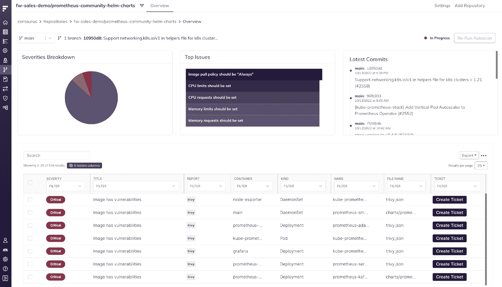

# Fairwinds Insights 发行说明 9.12-10.1:聚焦自动扫描增强功能

> 原文：<https://www.fairwinds.com/blog/fairwinds-insights-release-notes-9.12-10.1-spotlight-on-autoscan-enhancements>

 本月的[fair winds Insights](https://www.fairwinds.com/insights)发行说明提供了许多错误修复和对我们的自动扫描功能的增强。Autoscan 专为需要在多个团队中部署基础设施代码扫描的平台工程经理而设计，可自动发现和扫描 GitHub Repos 中的 YAML 文件和掌舵图，并提供自动扫描，无需单独的 CI 管道集成。借助 Autoscan，平台工程团队可以在几分钟内配置基础设施代码扫描，从而创建一个即时反馈循环，以便开发人员可以更快地修复问题。

[了解更多关于 Kubernetes 治理平台全部特性的](https://www.fairwinds.com/insights-features) 。

## 10.1.0

### 自动扫描日志

打开了自动扫描的存储库现在会在其存储库页面底部看到自动扫描日志部分。这将帮助用户更好地调试自动扫描功能的问题。

## 10.0.0

### 重新运行自动扫描

如果存储库设置了自动扫描，用户现在可以在其分支上重新运行 Insights 扫描。为此，请访问“存储库”页面，选择存储库和分支，然后单击“重新运行自动扫描”按钮。

## 9.12.0

### 关闭已修复和已解决行动项目的第三方票证

当某个操作项有关联的 GitHub、Azure DevOps 或吉拉票证，并且该操作项已修复或解决时，第三方票证将自动关闭。

## 错误修复和改进

*   加快加载集群页面的改进

*   打开了自动扫描的存储库现在将具有扫描状态

*   Insights Agent 2.6.11 中的新版本 Nova 将为过期容器创建操作项

*   修复了存储库中主要问题图表上的标签

*   修复了漏洞>所有图像表的导出功能

*   修正了在 Azure DevOps Scrum 项目上创建标签的问题

*   无法再对行动项目中的标签列进行排序

*   SSO 登录流程的改进

*   更改了漏洞中推荐标记列的过滤器

*   用户不再能够使用相同的名称创建合规性报告

*   使用 SSO 链接登录将提示用户输入他们的组织名称

*   已修复 Azure DevOps 票证在解决或修复行动项目后无法关闭的问题

*   固定右侧尺寸描述

