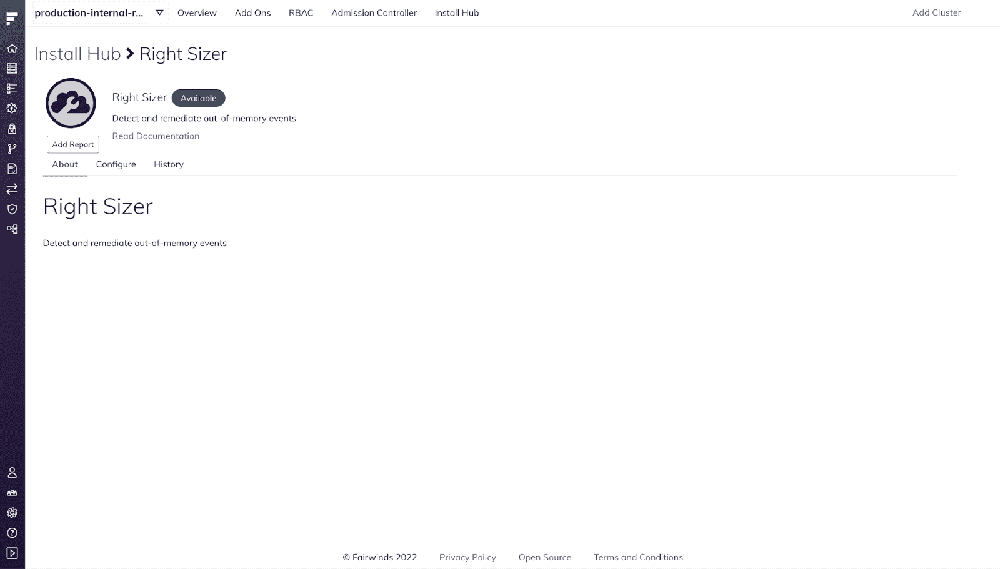
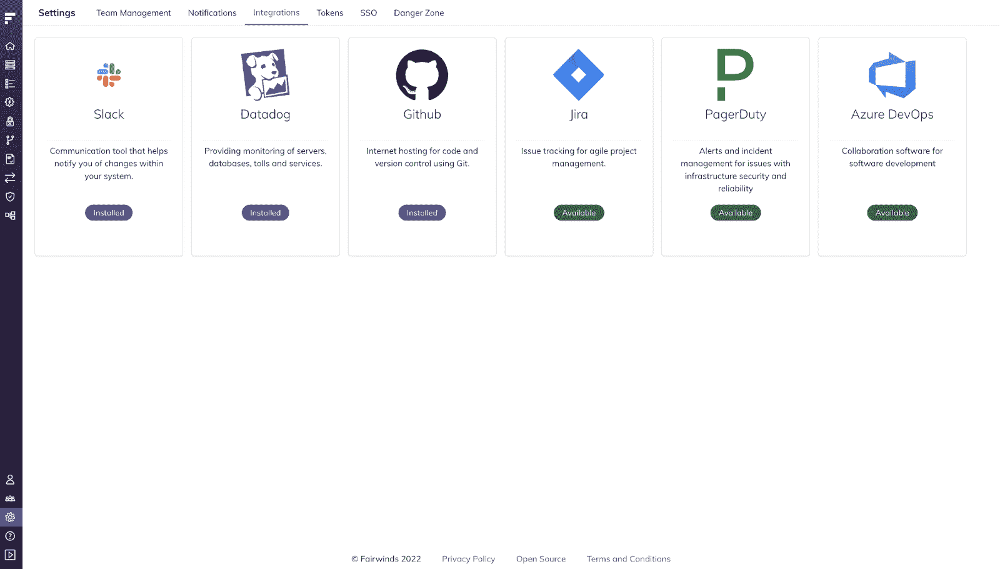

# Fairwinds Insights 发行说明 9.7-9.11:聚焦新报告

> 原文：<https://www.fairwinds.com/blog/fairwinds-insights-release-notes-9.7-9.11>

 我们一直在根据客户反馈为 Fairwinds Insights 开发新功能。我们最近对软件做了几处改动。从错误修复到新的集成，这些发行说明涵盖了我们最近对 Kubernetes 治理平台 Fairwinds Insights 的所有升级。

这个月，我们向 Azure DevOps 添加了新的集成，并使 AWS Costs、Right-Sizer 和 Falco 报告易于添加到见解中。请继续阅读，了解更多信息。

## 9.11.0

### Right-Sizer、AWS Costs 和 Falco

我们已经将 Right-Sizer、AWS Costs 和 Falco 报告添加到安装中心页面。可以像往常一样使用报告下的快速添加选项添加 Right-Sizer 报告。但是，AWS 成本和 Falco 需要更多配置，快速添加选项不适用于这些报告。相反，您将被带到这些报告的文档页面。

用户现在可以访问自动化规则中操作项的名称空间标签和名称空间注释。若要访问这些值，请使用 ActionItem。命名空间标签和 action item . namespace annotations

## 9.7.0

### 新的 Azure DevOps 集成

新的 Azure DevOps 集成允许组织将其 Azure DevOps 连接到 Insights，并手动或通过自动化规则创建行动项目的票证。要了解有关 Azure DevOps 集成的更多信息，请访问 [Azure DevOps 文档。](https://insights.docs.fairwinds.com/installation/integrations/azure)

### 

*   选择效率页面时，将始终显示所有群集视图

*   默认情况下，在效率中选择最新的数据

*   对于“新图像有漏洞”操作项，该图像会在描述下列出

*   贯穿 Insights 的微小 UI 修复

*   默认情况下，效率页面中的节点列表现在按角色排序

*   修复了普罗米修斯收集器文档链接

*   修正了效率页面中的节点搜索

*   效率中的节点容量内存图表现在可以正确显示

*   只有组织所有者能够向 Insights 添加新的存储库

*   健康分数现在使用新的时间表数据库，所以健康分数可能略有不同

*   用户将在主页中找到以下新信息:

*   L30D 的平均节点数(过去 30 天)

*   自定义策略集的数量

*   自定义规则集的数量

*   用户现在可以在效率页面中为群集比较设置不同的比例

*   修复了存储库页面中存储库名称被截断的问题

*   “所有存储库”下的“名称”列现在可以展开

