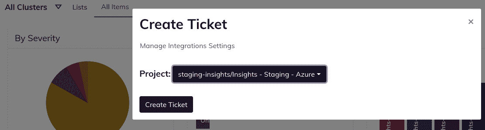
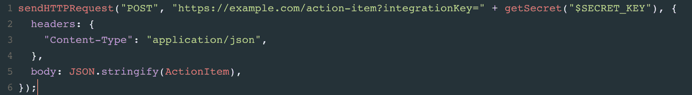

# 新的 Fairwinds Insights 发布:Azure DevOps 集成和秘密加密

> 原文：<https://www.fairwinds.com/blog/fairwinds-insights-releases-azure-devops-integration-secret-encryption>

 如果你正在管理一个使用 Kubernetes 的开发团队，毫无疑问你会遇到一些扩展问题——不是关于支持终端用户，而是关于能够容易地发现、分类和修复问题。最重要的是，您已经有了现有的工具来帮助开发团队已经在使用(并且很有希望喜欢)的票证或 CI/CD 管道工具，所以您不希望中断任何工作流。

但是你需要确保 Kubernetes 的安全性和成本效益。这就是 Fairwinds Insights 的帮助所在。它为您提供了 Kubernetes 集群的集中视图，帮助您识别应用程序中的安全性、性能和成本错误配置。它在实现所有这些的同时支持 Kubernetes 服务所有权，即开发团队对他们在开发生命周期的每一步交付的产品和服务负责的能力。

## 开发团队不需要另一个平台

在开发 Kubernetes 平台时，您已经选择了许多工具，所以您可能想知道为什么要在开发团队的道路上放置另一个平台。你不需要担心那个！

Fairwinds Insights 集成了 Kubernetes 社区可用的一些最广泛的工具，包括吉拉、Slack、PagerDuty 等。这种集成意味着，当 Insights 发现一个问题时，就会从 Insights 向您的开发人员已经喜欢的工具推送一个标签或通知。

从 Insights 内部触发工作流简化了将所有权分配给适当团队的流程，节省了时间和访问多个 ui 的次数。

> 对使用 Fairwinds Insights 感兴趣吗？免费提供！ [在此了解更多](https://www.fairwinds.com/coming-soon) 。

最近发布的两个版本引入了从 Insights 平台与第三方提供商交互的新方式。

## **在 Azure DevOps 中分配工作项目**

Azure DevOps 加入吉拉和 GitHub，成为 Insights 中最新的第三方票务集成。用户现在可以从 Insights 操作项手动创建 Azure DevOps 工作项，也可以通过自动化规则自动创建。安装轻而易举，从“设置”页面的“集成”选项卡触发。[查看文档](https://insights.docs.fairwinds.com/installation/integrations/azure/#installation)。

## 使用 Secrets Encryption 对第三方 API 进行安全的 Webhook 调用

虽然 Insights 有许多现有的集成，但您可能已经使用了一个工具，并希望将其功能扩展到。为此，Insights 使用了 [自动化规则](https://insights.docs.fairwinds.com/configure/automation/rules/#creating-automation-rules) 。此功能使您能够定制工作流，以处理来自 Fairwinds Insights 的新发现。例如，您可以在一个票据系统中创建新的问题，或者触发一个松弛警报。它有助于确保洞察力增加开发生命周期的效率，而不是妨碍它。

自动化规则的一个重要部分是能够安全地访问您发送洞察数据的位置。这就是为什么现在您可以 [添加和存储加密的秘密](https://insights.docs.fairwinds.com/configure/automation/integrations/#adding-and-using-secrets) 扩展现有的自动化规则功能以应对新的用例。使用“sendHTTPRequest”功能，可以上传和加密机密，以便对第三方服务(如票务提供商)进行安全的 webhook 调用。

## 使用洞察力和开发团队喜欢的工具

借助 Fairwinds Insights，您可以获得以下优势:

*   集中查看集群和基础架构代码扫描

*   开发、安全和运营部门的一致性

*   最重要的优先列表以及如何修复它

借助 Insights 及其交互，您将使开发团队能够在其应用中拥有安全性、性能和成本配置。

