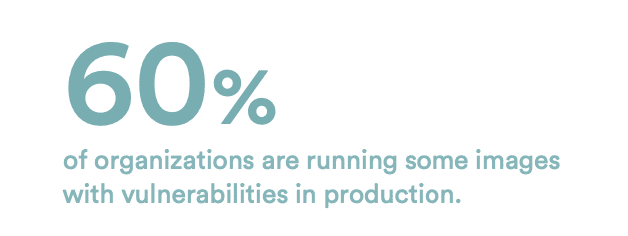

# 在我们新的基准测试报告中了解您的 Kubernetes 工作负载的对比情况

> 原文：<https://www.fairwinds.com/blog/find>

 经过长时间的艰苦工作，建立了全面有效的 Kubernetes 所有权，并让您的每个开发团队正确配置了他们的工作负载，您是否想过您的容器配置与您在云原生环境中的同行相比如何？好了，不用再想了，因为 Kubernetes 治理和安全的可信合作伙伴 Fairwinds 刚刚发布了 2021 年基准报告[，这是一份基于使用 Fairwinds Insights 平台对数百家组织的 100，000 多份工作负载进行扫描的行业比较。](https://www.fairwinds.com/kubernetes-config-benchmark-report)

[基准报告](https://www.fairwinds.com/kubernetes-config-benchmark-report)分为三个部分——可靠性、安全性和效率——对于希望了解其工作负载与其他业务相比如何的 Kubernetes 用户来说，这是一个非常好的工具。众所周知，正确的 Kubernetes 配置对于成功的云原生采用至关重要。没有它，从业者就没有办法提高他们的应用程序的可靠性、安全性和效率。随着组织的发展，开发运维团队以及平台和安全负责人需要了解每个集群中正在发生的事情。

从积极的一面来看，Kubernetes 提供了围绕配置的定制，这允许从业者更多地了解他们独特的环境。但是这种定制带来了风险，主要是因为错误配置很容易导致安全缺陷、停机和资源浪费。让我们来看看这份新报告的内容:

## 可靠性

基准测试报告强调了围绕 Kubernetes 成功的各种最佳实践，包括缺少 CPU 限制和请求、内存限制以及缺少活动和就绪性探测。确保扩展操作正常工作的关键是在每个 pod 上拨入您的资源限制和请求，以便工作负载正常运行。正确设置这些参数对于在 Kubernetes 集群中成功运行应用程序至关重要。

### 你知道吗？

## 安全性

了解有多少组织使用不安全的功能运行其工作负载，以及安全设置如何控制容器是否能够写入其文件系统。当涉及到[容器安全性](https://www.fairwinds.com/blog/is-kubernetes-service-ownership-the-key-to-better-container-security)时，团队需要明确确保他们利用了可能的最安全的配置实践。在该基准报告中，您可以深入了解有关可写文件系统、权限提升以及运行特权或 root 如何影响安全环境的信息。

### 你知道吗？

### **

## 效率

几乎一半的工作负载的内存限制设置过高，这通常会导致浪费或不必要的资源。您的工作负载的内存限制是否设置得太低？太高了？为了最大限度地利用您的 Kubernetes 集群，了解如何正确设置资源限制和请求是很重要的——设置太高，您最终会浪费资源，设置太低，您的应用程序会崩溃。为了避免因过度分配而浪费资源，您需要更多地了解高效运行所需的工作负载。

如果您希望更多地了解您的组织如何与行业中的其他组织竞争，以及最佳实践模式，请阅读我们最新的[基准报告](https://www.fairwinds.com/kubernetes-config-benchmark-report)并步入成功拥有 Kubernetes 的轨道！

