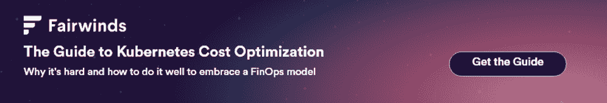

# 适用于 Kubernetes 的 FinOps“爬、走、跑”成熟度模型

> 原文：<https://www.fairwinds.com/blog/finops-maturity-model-applied-to-kubernetes>

 FinOps 已经成为许多组织越来越受欢迎的目标。它有助于将跨组织的财务团队和云运营团队团结在一起，使用同一种语言，了解云成本以及如何优化它们。

FinOps 基金会的成熟度模型描述了一个“爬行、行走、奔跑” [基金会称](https://www.finops.org/framework/maturity-model/) 遵循这种模式“组织[可以]从小规模开始，随着商业价值保证职能活动的成熟，在规模、范围和复杂性上增长。”

爬行、行走、奔跑方式映射到了 [Kubernetes 成熟度模型](https://www.fairwinds.com/kubernetes-maturity-model) Fairwinds 加在一起，而 CNCF 在生产 [云原生成熟度模型](https://github.com/cncf/cartografos/blob/main/reference/prologue.md) 时严重依赖。随着用户采用 Kubernetes，他们将对技术、人员、流程和政策采取类似的爬行、行走、运行方式。财务方面也应该是采用的一部分。

## 爬行

FinOps Foundation 爬行阶段的成熟度级别特征包括很少的报告和工具、基本 KPI、基本流程和策略，并且测量仅提供对成熟 FinOps 功能的益处的洞察。

那么这如何映射到 Kubernetes？对于工程领导者来说，Kubernetes 本身可能是一个很大的未知数。虽然采用 Kubernetes 的决定本身是战略性的，但资源分配如何配置的本质细节可能会产生重大影响。例如，Kubernetes 的一个好处是它的自动伸缩性。但是，如果没有设置资源限制或请求，这种好处可能会很快变成 5 万美元的超支。

在 Kubernetes 的爬行阶段，不太需要采用完整的 FinOps 文化，更多的是组织试图掌握 Kubernetes 中实际发生的事情。大多数组织缺乏对其集群内发生的事情的可见性

爬行阶段最重要的部分是正确设置 CPU 和内存。像 [Goldilocks](https://goldilocks.docs.fairwinds.com/) 这样的开源工具有助于确定设置 Kubernetes 资源请求和限制的基线。这在一到三个集群的小型环境中就足够了，在这些环境中，您很可能只有少量的工程师(一两个)管理 Kubernetes。拥有像 Goldilocks 这样的工具非常重要，原因如下:

*   它有助于提供一些关于资源分配的基本 KPI

*   它有助于实现一些基本的流程和策略，因为团队可以看到哪些集群具有正确配置的资源请求和限制

*   它提供了对每个应用程序的资源使用情况的一些测量，并支持应用程序规模调整

当爬行时，不太可能所有这些都被传达给上游的财务团队，但是当您进入行走阶段时，建立一些工程过程和最佳实践是非常重要的。

## 步行

FinOps 成熟度模型描述了在组织内理解和遵循能力、自动化和过程到位、存在困难的边缘情况并且或者没有解决或者有解决它们的计划的行走阶段。KPI 更加具体地衡量成功。

很可能当您到达 walk 阶段并且正在使用 Kubernetes 时，您正在运行多个集群并且有许多工程师在使用它。这是开源工具不一定要扩展的地方。

Kubernetes 用户需要研究一个平台，以帮助他们了解他们的环境，并在应用程序配置不正确时获得警报。这种理解包括每个工作负载或工作负载组的资源分配–用户应该能够按照集群、名称空间或标签来分配和分组成本估计，从而使报告更容易与业务环境保持一致。这将使工程领导层能够与财务团队合作，了解 Kubernetes 使用的真实成本以及哪里存在闲置或间接成本。此外，它还有助于改善 KPI，因为 Kubernetes 和单个应用程序可以根据它们的总体使用情况和估计的潜在节省进行优先排序，通常有机会在不影响应用程序性能的情况下优化资源使用和降低成本。

当您“行走”时，开发运维团队和平台工程团队正在研究成本问题。当您进入运行阶段时，这种情况会发生变化。

## 奔跑

FinOps 说，处于运行阶段的组织都是一致的，并且采用了一个健壮的模型。衡量成功的目标/KPI 非常高，自动化是首选。

这就是 Kubernetes 服务所有权映射到 FinOps 成熟度模型的地方。服务所有权是使开发人员能够“编码、发布、拥有”它的能力当到达运行阶段时，开发人员和工程负责人让开发人员能够自己查看集群中每个工作负载的成本以及如何进行改进。这种开发人员支持是通过采用像 [Fairwinds Insights](http://fairwinds.com/insights) 这样的软件实现的，该软件自动扫描集群，以提供跨名称空间、工作负载和标签的集群容量和使用情况的细分。它提供了关于在闲置容量、共享资源和特定于应用程序的资源上花费了多少的信息。

> 对使用 Fairwinds Insights 感兴趣吗？免费提供！ [在此了解更多](https://www.fairwinds.com/coming-soon) 。

运行时，还可以向财务团队提供 Kubernetes 使用成本的反馈报告，向开发团队分配具体的成本，并跟踪一段时间内的节省。像 spot 实例和面向批处理的任务这样的高级概念也可以帮助您更经济高效地运行。

> ### 优化库伯内特资源的决策健康
> 
> Fairwinds Insights 通过监控资源使用情况来确定可以在不影响性能的情况下降低成本的机会，从而为 Kubernetes 提供成本优化。
> 
> Decisio Health 的首席 DevOps 架构师 Glen Zangirolami 说:“云会用账单把你锤死。Fairwinds Insights 的一个主要优势是资源利用和成本优化。我们能够使用 Fairwinds 的资源建议来提供我们利用率的详细信息，并对我们的解决方案进行适当定价。"
> 
> “了解我们的集群规模是正确定价我们的解决方案的重要组成部分。使用 Fairwinds Insights，我们能够正确确定每个集群的节点和数据库数量。这种理解帮助我们将每个集群的成本降低了 25%。随着 25 个以上的集群投入生产并不断增长，这一成本节约是显著的。”
> 
> Decisio 还在监控其服务使用情况，并根据 Fairwinds 的建议实施 CPU 和内存限制，以避免过度分配或资源匮乏。“这使我们的团队能够在继续加入新医院的同时，调整应用程序限制和请求。”

## 最后的想法

了解云支出是许多供应商关注的焦点。对在 Kubernetes 上花费的理解通常是缺乏的，或者仅仅是对已经做的事情的附加。当您使用 Kubernetes 时，从为其构建的软件中获得专家的见解可以让您的开发人员真正接受 FinOps 模型。

