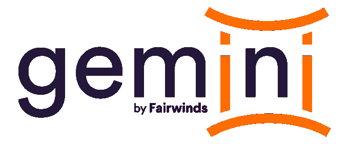

# Gemini:自动备份 Kubernetes 中的持久卷

> 原文：<https://www.fairwinds.com/blog/gemini-automate-backups-of-persistentvolumes-in-kubernetes>

 ## **持久存储很难**

当我第一次开始掌握 Kubernetes 时，我想用它做任何事情。在多年点击 AWS 控制台上的按钮后，拥有一个开源、代码驱动、独立于供应商的云平台的想法非常令人兴奋。因此，当我得知我的同事——我见过的一些最强的 Kubernetes 专家——强烈反对在 Kubernetes 中运行数据库，或将其用于任何类型的持久存储时，我感到很沮丧。他们告诉我坚持使用 S3 和 RDS 来满足我的存储需求。

当然，我没有听。虽然我们(谢天谢地)在设计生产应用程序时采纳了他们的建议，但我已经开始使用 Kubernetes 运行一些个人应用程序，比如照片共享和记笔记。我将所有数据存储在 persistent volumes(PV)上，甚至想出了一个简单的方法将数据备份到 S3。而且效果很好！

直到它没有。在某个时候，当更新我的一个应用程序时，我意外地删除了一个持久卷，却发现我的备份没有正常工作。几周的写作就这样消失了。

## **寻找解决方案**

我没有被吓倒，开始寻找更成熟的备份解决方案。

[Velero](https://github.com/vmware-tanzu/velero)

似乎是一个社区的最爱，但更多的是重量级的灾难恢复，而不是我需要的有针对性的应用程序备份解决方案。

[k8s-snapshots](https://github.com/miracle2k/k8s-snapshots)

相当有前途——它直接与 AWS、GCP 和 DigitalOcean APIs 集成，以创建 PVs 基础卷的备份。我让它运行了一段时间，直到我发现恢复被认为是

[out-of-scope](https://github.com/miracle2k/k8s-snapshots/issues/38)

为了项目！如果不能将备份重新连接到正在运行的应用程序，这些备份几乎毫无用处。

最后，我了解了

，一个 k8s 原生备份解决方案，从 1.17 开始进入测试版。它代表了一个巨大的进步

[VolumeSnapshot API](https://kubernetes.io/docs/concepts/storage/volume-snapshots/)

，这是 Kubernetes 中处理持久存储的官方方法。每个主要的云供应商都提供 CSI 挂钩，允许您使用 Kubernetes-native 接口管理他们云中的卷和备份。

[Container Storage Interface](https://kubernetes.io/blog/2019/01/15/container-storage-interface-ga/) [](https://kubernetes.io/blog/2019/01/15/container-storage-interface-ga/) [(CSI)](https://kubernetes.io/blog/2019/01/15/container-storage-interface-ga/)

这正是我所需要的！但有一个问题:卷快照必须手动创建。最终用户需要决定如何管理他们的快照，不仅要按计划创建新快照，还要淘汰旧快照以防止它们堆积。存储可能很便宜，但是每小时备份一个 1GB 的卷会很快变得昂贵！

**创造双子座**

## ****

我们希望给 VolumeSnapshot API 一个更健壮、用户友好的界面。具体来说，我们认为以下功能是任何生产级备份策略所必需的:

根据可定制的细粒度计划自动备份

*   自动删除过时的备份
*   从特定备份中轻松恢复数据的能力
*   因此，我们决定创建一个新项目 Gemini，以便自动化持久卷的备份和恢复。Gemini 由一个新的 CRD(快照组)和一个根据快照组规范创建、删除和恢复卷快照的操作器组成。它是这样工作的。

我们从快照组定义开始，它看起来像这样:

在这里，我们告诉 Gemini 找到现有的 postgres-data PVC，并安排每 10 分钟备份一次——这可能有点过分，但安全总比后悔好。除了最新的备份，我们还告诉 Gemini 保留最近的三个备份，这样我们至少有 30 分钟的覆盖时间。

```
apiVersion: gemini.fairwinds.com/v1beta1
kind: SnapshotGroup
metadata:
  name: postgres-backups
spec:
  persistentVolumeClaim:
    claimName: postgres-data
  schedule:
  - every: 10 minutes
    keep: 3 
```

但是我们可以更进一步！我们还可以告诉 Gemini 保持每小时、每天、每周、每月和每年的快照:

Gemini 仍将每 10 分钟运行一次备份，但它将保留额外的备份以满足长期备份计划。

```
apiVersion: gemini.fairwinds.com/v1beta1
kind: SnapshotGroup
metadata:
  name: postgres-backups
spec:
  persistentVolumeClaim:
    claimName: postgres-data
  schedule:
    - every: 10 minutes
      keep: 3
    - every: hour
      keep: 1
    - every: day
      keep: 1
    - every: week
      keep: 1
    - every: month
      keep: 1
    - every: year
      keep: 1 
```

恢复数据

## 从卷快照恢复数据可能有点麻烦，因为不幸的是，不停机就不可能完成。我们需要采取以下步骤:

关闭正在使用 PVC 的任何盒

*   为当前状态的 PVC 创建一次性备份，以防万一
*   删除现有的 PVC
*   从所需的卷快照创建新的 PVC
*   重启我们的 pod，将它们指向新的 PVC
*   因为更换 PVC 必然会导致停机，所以我们决定不对用户隐藏这个过程。具体来说，用户负责第一步和最后一步，即缩小和备份应用程序。Gemini 负责中间部分，替换掉 PVC。

下面是基本的恢复过程。首先，我们将检查哪些快照可用:

注意时间戳，`1585945609` -这是我们的目标还原点:15 分钟前。接下来，我们将缩小应用程序的规模:

```
$ kubectl get volumesnapshot
NAME                           AGE
postgres-backups-1585945609    15m
```

由于我们的应用程序处于离线状态，我们现在需要快速移动。要换出 PVC，我们只需用所需的还原点来注释快照组:

```
kubectl scale all --all --replicas=0
```

一旦 Gemini 看到此注释，它将触发一次性备份，删除旧 PVC，并使用指定快照中的数据用新 PVC(同名)替换它。恢复应该只需要 30 秒左右。与此同时，我们可以扩大规模，一旦新的 PVC 准备就绪，我们的 pod 就会上线。

```
kubectl annotate snapshotgroup/postgres-backups --overwrite \
  "gemini.fairwinds.com/restore=1585945609" 
```

不幸的是，恢复数据需要一点停机时间，而且似乎没有任何合理的方法来解决这个问题。如果您对如何改进这一流程有任何想法，请通过[提出问题](https://github.com/FairwindsOps/gemini/issues)告诉我们！

```
kubectl scale all --all --replicas=1 
```

同样值得注意的是，您可以从一个备份中启动第二个 PVC，并将其附加到应用程序的一个单独实例中。我使用这种机制来恢复旧照片，而不必将我的整个照片应用程序恢复到特定的时间点。

前进

```
apiVersion: v1
kind: PersistentVolumeClaim
metadata:
  name: restore-pvc
spec:
  dataSource:
    name: postgres-backups-1585945609
    kind: VolumeSnapshot
    apiGroup: snapshot.storage.k8s.io
  accessModes:
    - ReadWriteOnce
  resources:
    requests:
      storage: 1Gi 
```

我对 VolumeSnapshot API 感到非常兴奋，因为它填补了 Kubernetes 生态系统中的一个巨大空白。当与 Gemini 结合使用时，它允许我们在 Kubernetes 中安全地维护持久存储。虽然这里仍然有一些龙(毕竟卷快照仍处于测试阶段)，但我期待有一天 Fairwinds 可以自信地推荐使用独立于供应商的 k8s 原生存储解决方案，如

## 和

像 S3 和 RDS 这样的服务。

[MinIO](https://github.com/bitnami/charts/tree/master/bitnami/minio)[PostgreSQL-HA](https://github.com/bitnami/charts/tree/master/bitnami/postgresql-ha)

与此同时，我将享受边缘生活，使用 Gemini 和 VolumeSnapshots 管理我的个人数据。

In the meantime, I’ll be enjoying life on the edge, using Gemini and VolumeSnapshots to manage my personal data.