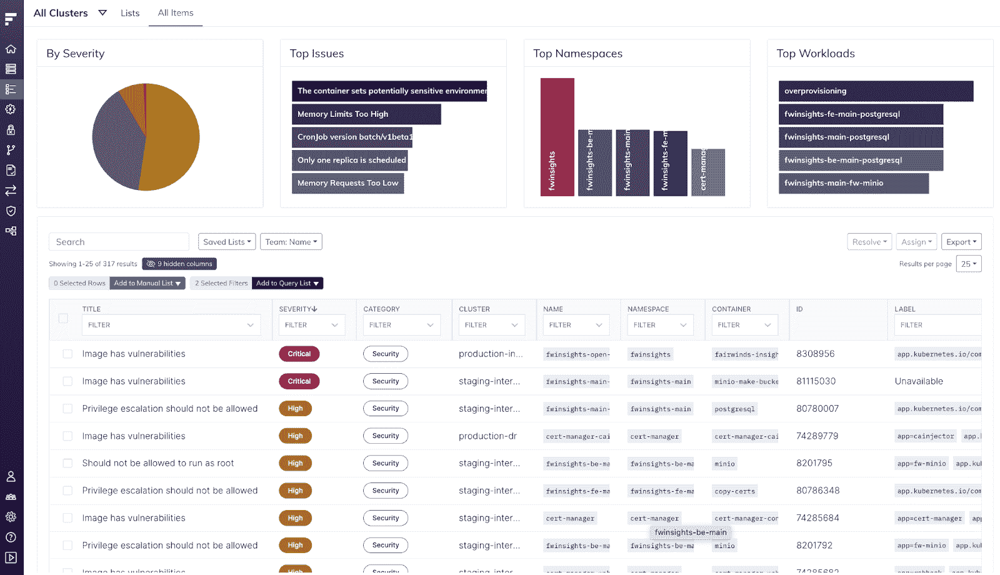

# 从 Kubernetes 治理平台 Fairwinds Insights(免费层)开始

> 原文：<https://www.fairwinds.com/blog/get-started-with-fairwinds-insights-free-tier>

 Fairwinds Insights 是一款供 Kubernetes 平台工程师集成到内部开发人员平台的软件，该软件内置和定制的 Kubernetes 最佳实践可改进 DevEx。

它根据 Kubernetes 集群和容器的最佳实践，主动监控、识别和优先排序建议。Insights 现已免费提供，适用于多达 20 个节点、两个集群和一个存储库的环境。一些人喜欢直接进入，而另一些人喜欢提前了解预期的情况。这篇文章正是这样做的，所以请继续阅读，了解如何开始使用 Fairwinds Insights。

如果你想看看 Insights 是什么样子，请查看我们的 [沙盒环境](https://insights.fairwinds.com/orgs/centaurus/clusters/) 。你不需要注册任何东西来体验这个平台。如果您确实建立了 Fairwinds Insights 免费层，我们将为您提供全程指导，帮助您了解下一步该做什么——就在应用程序中！

## 如何开始使用 Fairwinds Insights

只需七分钟，你就可以上手[fair winds Insights](https://www.fairwinds.com/insights)！这是一个简单的平台，有一个简单的图形用户界面(GUI ),对于平台工程师、开发人员和其他 Kubernetes 用户来说，很容易导航和直观。

您可以使用自己的集群或设置一个测试集群来开始自己的工作。在下面的示例中，我们设置了一个测试 GKE 集群。

## 第一步:注册账户

第一步是注册 Fairwinds Insights。这用不了一分钟。只需访问 [注册](https://insights.fairwinds.com/auth/register) 页面，输入您的电子邮件地址，并创建(并确认)一个安全密码。你还需要输入验证码。

在下一页，只需输入您的姓名，并告诉我们您是如何听说 Fairwinds Insights 的。单击下一步，几分钟后(可能更短)，您将收到一封确认您的电子邮件地址的电子邮件。

## 第二步:创建一个新的组织

这一步也不到一分钟。您可以请求组织所有者将您添加为组织成员，或者您可以创建一个新组织。让我们假设您正在创建一个新的组织。您可以输入您的公司名称或创建一个测试帐户。( ***注意:*** 你不能在以后更改你的组织名称，所以选择一个你将来会乐意使用的名称)。您的组织名称全部是小写字母，没有空格，但是您可以使用数字和破折号来分隔单词。然后单击“创建组织”进入下一步。

## 第三步:创建一个集群

接下来，您需要添加一个新的集群。这也很快！添加群集后，您可以选择要为该群集安装的报告。默认情况下，您将从北极星、新星、OPA 和冥王星开始。

## 第四步:用舵安装

是时候安装代理了！我们在下面的截图中建议了一些值。这些建议基于 Kubernetes 的最佳实践 ，我们认为它们会让你的生活更轻松。您可以稍后定制这个 yaml 文件，以包含更多的报告，这些报告可以在安装中心获得。在 Insights 平台中，很容易将这些代码复制并粘贴到您喜欢的编辑器中，然后保存。

接下来，用这些值安装舵图(复制/粘贴也很简单):

不使用头盔？下面是 [安装](https://helm.sh/docs/intro/install/) 舵的指南。

## 第 5 步:查看 Fairwinds Insights 集群概述

安装 Insights 代理后，屏幕将刷新并重定向至集群概述。根据集群的大小，只需要几分钟就可以开始看到您的报告。

集群概述突出显示了集群中运行的报告所确定的操作项，以及这些操作项如何影响集群的整体运行状况。您可以快速查看您的健康得分以及您有多少个严重和高警报。从集群概览中选择行动项目，您将进入行动项目导航中的过滤视图。

### 行动项目

单击行动项目查看集群中发现的问题。在页面顶部，您可以按集群进行筛选，并按名称空间和工作负载中的严重性和频率查看操作项的分布。

Insights 允许您搜索行动项目，按标题、严重性(低、中、高、关键)、类别(效率、可靠性、安全性)、集群、名称、命名空间和容器进行过滤。

### 补救行动项目

查找要修复的操作项。只需点击问题，即可查看问题描述以及如何补救的信息。

如果您单击类别旁边的三个点(在本例中，这是一个安全问题)，您可以访问一个菜单，该菜单允许您:

*   **创建票证** (Insights 有 [集成](https://insights.docs.fairwinds.com/) 与 Slack、Datadog、PagerDuty、吉拉和 Azure devo PS——你需要点击管理集成设置来安装它们并创建票证)

*   **解决** 问题(无，按预期工作，不会修复)

*   **贪睡** 动作项(1 天、1 周、1 个月)

*   **将** 分配给一个团队成员(如果你是一个更大组织的一部分，你会在这个列表中看到你的团队成员)

*   **见类似物品**

如果您需要更多操作项，请转到顶部导航栏中的“安装集线器”并添加更多检查。

## 安装轮毂

准备就绪后，您可以返回到集群导航内的安装中心添加附加报告，如 [使用指标](https://www.fairwinds.com/blog/kubernetes-resource-usage-estimate-workload-cost-with-goldilocks-open-source) 和 [容器漏洞的识别](https://www.fairwinds.com/blog/validating-container-security) 。只需使用图块在 Insights Agent 中添加或删除报告。您还可以通过单击一个单幅图块来更改报告的配置。选择要使用的报告后，单击页面右上角的“准备安装”。您将获得一个 Helm 命令来使用您的新设置安装代理。

一些可用的报告包括:

*   [繁琐](https://github.com/aquasecurity/trivy)——扫描你的容器中已知的漏洞

*   **RBAC 记者**——跟踪角色和绑定

*   [【Kube】-猎人](https://github.com/aquasecurity/kube-hunter) -搜寻你的集群内部的安全弱点

*   [普罗米修斯](https://prometheus.io/) **收集器** -收集指标以提供更准确的成本估算

*   **AWS 成本** -从您的 [AWS 成本](https://calculator.aws/#/) 和使用报告中摄取计费信息

## 通知集成

通过分享他们已经使用的工具中的问题，授权团队采取行动。访问设置，探索与供应商的可用集成，如[【吉拉](https://www.fairwinds.com/blog/kubernetes-basics-tutorial-how-to-integrate-jira-and-fairwinds-insights)。

##  通过 IaC 扫描更快发现问题

通过将 Fairwinds Insights 与持续集成平台连接，您可以使用 fair winds Insights[扫描您的基础架构即代码库](https://www.fairwinds.com/blog/why-infrastructure-as-code-scanning-matters-for-kubernetes-configuration) 。在“存储库”选项卡中有两种方法可以做到这一点

1.  连接 GitHub——这是最简单的入门方式。授予 Insights 对特定存储库的访问权限，我们将自动扫描每个新的拉取请求并提交。

2.  手动连接——您需要向现有 CI/CD 管道添加脚本。如果你没有使用 GitHub，我们推荐这种方法。

    

## 与你的团队分享发现

在设置>团队管理下管理您的团队。您可以在 Fairwinds Insights 中邀请用户加入您的新组织，将他们分配到一个团队，分配一个角色，并选中复选框以指明他们是否拥有所有者访问权限(添加新用户、管理团队和删除组织的访问权限)。他们将收到一封电子邮件，邀请他们完成前面部分概述的相同用户注册过程，但他们将成为您组织的一部分。

您还可以创建一个新团队，并配置团队对集群、名称空间和存储库的访问。或者，您可以阻止对特定集群、名称空间和存储库的访问。设置好并点击**创建团队**。

## 试用 Fairwinds Insights

这些是开始使用 Fairwinds Insights Free Tier 的基本第一步！使用 Fairwinds Insights，您可以发现许多关于您的 Kubernetes 集群和工作区的信息，所以请尝试不同的功能。发现漏洞，提高效率，并查看合规性报告。

如果遇到困难或有疑问，请告诉我们。并查看 [Fairwinds 社区 Slack group](https://fairwindscommunity.slack.com/) ，在这里您可以向我们的团队和社区提出问题并获得答案。我们期待着帮助您安装护栏，并使 [Kubernetes 治理](https://www.fairwinds.com/blog/what-is-kubernetes-governance) 成为您团队的现实。

