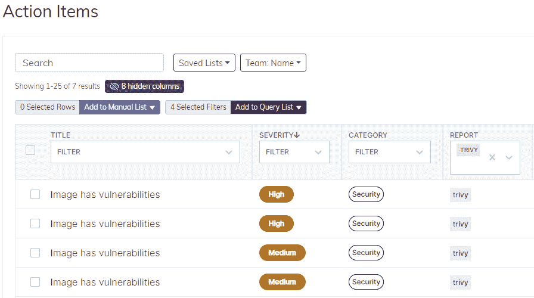
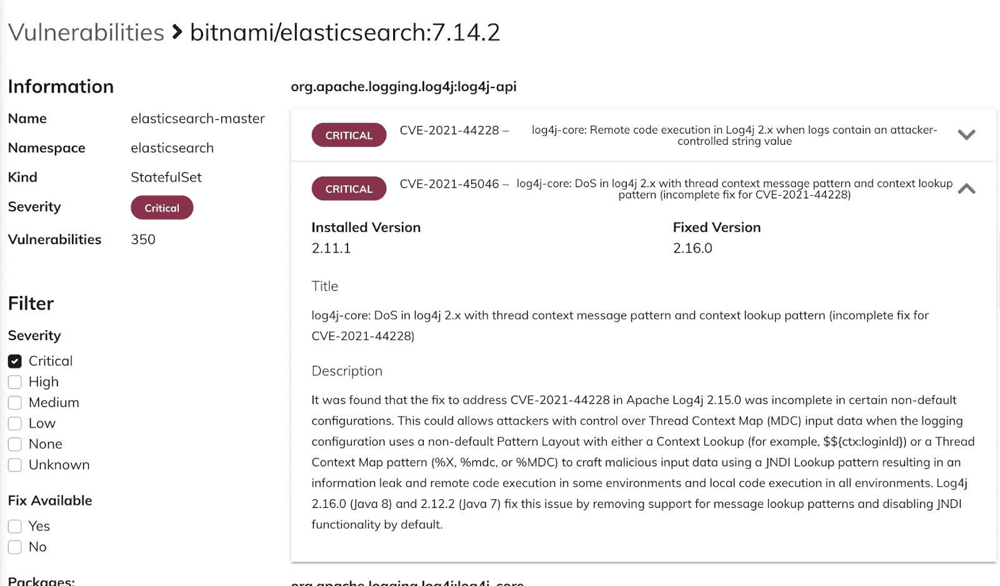

# Fairwinds Insights 如何帮助您识别 log4j 容器漏洞

> 原文：<https://www.fairwinds.com/blog/how-fairwinds-insights-can-help-you-identify-log4j-container-vulnerabilities>

 被称为 log4j 的零日漏洞被称为近年来最严重的安全问题之一，它允许攻击者远程执行代码并获得对机器的访问权限。log4j 不仅易于利用，其无处不在的特性意味着它已经被嵌入到大量的应用程序、服务和软件工具中——并被世界各地的坏人所利用。

随着 2021 年的临近，我们花费了大量时间来确定基础设施是否受到影响。你可以在我们的开源工具和洞察平台[这里](https://www.fairwinds.com/blog/a-fairwinds-security-statement-on-the-apache-log4j-vulnerability)阅读 Fairwinds 的声明。

## 识别容器漏洞

如果您是 Kubernetes 用户，并且需要了解您是否存在 log4j 容器漏洞，Fairwinds 可以提供帮助。Fairwinds Insights 是护栏和治理软件，允许负责 Kubernetes 的团队识别容器漏洞并提出补救建议。

Fairwinds Insights 将根据包括 log4j 在内的已知 CVE 扫描您的集装箱。如果集装箱存在风险，Insights 将创建一个行动项目。

您可以看到受影响的容器的详细信息以及严重性——在本例中是严重的。然后，用户可以升级到最新的固定版本。Insights 将持续扫描以识别更多 log4j 漏洞(以及其他漏洞)。

团队领导可以使用 Fairwinds Insights 监控跨团队和多个集群的容器健康状况。

## Kubernetes 安全和 Fairwinds 洞察:开始行动

您现在可以使用 Fairwinds Insights 来帮助您的团队识别 log4j 容器漏洞。它可以免费使用——你可以在这里注册。您将确认您的电子邮件，建立一个新的组织，然后能够向该组织添加集群和同事。

有三种方式与 Fairwinds Insights 联系:

*   [持续集成](https://insights.docs.fairwinds.com/run/ci/about)功能可以通过扫描您的基础设施代码来报告拉请求期间的问题
*   [准入控制器](https://insights.docs.fairwinds.com/run/admission/about)阻止有严重问题的资源进入集群
*   [集群内代理](https://insights.docs.fairwinds.com/run/agent/about)报告已经部署到集群的资源的问题

识别 log4j 容器漏洞的最快方法是安装集群内代理。您可以在 [Fairwinds Insights 文档](https://insights.docs.fairwinds.com/run/agent/about/)中了解更多信息。

不要让你的容器抓住你。使用 Fairwinds Insights 确保 Kubernetes 的安全。

