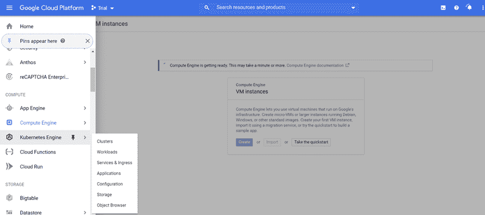
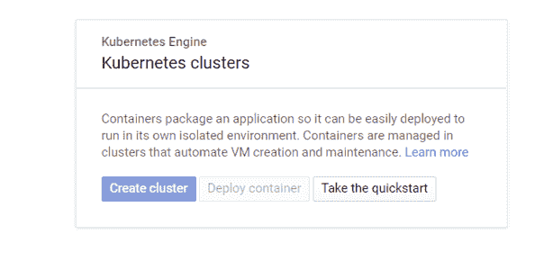
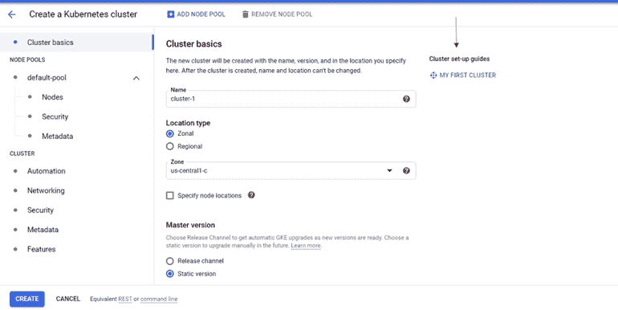
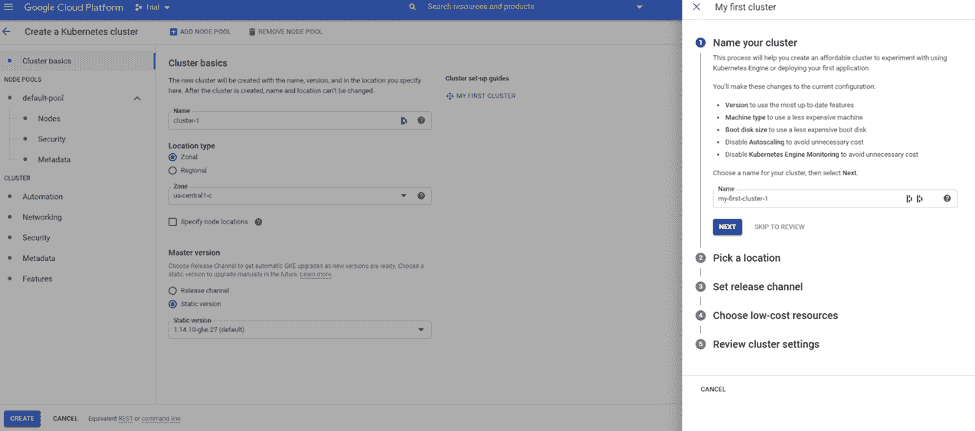
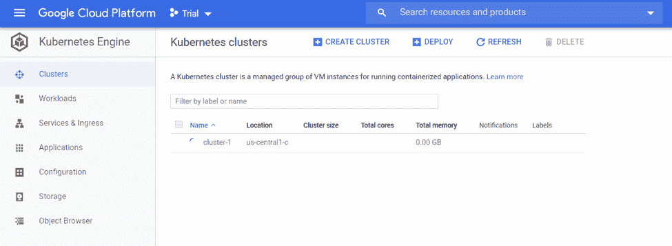
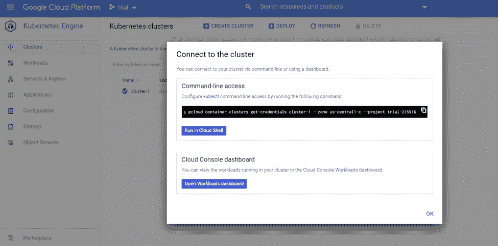
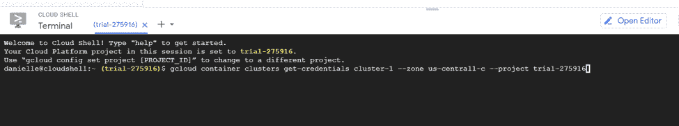

# 如何在 GKE 建立 Kubernetes 集群

> 原文：<https://www.fairwinds.com/blog/how-to-build-a-kubernetes-cluster-in-gke>

 本系列面向刚接触库伯内特和 GKE 的工程师。它提供了 Kubernetes 、[架构基础和定义](/blog/getting-started-with-kubernetes-architecture-basics-definitions)的[基本概述，以及构建 Kubernetes 集群和](/blog/what-problems-does-kubernetes-solve)[构建您的第一个多层 webapp](/blog/how-to-deploy-multi-tiered-web-application-with-kubernetes) 的快速入门。

本博客将向您展示如何与 GKE 一起启动并运行您的第一个 Kubernetes 集群。

去 console.cloud.google.com 的谷歌云平台。如果你需要注册一个账户，这是非常简单的。谷歌会给你免费的积分。

单击左上角的汉堡，向下滚动到 Kubernetes 引擎，然后单击集群。



您将看到没有创建任何集群，因此您将单击“create cluster”。



对于您的第一个集群来说，默认设置基本上是可以的。因为您可能会使用 Google 提供的免费积分，所以您会希望通过使用我的第一个集群选项来最大限度地降低成本。

在右侧，单击我的第一个集群。



对于您的第一个集群，只需使用默认设置。随着 Kubernetes 越来越先进，所提供的选项将变得更有意义，比如选择节点的数量和大小。您可以跳到“查看”并单击左下方的“创建”。



在创建集群时，您会看到一个旋转的轮子——大约需要 3-5 分钟集群才会启动。

如果您曾经从零开始创建过 Kubernetes 集群，那么您会确切地知道需要多少时间。当您创建第一个集群时，Google 会在幕后处理所有这些事情。



一旦您的集群准备就绪，您会在集群名称旁边看到一个绿色复选标记。如果您使用上一个屏幕的默认设置，Google 将命名您的集群。在这种情况下是 `cluster-1.`

启动并运行后，有两种方法可以验证您是否可以连接到集群。最简单的方法是使用谷歌云控制台。

点击右边的连接按钮。您将看到一个可以拷贝 gcloud 命令的地方。这里假设您已经安装了 gcloud 命令行和 kubectl 实用程序。如果你还没有安装这些或者想更快上手，点击按钮 run in cloud shell。



这将在您的浏览器中打开一个云控制台。您可以看到，它自动填充了为我们的 Kubernetes 集群进行身份验证所需的命令。

要运行这个命令，只需按回车键。

您可以运行一些快速的 kubectl 命令来验证您可以连接到您的集群。

您可以运行的第一个是`kubectl config current-context.`,它应该回显我们连接到 Kubernetes 集群的当前上下文。

```
danielle@cloudshell:~ (trial-275916)$ kubectl config current-context
gke_trial-275916_us-central1-c_cluster-1
```

在现实世界中，您可能同时连接到任意数量的集群。您可以使用 kubectl config 命令在集群之间切换上下文。如果您使用它在生产集群和开发集群之间切换，请小心。您可以让您的当前上下文指向一个生产集群，并打算在您的开发集群中运行。请随意使用该命令。

您可以看到现在您已经连接到了刚刚创建的 Kubernetes 集群。您可以通过运行 `kubectl get nodes.` 来验证 Kubernetes 集群是否有工作空间

```
danielle@cloudshell:~ (trial-275916)$ kubectl get nodes
NAME                                       STATUS   ROLES    AGE   VERSION
gke-cluster-1-default-pool-45c619a9-13l8   Ready       51m   v1.14.10-gke.27
gke-cluster-1-default-pool-45c619a9-hrfr   Ready       51m   v1.14.10-gke.27
gke-cluster-1-default-pool-45c619a9-x7q9   Ready       51m   v1.14.10-gke.27 
```

您可以看到，在 GKE 有一个三节点 Kubernetes 群集。

[](https://cta-redirect.hubspot.com/cta/redirect/2184645/e68d92d3-c876-4525-b775-6123e46c7212)