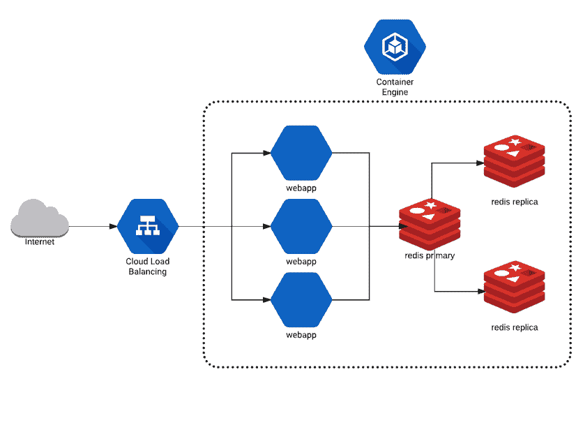
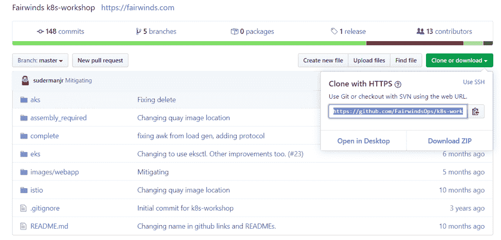
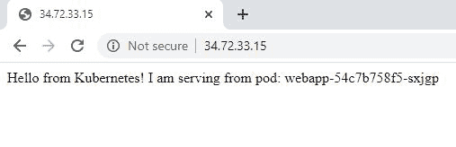

# 如何用 Kubernetes 部署多层 Web 应用程序

> 原文：<https://www.fairwinds.com/blog/how-to-deploy-multi-tiered-web-application-with-kubernetes>

 在 Kubernetes 系列的最后一篇介绍中，我们将带您了解如何部署多层 web 应用程序。webapp 是一个带有 Redis 后端的关键值存储和检索服务。(阅读 Kubernetes 解决的[问题](/blog/what-problems-does-kubernetes-solve)、[架构和定义](/blog/getting-started-with-kubernetes-architecture-basics-definitions)或[在 GKE 建立 K8S 集群](/blog/how-to-build-a-kubernetes-cluster-in-gke))。

下面是我们将部署的内容的简要概述:



我们已经准备了一个 [GitHub 存储库](https://github.com/FairwindsOps/k8s-workshop)，您可以用所有库本内特存储库、各种文档和 Fairwinds 用于研讨会的代码进行克隆。

转到 Git >克隆或下载>复制 URL。



你需要一个 Kubernetes 集群。你可以看看我们的博客[如何用 GKE](/blog/how-to-build-a-kubernetes-cluster-in-gke) 构建一个 Kubernetes 集群。在 GKE，打开您的云 shell 终端窗口，然后运行命令:

`git clone [https://github.com/FairwindsOps/k8s-workshop.git](https://github.com/FairwindsOps/k8s-workshop.git)`

这是一个相对较小的项目，所以会很快拉下来。

在存储库中，您可以找到自述文件、装配所需文件夹、完整文件夹、图像文件夹和 istio 文件夹。在这篇博客中，除了自述文件和完整的文件夹之外，你可以忽略所有的内容。自述文件中提供了两种途径。我们将把重点放在基本轨道上，但是如果你想深入研究在 Kubernetes 上部署应用程序时可能出现的问题，你可以回头看看 kub assembly required 版本。它为 Kubernetes YAML 提供了更多的细微差别，允许您调试和测试运行 kubectl 命令的能力。

下面是我们将用来部署完整 web 应用程序的步骤。这个博客将部署一个损坏的应用程序，我们将修复 Kubernetes YAML 文档，以使部署成功。

## 部署到 Redis 数据库

在本次研讨会中，您将:

*   为您的应用程序部署新的命名空间
*   将 Redis 服务器部署到新的名称空间中
*   查看您使用 Kubernetes 部署的对象(部署，pod)
*   通过 kubectl 从部署的资源中获取日志

您首先需要提供一个名称空间。名称空间是一种分割和存储 Kubernetes API 中提供的对象的方式。您可以通过运行以下命令来检查现有的名称空间:

`kubectl get namespace`

```
danielle@cloudshell:~ (trial-275916)$ kubectl get namespace
NAME              STATUS   AGE
default           Active   75m
kube-node-lease   Active   75m
kube-public       Active   75m
kube-system       Active   75m 
```

在 GKE，你可以看到四种现有的名称空间——默认、kube-节点租赁、kube-公共和 kube-系统。我们将创建一个新的名称空间:

`kubectl apply -f namespace.yml`

`-f`标志表示您将把一个文件传递给 `kubectl` ，让它提交给 Kubernetes API。

```
danielle@cloudshell:~ (trial-275916)$ kubectl apply -f namespace.yml
namespace/k8s-workshop created 
```

您可以运行 get namespace 命令来查看您创建了什么。

```
danielle@cloudshell:~/k8s-workshop/complete (trial-275916)$ kubectl get namespaces
NAME              STATUS   AGE
default           Active   81m
k8s-workshop      Active   73s
kube-node-lease   Active   81m
kube-public       Active   81m
kube-system       Active   81m
```

随着学习的深入，您将向 Kubernetes API all in YAML 定义应用和提交对象。我们将使用`kubectl`命令行工具获取文件，解析它们并提交给 API。

## 第一层 Web 应用程序:Redis

现在，您将从存储 webapp 状态的有状态后端开始部署 web 应用程序的第一层。kubectl 允许你获取一系列 YAML 文件，把它们放在一个文件夹中，然后对整个文件夹进行操作。它将提供文件夹下定义的所有资源和对象。这允许您创建一组对象和迷你 YAML 文件，而不是用一千行定义一切的单个 YAML 文件。您将首先推出这个多层 web 应用程序的后端层——一个 HA Redis 实现。要四处看看，可以跑`ls -l 01_redis/`

```
danielle@cloudshell:~/k8s-workshop/complete (trial-275916)$ ls -1 01_redis/
redis.networkpolicy.yml
redis-primary.deployment.yml
redis-primary.service.yml
redis-replica.deployment.yml
redis-replica.horizontal_pod_autoscaler.yml
redis-replica.service.yml
```

这下面有一系列文件。

*   部署文件定义了启动的 pod 的数量(更多信息请参考 Kubernetes 架构基础和定义)。

*   您将看到定义 clusterIP 服务的服务文件(clusterIP，因为您不想让 Redis 暴露给公共 internet)。

*   这是一个 HA Redis 实施，因此您将拥有一个复制副本部署文件和一个复制副本水平 pod 自动缩放器(HPA)。autoscaler 允许您根据部署中设置的资源请求自动扩展。

*   您还拥有一个可用于副本服务器的服务，这样主服务器就可以与副本服务器对话，还拥有一个用于 redis 的网络策略。

您可以查看这些文件，看看定义是什么样子的。在文本编辑器中，打开 redis-primary 部署文件:

`vim redis.primary.deployment.yml`

您将看到一个 API 版本，一个种类(您在其中指定了您将提交的对象)，元数据，以及一个关于部署应该是什么样子的规范。

```
apiVersion: extensions/v1beta1
kind: Deployment
metadata:
  name: redis-primary
  namespace: k8s-workshop
spec:
  replicas: 1
  template:
    metadata:
      labels:
        app: redis
        role: primary
        tier: backend
    spec:
      containers:
      - name: redis
        image: gcr.io/google_containers/redis:e2e  # or just image: redis
        resources:
          requests:
            cpu: 100m
            memory: 100Mi
        ports:
        - containerPort: 6379 
```

在这种情况下，您将调配一个副本(即一个单元是部署的一部分)。您将在 template.spec 中模板化您想要的规范。您还可以定义一组容器。在本例中，您将只有一个容器需要旋转。容器的名称是从 Google 容器注册表中提取的 Redis。您还将发出一些附加到容器的资源请求——分配 100 个 CPU 份额、100 MB 内存和网络，以公开 redis 默认的端口 6379。您可以深入研究 YAML 定义，并尝试添加更多的容器或副本。

## **将 YAML 应用于集群**

现在，您将把您的 YAML 定义应用到集群中。运行:

`kubectl apply -f 01_redis/`

这个命令检查了上面检查的所有文件，并为每个文件创建了对象。

```
danielle@cloudshell:~/k8s-workshop/complete (trial-275916)$ kubectl apply -f 01_redis/
deployment.extensions/redis-primary created
service/redis-primary created
deployment.extensions/redis-replica created
horizontalpodautoscaler.autoscaling/redis-replica created
service/redis-replica created
networkpolicy.networking.k8s.io/redis created
```

现在，您需要读取这些对象，并获取正在运行的数据。

`kubectl -n k8s-workshop get pod`

您将看到有两个 pod 在运行——一个 Redis 主服务器和一个副本服务器。

```
NAME                             READY   STATUS    RESTARTS   AGE
redis-primary-684c84fc56-57brt   1/1     Running   0          75s
redis-replica-d64bd9565-zn7sg    1/1     Running   0          74s
```

现在对部署采取相同的步骤:

`kubectl -n k8s-workshop get deployments`

您将看到有关您的部署的信息—Redis 副本、Redis 主服务器、所需的 1 计数、当前 1、最新、可用内容以及 pod 的年龄。

```
NAME            READY   UP-TO-DATE   AVAILABLE   AGE
redis-primary   1/1     1            1           2m37s
redis-replica   1/1     1            1           2m36s
```

如果您正在进行滚动部署，您将在这里看到更多关于应用程序状态的有趣信息。

您还可以通过运行以下命令来查看服务:

`kubectl -n k8s-workshop get services`

在这里，您可以看到两个服务—主服务和副本服务。

```
NAME            TYPE        CLUSTER-IP   EXTERNAL-IP   PORT(S)    AGE
redis-primary   ClusterIP   10.8.11.78           6379/TCP   5m35s
redis-replica   ClusterIP   10.8.4.228           6379/TCP   5m34s
```

这两种服务都是集群 IP 服务(即仅在集群内部的 IP 上可用)。您还会看到 IP 和一些关于端口和年龄的信息。如果您想用一个命令进行总结，您可以运行:

`kubectl -n k8s-workshop get deployments,pods,services`

这允许您在单个图像中显示所有资源。

```
NAME                                  READY   UP-TO-DATE   AVAILABLE   AGE
deployment.extensions/redis-primary   1/1     1            1           6m42s
deployment.extensions/redis-replica   1/1     1            1           6m41s
NAME                                 READY   STATUS    RESTARTS   AGE
pod/redis-primary-684c84fc56-57brt   1/1     Running   0          6m42s
pod/redis-replica-d64bd9565-zn7sg    1/1     Running   0          6m41s
NAME                    TYPE        CLUSTER-IP   EXTERNAL-IP   PORT(S)    AGE
service/redis-primary   ClusterIP   10.8.11.78           6379/TCP   6m42s
service/redis-replica   ClusterIP   10.8.4.228           6379/TCP   6m41s
```

通过这些步骤，您现在应该可以在 Kubernetes 的 `k8s-workshop namespace` 中看到一个健康的 redis 主服务器和副本。

## **部署 Web App**

接下来，您将:

*   将 web 应用程序部署到 `default` 名称空间(与我们在上面创建的名称空间不同)
*   观察云负载平衡器创建对 web 应用程序的外部访问
*   卷曲新部署的 web 应用程序以进行手动测试
*   查看 web 应用程序的日志
*   通过部署到正确的名称空间来修复损坏的 web 应用程序部署
*   再次卷曲 web 应用程序进行测试

首先列出 webapp 目录 `ls -l 02_webapp/` ,看看它有没有类似于 redis 后端的文件。

```
danielle@cloudshell:~/k8s-workshop/complete (trial-275916)$ ls -1 02_webapp/
app.configmap.yml
app.deployment.yml
app.horizontal_pod_autoscaler.yml
app.networkpolicy.yml
app.secret.yml
app.service.yml
```

有两种新的对象类型:配置映射和机密。

*   配置映射提供了将环境变量和静态文件导入 pod 的方法。如果您查看 configmap YAML 文件，您可以深入查看一系列分层的键。
*   秘密允许您存储和管理敏感信息，如密码、OAuth 令牌和 ssh 密钥。

要部署基本 webapp:

T2`kubectl apply -f 02_webapp/`

这将部署`02_webapp/`文件夹中的所有 yaml 定义。注意，我们*不是*在 YAML 的`metadata`中定义名称空间，所以它将默认为用`kubectl.`配置的默认名称空间

```
danielle@cloudshell:~/k8s-workshop/complete (trial-275916)$ kubectl apply -f 02_webapp/
configmap/webapp created
deployment.extensions/webapp created
horizontalpodautoscaler.autoscaling/webapp created
networkpolicy.networking.k8s.io/app created
secret/webapp created
service/webapp created
```

您可以通过运行`kubectl -n k8s-workshop get configmaps` 来查看您创建并在部署中引用的配置图，您将看到没有找到任何资源。

```
danielle@cloudshell:~/k8s-workshop/complete (trial-275916)$ kubectl -n k8s-workshop get configmaps
No resources found in k8s-workshop namespace.
```

在这个有意的例子中，您将看到一个参数丢失的实例。每次部署或尝试读回信息时，您都要查看默认名称空间并指定`k8s-workshop`名称空间。

在这个例子中，`02_webapp/`实现被部署到默认的名称空间中。要检查这一点，请运行:

`kubectl get configmaps`

您将看到 webapp configmap 在那里，但是它被部署到了错误的名称空间。

```
danielle@cloudshell:~/k8s-workshop/complete (trial-275916)$ kubectl get configmaps
NAME     DATA   AGE
webapp   2      4m8s
```

您需要重新运行 apply 并指定名称空间。原因是如果您查看`01_redis`主部署，您指定了一个名称空间。如果您查看 webapp 的相同部署，您会看到在元数据下，您没有提供名称空间。

您需要使用 kubectl delete `-f 02_webapp/`取消最后一次应用，以删除创建的对象并正确部署到 k8s-workshop 名称空间中。

```
danielle@cloudshell:~/k8s-workshop/complete (trial-275916)$ kubectl delete -f 02_webapp/
configmap "webapp" deleted
deployment.extensions "webapp" deleted
horizontalpodautoscaler.autoscaling "webapp" deleted
networkpolicy.networking.k8s.io "app" deleted
secret "webapp" deleted
service "webapp" deleted
```

现在，您将在正确的名称空间中应用程序。

`kubectl apply -f 02_webapp/ --namespace k8s-workshop`

这将覆盖未设置的`default`名称空间，并将所有 yaml 文件部署到 `k8s-workshop` 名称空间中。

```
danielle@cloudshell:~/k8s-workshop/complete (trial-275916)$ kubectl apply -f 02_webapp/ --namespace k8s-workshop
configmap/webapp created
deployment.extensions/webapp created
horizontalpodautoscaler.autoscaling/webapp created
networkpolicy.networking.k8s.io/app created
secret/webapp created
service/webapp created
```

接下来，运行 `kubectl get services --namespace k8s-workshop.`

```
danielle@cloudshell:~/k8s-workshop/complete (trial-275916)$ kubectl get services --namespace k8s-workshop
NAME            TYPE           CLUSTER-IP   EXTERNAL-IP   PORT(S)        AGE
redis-primary   ClusterIP      10.8.11.78           6379/TCP       19m
redis-replica   ClusterIP      10.8.4.228           6379/TCP       19m
webapp          LoadBalancer   10.8.7.188   34.72.33.15   80:31550/TCP   48s
```

您可以看到有一个负载平衡器 IP 挂起。如果你给它几分钟，负载平衡器 IP 将已经改变。

现在，您已经运行了 webapp 的前端层。

## **访问您的服务**

现在，您可以查看可用的服务，看看您实际上是如何访问 webapp 的。

`kubectl -n k8s-workshop get services`

您可以看到两个服务都连接到 Redis，这是只能从集群内部访问的集群 IP 服务。您还会看到第三个服务 webapp，它是公开的，因为它是一个负载平衡器服务。当您列出服务时，您会获得一个外部 IP。

```
danielle@cloudshell:~/k8s-workshop/complete (trial-275916)$ kubectl -n k8s-workshop get services
NAME            TYPE           CLUSTER-IP   EXTERNAL-IP   PORT(S)        AGE
redis-primary   ClusterIP      10.8.11.78           6379/TCP       20m
redis-replica   ClusterIP      10.8.4.228           6379/TCP       20m
webapp          LoadBalancer   10.8.7.188   34.72.33.15   80:31550/TCP   97s
```

如果你复制外部 IP，打开一个网络浏览器，你可以看到我们的 webapp 正在服务来自 Kubernetes 的 Hello。



要检查这个特定的 pod 和 pod 内的容器是否真的获得了流量，您首先需要获得实际运行的 pod 的名称:`kubectl -n k8s-workshop get pods`

您将看到有一个 webapp pod 正在运行。复制 pod 的全名。

```
danielle@cloudshell:~/k8s-workshop/complete (trial-275916)$ kubectl -n k8s-workshop get pods
NAME                             READY   STATUS    RESTARTS   AGE
redis-primary-684c84fc56-57brt   1/1     Running   0          25m
redis-replica-d64bd9565-zn7sg    1/1     Running   0          25m
**webapp-54c7b758f5-sxjgp**          1/1     Running   0          6m43s
```

运行`kubectl -n k8s-workshop logs -f **webapp-54c7b758f5-sxjgp**`

您将看到有一个 webapp pod 正在运行。

```
10.4.0.1 - - [11/May/2020:20:50:11 +0000] "GET / HTTP/1.1" 200 70 0.0030
10.4.0.1 - - [11/May/2020:20:50:14 +0000] "GET / HTTP/1.1" 200 70 0.0029
10.4.0.1 - - [11/May/2020:20:50:17 +0000] "GET / HTTP/1.1" 200 70 0.0045
10.4.0.1 - - [11/May/2020:20:50:18 +0000] "GET / HTTP/1.1" 200 70 0.0029
10.4.0.1 - - [11/May/2020:20:50:20 +0000] "GET / HTTP/1.1" 200 70 0.0030
10.4.0.1 - - [11/May/2020:20:50:23 +0000] "GET / HTTP/1.1" 200 70 0.0030
10.4.0.1 - - [11/May/2020:20:50:26 +0000] "GET / HTTP/1.1" 200 70 0.0030
10.4.0.1 - - [11/May/2020:20:50:28 +0000] "GET / HTTP/1.1" 200 70 0.0030
10.4.0.1 - - [11/May/2020:20:50:29 +0000] "GET / HTTP/1.1" 200 70 0.0035
10.4.0.1 - - [11/May/2020:20:50:32 +0000] "GET / HTTP/1.1" 200 70 0.0030
10.4.0.1 - - [11/May/2020:20:50:35 +0000] "GET / HTTP/1.1" 200 70 0.0031
10.4.0.1 - - [11/May/2020:20:50:38 +0000] "GET / HTTP/1.1" 200 70 0.0029
10.4.0.1 - - [11/May/2020:20:50:38 +0000] "GET / HTTP/1.1" 200 70 0.0044
10.4.0.1 - - [11/May/2020:20:50:41 +0000] "GET / HTTP/1.1" 200 70 0.0032
10.4.0.1 - - [11/May/2020:20:50:44 +0000] "GET / HTTP/1.1" 200 70 0.0031
10.4.0.1 - - [11/May/2020:20:50:47 +0000] "GET / HTTP/1.1" 200 70 0.0030
10.4.0.1 - - [11/May/2020:20:50:48 +0000] "GET / HTTP/1.1" 200 70 0.0027
10.4.0.1 - - [11/May/2020:20:50:50 +0000] "GET / HTTP/1.1" 200 70 0.0031
```

您可以查看内部运行状况检查请求，以了解 pod 是否处于活动状态。如果您返回浏览器并点击 refresh，您将会看到针对基本 URL 的不同 git 请求通过。您将知道，从公共互联网上，可以访问运行在您的 Kubernetes 集群中的 webapp。

```
10.4.0.1 - - [11/May/2020:20:51:38 +0000] "GET / HTTP/1.1" 200 70 0.0030
10.4.0.1 - - [11/May/2020:20:51:38 +0000] "GET / HTTP/1.1" 200 70 0.0029
10.4.0.1 - - [11/May/2020:20:51:38 +0000] "GET /favicon.ico HTTP/1.1" 200 37 0.0020
10.128.0.22 - - [11/May/2020:20:51:38 +0000] "GET / HTTP/1.1" 200 70 0.0027
10.128.0.22 - - [11/May/2020:20:51:38 +0000] "GET /favicon.ico HTTP/1.1" 200 37 0.0010
10.128.0.22 - - [11/May/2020:20:51:38 +0000] "GET / HTTP/1.1" 200 70 0.0028
10.128.0.22 - - [11/May/2020:20:51:38 +0000] "GET /favicon.ico HTTP/1.1" 200 37 0.0010
10.128.0.22 - - [11/May/2020:20:51:38 +0000] "GET / HTTP/1.1" 200 70 0.0027
10.4.0.1 - - [11/May/2020:20:51:38 +0000] "GET / HTTP/1.1" 200 70 0.0081
10.128.0.22 - - [11/May/2020:20:51:38 +0000] "GET /favicon.ico HTTP/1.1" 200 37 0.0011
10.128.0.22 - - [11/May/2020:20:51:38 +0000] "GET / HTTP/1.1" 200 70 0.0027
10.128.0.22 - - [11/May/2020:20:51:38 +0000] "GET /favicon.ico HTTP/1.1" 200 37 0.0012
10.4.0.1 - - [11/May/2020:20:51:39 +0000] "GET / HTTP/1.1" 200 70 0.0028
10.4.0.1 - - [11/May/2020:20:51:39 +0000] "GET /favicon.ico HTTP/1.1" 200 37 0.0010
10.4.0.1 - - [11/May/2020:20:51:39 +0000] "GET / HTTP/1.1" 200 70 0.0029
10.4.0.1 - - [11/May/2020:20:51:39 +0000] "GET /favicon.ico HTTP/1.1" 200 37 0.0010
10.128.0.22 - - [11/May/2020:20:51:39 +0000] "GET / HTTP/1.1" 200 70 0.0028
10.128.0.22 - - [11/May/2020:20:51:39 +0000] "GET /favicon.ico HTTP/1.1" 200 37 0.0010
10.128.0.22 - - [11/May/2020:20:51:39 +0000] "GET / HTTP/1.1" 200 70 0.0028
10.128.0.22 - - [11/May/2020:20:51:39 +0000] "GET /favicon.ico HTTP/1.1" 200 37 0.0010
10.4.0.1 - - [11/May/2020:20:51:39 +0000] "GET / HTTP/1.1" 200 70 0.0027
10.4.0.1 - - [11/May/2020:20:51:39 +0000] "GET /favicon.ico HTTP/1.1" 200 37 0.0010
10.4.0.1 - - [11/May/2020:20:51:39 +0000] "GET / HTTP/1.1" 200 70 0.0028
10.4.0.1 - - [11/May/2020:20:51:39 +0000] "GET /favicon.ico HTTP/1.1" 200 37 0.0010
10.4.0.1 - - [11/May/2020:20:51:41 +0000] "GET / HTTP/1.1" 200 70 0.0030
```

现在，您已经在 Kubernetes 中部署了一个多层 web 应用程序。这只是冰山一角，在 Kubernetes 中有许多方法可以编排工作负载和应用程序。

[](https://cta-redirect.hubspot.com/cta/redirect/2184645/df6709b9-c7f5-4c1a-8bf4-315f56b16325)