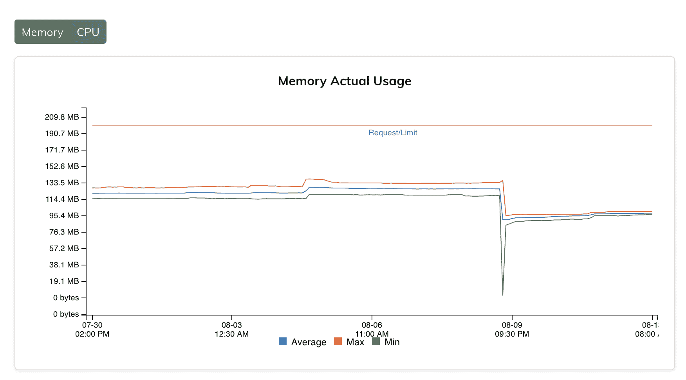

# 如何合理调整您的 Kubernetes 工作负载

> 原文：<https://www.fairwinds.com/blog/how-to-rightsize-your-kubernetes-workloads>

 是时候对你选择的云进行第一次大的投入了，或者你正准备更新一次投入，并且需要所有的细节来把事情做好。在你签下一大笔钱之前，你要确保你签下的细节是正确的，并且与你实际花费的一致。如果你没有用完，承诺消费没有折扣。事实上，它最终会让你付出更多。所以知道承诺什么很重要。

## 合理调整和优化

为了使您的云或续订提交尽可能准确，您需要正确调整实例、工作负载和优化计算。对于许多组织来说，云支出是一项巨大的成本，不必要的支出对任何组织来说都是糟糕的选择。与此同时，挖掘应用程序资源和历史使用情况的细节以做出决策可能是一个真正的挑战。大多数组织对其 Kubernetes 环境的效率知之甚少。

缺乏可见性使得在 Kubernetes 这样的动态环境中优化您的计算和工作负载变得非常困难。多个团队、多个集群和巨大的复杂性意味着您需要审查和评估大量信息，以做出最佳决策。

## 获得恰到好处的工作负载

这就是我们创建 [Goldilocks](https://goldilocks.docs.fairwinds.com/) 的原因之一，这是 Fairwinds 的一款开源软件工具，可以帮助您合理调整工作负载。我们在 2019 年 10 月开源了 Goldilocks，以提供一个仪表板实用程序来确定设置 [Kubernetes 资源请求和限制](https://www.fairwinds.com/blog/goldilocks-kubernetes-resource-requests)的基线。金发女孩(显然)帮助你“恰到好处地”获得那些具有挑战性的设置——所以你正在以正确的方式打包。Goldilocks 包括一个 [VPA 子图](https://github.com/FairwindsOps/charts/tree/master/stable/vpa)，你可以用它来安装 VPA 控制器和它的资源，这提高了它处理具有数百个名称空间和 VPA 对象的大型集群的能力。

如果你想要更好、更精细的控制，请查看 [Fairwinds Insights](https://www.fairwinds.com/insights) 。它提供了对 Kubernetes 集群的多集群可见性，这有助于确保应用程序得到适当的配置。

> 您可以永远免费使用 Fairwinds Insights。[拿到这里。](/coming-soon)

Fairwinds Insights 利用 Goldilocks 以及更高级的逻辑(以及高级的 [Prometheus](https://prometheus.io/) 指标，如果有的话)来分析和审查您的工作负载请求和限制。这种额外的可见性有助于您确信您正在致力于对您的业务最有意义的事情，因此在注册或续订您的云承诺时，您不会得到比您需要的更多(或更少)的东西。

## 云提交后，继续监控和优化

即使您已经为下一年提交了云，并按照您想要的方式设置了一切，一次性优化也不能替代对 Kubernetes 环境的持续监控。确保您拥有所需的工具，使您的开发人员能够定期监控这些工作负载。作为一名管理人员，借助 Fairwinds Insights，您可以洞察您的支出去向，以及是否以最佳方式使用。配置和优化总是很重要，应该是持续的优先事项，以确保环境的可扩展性、可靠性、资源效率和安全性。

需要很好的工具来使您的团队能够了解您的 Kubernetes 环境。合适的工具可以帮助您合理调整工作负载，使您的服务可用，但不会过度调配。完成您需要的任务，而不需要在云服务上花费过多的资金，并确保您的云承诺符合您未来一年的需求和目标。

